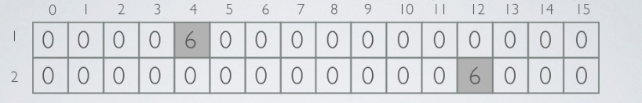

# 1 Khái niệm

## 1.1 Cấu trúc dữ liệu

### Probabilistic data structures
Probabilistic data structures là nhóm data structers vô cùng hữu ích cho big data và streaming application. 

### Membership Query - Bloom filter
- Bloom filter gồm 3 operation:
  - Thêm 1 phần tử vào set
  - Kiểm tra 1 phần tử có thuộc set không
  - Kiểm tra 1 phần tử có không thuộc set không
- Bloom filter gồm 2 parameter:
  - m: length của filter
  - k: số lượng các hash function khác nhau
  - Nếu như không chứa phần tử nào thì cần 1 byte để luu data
-  Bloom filter là dãy gồm m bit, tất cả được khỏi tạo bằng 0
-  Để thêm phần tử vào filter
   - Tính giá trị của tất cả k hash function cho phần tử đó, và set các vị trí tính được thành 1.
- Để kiểm tra 1 phần tử có trong filter không:
  - Tính tất cả giá trị k hash function cho phần tử đó
  - Kiểm tra các bit vị trí đó có phải là 1 không
    - Nếu tất cả các bit là 1: thì có thể phần tử đó thuộc set
    - Chỉ cần ít nhất 1 bit là 0: chắc chắn phần tử đó không thuộc set
- Thời gian cần để thêm hay kiểm tra phần tử là hằng O(k), phù thuộc và số phần tử đã có sẵn trong filter

Ví dụ:


Thêm x,y,z vào bloom filter, với k=3 hash function như hình trên. Với mỗi phần tử được thêm ta tính được 3 vị trí để set thành 1. 
Thử kiểm tra w có trong set không, tính các vị trí của w với 3 hash function, ta thấy có 1 vị trí không được set là 1, vậy w không thuộc set

Số hash function k tối ưu có thể xác định bằng công thức:


Xác suất false positive p và ước lượng số lần chèn n, thì độ dài dãy bit được tính:


Hash function dùng cho bloom filter nên nhanh hơn cryptographic hash algorithms với phân bố đều và không bị đụng độ. Hash function thongwf dùng cho bloom filter là: Murmur hash, fnv series of hashes, Jenkins hash. Murmur hash nhanh nhất rtong 3 cái.

- Vấn đề của bloom filter:
  - Basic bloom filter không hỗ trợ delete
  - Bloom filter hoạt động tốt nếu nó nằm trong bộ nhớ chính

Link: https://dzone.com/articles/introduction-probabilistic-0

### Cardinality - HyperLogLog
HyperLogLog là thuật toán streaming dùng để ước lượng số phần tử khác nhau (cardinality) của set data rât lớn.

HyperLogLog gồm 2 parameter:
- p: số bit để xác định bucket dùng để tính trung bình (ví dụ: m=2^p là số bucket/substream)
- h: hash function để tính các giá trị hash khác nhau
  
HyperLogLog counter có thể đếm được 1 tỉ các phần tử khác nhau với tỉ lệ sai là 2% và dùng 1.5kB bộ nhớ.

HyperLogLog dùng random để ước lượng gần đúng số phần tử của set. Sự random này dựa trên việc dùng hash funtion h

Quan sát số lượng số 0 tối đa ở đầu cho tất cả giá trị hash
- Nếu bit có dạng: 0^(L-1)1 được tìm thấy ở đầu của hash value thì rank=L, ước lượng tốt nhất cho size của multiset là 2^L

Stochastic averaging(tính trung bình ngẫu nhiên) được dùng để giảm sự chênh lệch lớn
- Dòng dữ liệu input stream S được chia thành m substream Si dùng p bit đầu làm hash value (m=2^p)
- Với mỗi substream, rank gồm các bit sau p bit đầu, được tính độc lập
- Rank đó sẽ lưu trong dãy M, với M[i] lưu giá trị max rank của các substream với index i

Ước lượng số phần tử khác nhau được tính bởi công thức sau:


Ví dụ:
- Dùng p=3 bit để lưu số bucket, m=2^3=8 bucket
  
- L=8 bit hash function h
- Dùng hash function h tính index cho "berlin" và "ferret"
  - h("berlin")=0110111
  - h("ferret")=1100011
- Khởi tạo bucket và tính các giá trị lưu vào (dùng p=3 bit đầu cho bucket và nhiều nhất L-p=5 bit cho rank)
  - bucket("berlin")=011=3 , value("berlin")=rank(0111)=2
  - bucket("ferret")=110=6 , value("ferret")=rank(0011)=3


- Tính giá trị cho "kharkov"
  - h("kharkov") = 1100001
  - bucket("kharkov")=110=6 value("kharkov")=rank(0001)=4
  - M[6]=max(M[6],4)= max(3,4)=4


- Ước lượng cardinality với const(8)=0.66
  


#### Ưu điểm
- Bộ nhớ cần dùng không tăng tuyến tính với L: với hash function L bits với p bit đầu, thì cần bộ nhớ


HyperLogLog nguyên thủy dùng 32 bit hash code, càn 5.2^p bit

- Không cần tính tất cả giá trị hash code cho từng phần tử
  - p bit đầu và số lượng số 0 đầu của dãy bit là đủ
- Standard error(sai số chuẩn) được tính:
  
  
#### Khuyết điểm:
- Thuật toán sai số lớn với tập phần tử nhỏ
  - Với n =0, thuật toán luôn trả về kêt quả 0.7m
  - Để đạt kết quả tốt hơn với tập phàn tử nhở dùng LinearCouting 

Link: https://www.slideshare.net/gakhov/probabilistic-data-structures-part-2-cardinality

### Frequency - Count Min Sketch
Count min sketch là cấu trúc dữ liệu không gian con hỗ trợ:
- Thêm phần tử vào structure
- Đếm số lần phần tử được thêm vào (frequency)

Count min sketch gồm 2 parameter:
- m: số lượng bucket (phù thuộc n, nhưng nhỏ hơn nhiều)
- k:  số lượng các hash function khác nhau
- Không gian: m*k counters và k hash function

Count min sketch là ma trận của các counter (được khởi tạo 0), mỗi dòng ứng với 1 hash function

Thêm 1 phần tử vào sketch: tăng tất cả k hash function counter ở vị trí [i,hi(element)] i=1..k


Thuật toán count min sketch:
- Vì sự động độ nhẹ, ta có k ước lượng của giá trị tần số chính xác của phần tử, nhưng vì counter không bao giờ giảm nên nó chỉ vượt quá ước lượng, chứ không bị dưới ước lượng
- Để lấy tần số của một phần tử, ta tính tất cả k hash function và trả về giá trị nhỏ nhất của counter ở vị trí [i,hi(element)], i=1..k
- Thời gian để thêm hay trả về tần số là hằng O(k), giả sử là mọi hash function đều đặt thời gian hằng

Ví dụ
- Count min sketch với 16 cột (m=16)
- Dùng 2 hash function (k=2)
Với h1 là MurmurHash3 và h2 là Fowler-Noll-Vo (để tính giá trị index gần đúng, ta lấy kết quả mode 16)


- Thêm phần tử "berlin" vào cấu trúc
  h1("berlin")=4, h2("berlin")=12
  
- Thêm phần tử "berlin" vào 5 lần nữa, tổng là 6 lần
  
- Thêm phần tử "bernau": 
  h1("bernau")=4 , h2("bernau")=4
  
- Thêm phần tử "paris"
  h1("paris")=11, h2("paris")=4
  
- Lấy tần số của phần tử "london"
  h1("london")=7, h2("london")=4
  freq("london")=min(0,2)=0
- Lấy tần số của phân tử "berlin"
  h1("berlin")=4, h2("berlin")=12
  freq("berlin")=min(7,6)=6
- Lấy tần số của phân tử "warsaw"
  h1("warsaw")=4, h2("warsaw")=12
  freq("warsaw)=min(7,6)=6 (hash collision)


Tính chất count min sketch:
- Count min sketch chỉ trả về giá trị vượt quá giá rtrị tần số chính xác, không bao giờ nhỏ hơn
- Để đạt xác suất sai số là theta, ta cần k>=ln1/theta. Ví dụ: để theta xấp xỉ 1% thì k=5 là đủ
- Count min sketch có data structure khá giống với counting bloom filter. Điểm khá nhau:
  - Count min sketch có số cột gần đúng,  
  - Counting bloom filter có kích thước đúng bằng số phần tử trong set


### Cuckoo filter
Cuckoo filter cải tiến hơn bloom filter ở chỗ: có thêm delete, limited counting, giới hạn false positive probability, với không gian tương tự. Có thể dùng cuckoo hashing để giải quyết collision

Cuckoo và bloom filter đều hữu dụng với set membership testing khi kích thước của data là rất lớn. Chúng đều chỉ dùng 7 bit cho mỗi entry. 

Cuckoo filter gồm các parameter sau:
- 2 hash function: h1, h2
- Mảng b với n bucket, 

Input: L là list các phần tử được thêm vào cuckoo filter

Thuật toán:

```
while L chưa hết
    x= phân tử đầu trong list L
    remove x ra khỏi L
    if b[h1(x)] còn trống
        b[h1(x)]=x
    else if b[h2(x)] còn trống
            b[h2(x)]=x
        else
            y=b[h2(x)]
            thêm y vào đầu L
            b[h2(x)]=x           
```

Cài đặt:
Cuckoo filter bao gồm cuckoo hash table, dùng để luu các chữ kí (fingerprint) của các item được thêm vào. Fingerprint của một item là chuỗi bit được tạo ra từ hash của item đó. Cuckoo hash table là mảng các bucket, mỗi item được thêm vào sẽ ứng với 2 bucket của 2 hash function. Mỗi bucket lưu 1 giá trị của fingerprint. Cuckoo filter được xác định bởi fingerprint và bucket size của nó. 
Ví dụ: (2,4) cuckoo filter lưu fingerprint độ dài 2 bit và mỗi bucket trong cuckoo hash table có thể lưu tối đa 4 fingerprint

Insertion: thuật toán
```
f = fingerprint(x);
i1 = hash(x);
i2 = i1 ⊕ hash(f);
if bucket[i1] or bucket[i2] has an empty entry then
   add f to that bucket;
   return Done;
// must relocate existing items;
i = randomly pick i1 or i2;
for n = 0; n < MaxNumKicks; n++ do
   randomly select an entry e from bucket[i];
   swap f and the fingerprint stored in entry e;
   i = i ⊕ hash(f);
   if bucket[i] has an empty entry then
      add f to bucket[i];
      return Done;
// Hashtable is considered full;
return Failure;
```

Search: thuật toán
```
f = fingerprint(x);
i1 = hash(x);
i2 = i1 ⊕ hash(f);
if bucket[i1] or bucket[i2] has f then
    return True;
return False;
```

Delete: thuật toán:
```
f = fingerprint(x);
i1 = hash(x);
i2 = i1 ⊕ hash(f);
if bucket[i1] or bucket[i2] has f then
   remove a copy of f from this bucket;
   return True;
return False;
```


Link: https://brilliant.org/wiki/cuckoo-filter/
https://medium.com/techlog/cuckoo-filter-vs-bloom-filter-from-a-gophers-perspective-94d5e6c53299


### Trie
Trie là một cấu trúc dữ liệu dùng để quản lí một tập hợp các xâu, cho phép:
- Thêm một xâu và tập hợp
- Xóa một xâu khỏi tập hợp
- Kiểm tra một xâu có trong tập hợp không
  
Cấu trúc:
Trie gồm
- Một gốc không chưa thông tin
- Mỗi cạnh lưu một kí tự
- Mỗi nút và đường đi từ gốc đến nút đó là 1 xâu: gồm các kí tự thuộc cạnh trên đường đi đó
  
  
  Ví dụ: nút 7 thể hiện xâu 'bg', nút 8 thể hiện xâu 'db'

  Tuy nhiên với một số nút, ta không biết được nó có là nút cuối của xâu hay không, ví dụ như nút 4. Vì vậy khi cài đặt, cần lưu thêm thông tin nút X có là nút kết thúc của 1 xâu hay không

Ưu điểm:
- Cài đặt đơn giản, dễ nhớ
- Tiết kiệm bộ nhớ: khi số lượng khóa lớn nhưng các khóa có độ dài nhỏ, trie tiết kiệm bộ nhớ hơn do các phần đầu giống nhau của các khóa chỉ được lưu 1 lần
- Thao tác tìm kiếm: O(m) với m là độ dài khóa. Với binary search tree cân bằng: là O(logN). Khi số lượng khóa cần tìm lớn và độ dài mỗi khóa tương đối nhỏ, logN sẽ xấp xỉ m, việc cài đặt BST cũng không đon giản. Hơn nữa các thao tác trên trie rất đơn giản và thường chạy nhanh hơn trên thực tế
- Dựa vào tính chất của trie, có thể thực hiện 1 số việc liên quan đến thứ tự từ điển như sắp xếp, tìm một khóa có thứ tự từ điển nhỏ hơn hay lớn hơn một khóa cho trước, một số thao tác liên quan đến tiền tố, hậu tố.

Cài đặt

- Thêm và tìm kiếm 
```
// C++ implementation of search and insert 
// operations on Trie 
#include <bits/stdc++.h> 
using namespace std; 
  
const int ALPHABET_SIZE = 26; 
  
// trie node 
struct TrieNode 
{ 
    struct TrieNode *children[ALPHABET_SIZE]; 
  
    // isEndOfWord is true if the node represents 
    // end of a word 
    bool isEndOfWord; 
}; 
  
// Returns new trie node (initialized to NULLs) 
struct TrieNode *getNode(void) 
{ 
    struct TrieNode *pNode =  new TrieNode; 
  
    pNode->isEndOfWord = false; 
  
    for (int i = 0; i < ALPHABET_SIZE; i++) 
        pNode->children[i] = NULL; 
  
    return pNode; 
} 
  
// If not present, inserts key into trie 
// If the key is prefix of trie node, just 
// marks leaf node 
void insert(struct TrieNode *root, string key) 
{ 
    struct TrieNode *pCrawl = root; 
  
    for (int i = 0; i < key.length(); i++) 
    { 
        int index = key[i] - 'a'; 
        if (!pCrawl->children[index]) 
            pCrawl->children[index] = getNode(); 
  
        pCrawl = pCrawl->children[index]; 
    } 
  
    // mark last node as leaf 
    pCrawl->isEndOfWord = true; 
} 
  
// Returns true if key presents in trie, else 
// false 
bool search(struct TrieNode *root, string key) 
{ 
    struct TrieNode *pCrawl = root; 
  
    for (int i = 0; i < key.length(); i++) 
    { 
        int index = key[i] - 'a'; 
        if (!pCrawl->children[index]) 
            return false; 
  
        pCrawl = pCrawl->children[index]; 
    } 
  
    return (pCrawl != NULL && pCrawl->isEndOfWord); 
} 
  
// Driver 
int main() 
{ 
    // Input keys (use only 'a' through 'z' 
    // and lower case) 
    string keys[] = {"the", "a", "there", 
                    "answer", "any", "by", 
                     "bye", "their" }; 
    int n = sizeof(keys)/sizeof(keys[0]); 
  
    struct TrieNode *root = getNode(); 
  
    // Construct trie 
    for (int i = 0; i < n; i++) 
        insert(root, keys[i]); 
  
    // Search for different keys 
    search(root, "the")? cout << "Yes\n" : 
                         cout << "No\n"; 
    search(root, "these")? cout << "Yes\n" : 
                           cout << "No\n"; 
    return 0; 
} 
```

Ứng dụng:
Sau đây là một vài ví dụ cơ bản thể hiện tác dụng của trie

- Chuỗi từ: Chuỗi từ có độ dài n là một dãy các từ w1,w2,...,wn sao cho với mọi 1≤i<n, từ wi là tiền tố của từ wi+1. Từ u có độ dài k là tiền tố của từ v có độ dài l nếu l>k và các ký tự đầu tiên của v trùng với từ u. Cho tập hợp các từ S=s1,s2,...,sm. Tìm chuỗi từ dài nhất có thể xây dựng được bằng cách dùng các từ trong tập hợp S (có thể không sử dụng hết các từ).
  - Thuật toán: Một trong những cách giải khá đơn giản đối với bài này là sử dụng trie: Lưu tất cả các từ lại vào trie. Đối với mỗi nút trên cây, ta tính f là độ dài chuỗi từ dài nhất bắt đầu ở nút đó.
  - Cài đặt:
  ```
    type
    trie = ^node;
    node = record
        f,u : longint; //Số lượng xâu kết thúc tại một nút
        c : array['a'..'z'] of trie; //Link đến các nút con của một nút
    end;
    ...
    procedure dfs(a:trie);
    var
        c : char;
    begin
        a^.f:=0
        for c:='a' to 'z' do
            begin
                dfs(a^.c[c]);
                a^.f:=max(a^.f,a^.c[c].f);
            end;;
        inc(a^.f,a^.u);
    end;

    function solve:longint;
    begin
        add(root);
        for i:=1 to m do insert(s[i]);
        dfs(root);
        exit(root^.f);
    end;
  ```

- Tách từ: Một xâu S độ dài không quá 300,000 cần được tách thành các đoạn con sao cho mỗi đoạn con thuộc một tập gồm không quá 400 từ cho trước, mỗi từ có độ dài không quá 100, không có 2 từ nào giống nhau.
  - Thuật toán: Quy hoạch động.

    Đặt f[i] là số cách tách đoạn từ 1 đến i của S.

    Như vậy, f[i]=∑f[j] với mỗi j thoả mãn đoạn từ j+1..i là một từ thuộc tập từ đã cho. Ta lần lượt tính f[i] với i chạy từ 1 đến n. Với mỗi i, để kiểm tra mọi đoạn j..i có là một từ cho trước không, chú ý là khi giảm j, các từ này có độ dài tăng lên, và từ trước là hậu tố của từ sau, các từ có độ dài hơn kém nhau một đơn vị. Do đó, trên cây trie, ta có thể đi từ gốc xuống các nút thể hiện các xâu này, nếu không đi được nữa, tức là không có từ nào thoả mãn. Chú ý là khi thêm các xâu của tập đã cho, ta cần thêm các xâu này theo chiều ngược (hoặc một cách xử lý khác là ta tính hàm f từ n đến 1).
  -  Cài đặt:
  ```
  f[0]=1;
    for i:=1 to n do
        begin
            j:=i; p:=root;
            while (j>0) and (p^.c[s[j]]<>nil) do
                begin
                    p:=p^.c[s[j]];
                    dec(j);
                    if (x^.c=1) then inc(f[i],f[j]);
                end;
        end;
    ```

Link:
https://vnoi.info/wiki/algo/data-structures/trie

https://www.geeksforgeeks.org/trie-insert-and-search/

## 1.2 Design pattern
### Singleton
Mẫu này liên quan đến single class, nó chịu trách nhiệm tạo 1 object và đảm bảo 
rằng chỉ có duy nhất một đối tượng được tạo. 


Cài đặt: 


- Tạo class Singleton: tên là SingleObject
  
```
public class SingleObject {

   //create an object of SingleObject
   private static SingleObject instance = new SingleObject();

   //make the constructor private so that this class cannot be
   //instantiated
   private SingleObject(){}

   //Get the only object available
   public static SingleObject getInstance(){
      return instance;
   }

   public void showMessage(){
      System.out.println("Hello World!");
   }
}
```

- Lấy 1 object duy nhất từ class singleton

```
public class SingletonPatternDemo {
   public static void main(String[] args) {

      //illegal construct
      //Compile Time Error: The constructor SingleObject() is not visible
      //SingleObject object = new SingleObject();

      //Get the only object available
      SingleObject object = SingleObject.getInstance();

      //show the message
      object.showMessage();
   }
}
```

- Output

```
Hello World!
```

### Factory
Là design pattern được dùng nhiều nhất trong Java. Với Factory pattern, ta tạo object mà không cần phơi bày logic việc tạo lập bên trong cho client, và trỏ tới object mới được tạo bằng interface chung

Cài đặt:


- Tạo interface
  
```
public interface Shape {
   void draw();
}
```

- Tạo các class cụ thể implement chung interface trên
  
```
public class Rectangle implements Shape {

   @Override
   public void draw() {
      System.out.println("Inside Rectangle::draw() method.");
   }
}
```

```
public class Square implements Shape {

   @Override
   public void draw() {
      System.out.println("Inside Square::draw() method.");
   }
}
```

```
public class Circle implements Shape {

   @Override
   public void draw() {
      System.out.println("Inside Circle::draw() method.");
   }
}
```

- Tạo 1 factory để khởi tạo các object của các class cụ thể dựa vào thông tin
```
public class ShapeFactory {
	
   //use getShape method to get object of type shape 
   public Shape getShape(String shapeType){
      if(shapeType == null){
         return null;
      }		
      if(shapeType.equalsIgnoreCase("CIRCLE")){
         return new Circle();
         
      } else if(shapeType.equalsIgnoreCase("RECTANGLE")){
         return new Rectangle();
         
      } else if(shapeType.equalsIgnoreCase("SQUARE")){
         return new Square();
      }
      
      return null;
   }
}
```

- Dùng factory để lấy object của các class cụ thể từ thông tin về loại
```
public class FactoryPatternDemo {

   public static void main(String[] args) {
      ShapeFactory shapeFactory = new ShapeFactory();

      //get an object of Circle and call its draw method.
      Shape shape1 = shapeFactory.getShape("CIRCLE");

      //call draw method of Circle
      shape1.draw();

      //get an object of Rectangle and call its draw method.
      Shape shape2 = shapeFactory.getShape("RECTANGLE");

      //call draw method of Rectangle
      shape2.draw();

      //get an object of Square and call its draw method.
      Shape shape3 = shapeFactory.getShape("SQUARE");

      //call draw method of square
      shape3.draw();
   }
}
```

- Output
```
Inside Circle::draw() method.
Inside Rectangle::draw() method.
Inside Square::draw() method.
```

### Builder
Builder pattern tạo 1 object phức tạp bằng cách sử dụng các object đơn giản và cách tiếp cận từng bước. 
Builder class build object từng bước 1. 

Cài đặt:


Ví dụ chuỗi cửa hàng thức ăn nhanh bán các loại burger và đồ uống. Burger có thể là Veg Burger hoặc Chicken Burger, được gói lại. Đồ uống gồm pepsi và coke, được đựng trong chai. 

- Tạo interface item để đại diện cho food item và packing
```
public interface Item {
   public String name();
   public Packing packing();
   public float price();	
}
```

```
public interface Packing {
   public String pack();
}
```

- Tạo các class cụ thể implement Packing interface
```
public class Wrapper implements Packing {

   @Override
   public String pack() {
      return "Wrapper";
   }
}
```

```
public class Bottle implements Packing {

   @Override
   public String pack() {
      return "Bottle";
   }
}
```

- Tạo abstract class implement item interface 
```
public abstract class Burger implements Item {

   @Override
   public Packing packing() {
      return new Wrapper();
   }

   @Override
   public abstract float price();
}
```

```
public abstract class ColdDrink implements Item {

	@Override
	public Packing packing() {
       return new Bottle();
	}

	@Override
	public abstract float price();
}
```

- Tạo class extend Burger và ColdDrink class
```
public class VegBurger extends Burger {

   @Override
   public float price() {
      return 25.0f;
   }

   @Override
   public String name() {
      return "Veg Burger";
   }
}
```

```
public class ChickenBurger extends Burger {

   @Override
   public float price() {
      return 50.5f;
   }

   @Override
   public String name() {
      return "Chicken Burger";
   }
}
```

```
public class Coke extends ColdDrink {

   @Override
   public float price() {
      return 30.0f;
   }

   @Override
   public String name() {
      return "Coke";
   }
}
```

```
public class Pepsi extends ColdDrink {

   @Override
   public float price() {
      return 35.0f;
   }

   @Override
   public String name() {
      return "Pepsi";
   }
}
```

- Tạo class Meal gồm các item object được định nghĩa ở trên
```
import java.util.ArrayList;
import java.util.List;

public class Meal {
   private List<Item> items = new ArrayList<Item>();	

   public void addItem(Item item){
      items.add(item);
   }

   public float getCost(){
      float cost = 0.0f;
      
      for (Item item : items) {
         cost += item.price();
      }		
      return cost;
   }

   public void showItems(){
   
      for (Item item : items) {
         System.out.print("Item : " + item.name());
         System.out.print(", Packing : " + item.packing().pack());
         System.out.println(", Price : " + item.price());
      }		
   }	
}
```

- Tạo class MealBuilder, là class builder có trách nhiệm tạo meal object
```
public class MealBuilder {

   public Meal prepareVegMeal (){
      Meal meal = new Meal();
      meal.addItem(new VegBurger());
      meal.addItem(new Coke());
      return meal;
   }   

   public Meal prepareNonVegMeal (){
      Meal meal = new Meal();
      meal.addItem(new ChickenBurger());
      meal.addItem(new Pepsi());
      return meal;
   }
}
```

- BuilderPatternDemo dùng MealBuilder để 
thể hiện builder pattern
```
public class BuilderPatternDemo {
   public static void main(String[] args) {
   
      MealBuilder mealBuilder = new MealBuilder();

      Meal vegMeal = mealBuilder.prepareVegMeal();
      System.out.println("Veg Meal");
      vegMeal.showItems();
      System.out.println("Total Cost: " + vegMeal.getCost());

      Meal nonVegMeal = mealBuilder.prepareNonVegMeal();
      System.out.println("\n\nNon-Veg Meal");
      nonVegMeal.showItems();
      System.out.println("Total Cost: " + nonVegMeal.getCost());
   }
}
```
- Output
```
Veg Meal
Item : Veg Burger, Packing : Wrapper, Price : 25.0
Item : Coke, Packing : Bottle, Price : 30.0
Total Cost: 55.0


Non-Veg Meal
Item : Chicken Burger, Packing : Wrapper, Price : 50.5
Item : Pepsi, Packing : Bottle, Price : 35.0
Total Cost: 85.5
```

### Dependency Injection
Dependency injection là một kĩ thuật trong đó một object (hoặc một static method) cung cấp các dependencies của một object khác. Một dependency là một object mà có thể sử dụng (một service). Tuy nhiên định nghĩa trên vẫn khá là khó hiểu, vậy nên hãy cùng tìm hiểu để hiểu rõ hơn về nó nào.

Về cơ bản có 3 loại dependency injection:
- Constructor injection: các dependency được cung cấp thông qua constructor
- Setter injection:  client tạo ra một setter method để các class khác có thể sử dụng chúng để cấp dependency.
- Interface injection: dependency sẽ cung cấp một hàm injector để inject nó vào bất kì client nào đc truyền vào. Các client phải implement một interface mà có một setter method dành cho việc nhận dependency.

Cài đặt:
```
class Car{
  private Wheels wheel;
  private Battery battery;
  
  /*Ở đâu đó trong project, ta khởi tạo những objects mà đc yêu cầu bởi class này
    Có 2 cách để implement dependency injection
    1. Dựa vào constructor
    2. Dựa vào Setter method
  */
  
  // Dựa vào constructor
  Car(Wheel wh, Battery bt) {
    this.wh = wh;
    this.bt = bt;
  }
  
  // Dựa vào Setter method
  void setWheel(Batter bt){
    this.bt = bt;
  }
  ...  
  ...
}
```

Trách nhiệm của dependency injection:
- Tạo ra các object.
- Biết được class nào cần những object đấy.
- Cung cấp cho những class đó những object chúng cần.

Bằng cách này, nếu trong tương lai object đó có sự thay đổi thì dependency injection có nhiệm vụ cấp lại những object cần thiết cho class.

Lợi ích của dependency injection:
- Giúp viết Unit test dễ dàng hơn.
- Giảm thiểu đc boilerplate code vì việc khởi tạo dependency đc làm bởi một component khác.
- Mở dụng dự án dễ dàng hơn.
- Giúp ích trong việc liên kết lỏng (loose coupling) giữa các thành phần trong dự án.

Khó khăn khi dùng dependency injection:
- Nó khá là phức tạp để học, và nếu dùng quá đà thì có thể dẫn tới một số vấn đề khác.
- Rất nhiều các lỗi ở compile time có thể bị đẩy sang runtime.
- Có thể làm ảnh hưởng tới chức năng auto-complete hay Find references của một số IDE

Link: https://viblo.asia/p/dependency-injection-la-gi-va-khi-nao-thi-nen-su-dung-no-LzD5d0d05jY

### Composite
Composite pattern được sử dụng khi chúng ta cần xử lý một nhóm đối tượng tương tự theo cách xử lý 1 object. Composite pattern sắp xếp các ojbect theo cấu trúc cây để diễn giải 1 phần cũng như toàn bộ hệ thống phân cấp. Kiểu thiết kế này xuất hiện dưới dạng cấu trúc vì pattern này tạo ra nhóm sơ đồ cây cho object. pattern này tạo một lớp chứa nhóm đối tượng của riêng nó. Lớp này cung cấp các cách để sửa đổi nhóm của cùng 1 object

Cài đặt:
Chúng ta có class Employee hoạt động như 1 actor class. CompositePatternDemo , lớp demo của chúng tôi sẽ sử dụng lớp Employee để phân quyền sơ đồ cây.


- Tạo lớp Employee với một danh sách các đối tượng Employee.
```
import java.util.ArrayList;
import java.util.List;

public class Employee {
   private String name;
   private String dept;
   private int salary;
   private List<Employee> subordinates;

   // constructor
   public Employee(String name,String dept, int sal) {
      this.name = name;
      this.dept = dept;
      this.salary = sal;
      subordinates = new ArrayList<Employee>();
   }

   public void add(Employee e) {
      subordinates.add(e);
   }

   public void remove(Employee e) {
      subordinates.remove(e);
   }

   public List<Employee> getSubordinates(){
     return subordinates;
   }

   public String toString(){
      return ("Employee :[ Name : " + name + ", dept : " + dept + ", salary :" + salary+" ]");
   }   
}
```

- Sử dụng lớp Employee để tạo và phân cấp sơ đồ cây.
```
public class CompositePatternDemo {
   public static void main(String[] args) {
   
      Employee CEO = new Employee("John","CEO", 30000);

      Employee headSales = new Employee("Robert","Head Sales", 20000);

      Employee headMarketing = new Employee("Michel","Head Marketing", 20000);

      Employee clerk1 = new Employee("Laura","Marketing", 10000);
      Employee clerk2 = new Employee("Bob","Marketing", 10000);

      Employee salesExecutive1 = new Employee("Richard","Sales", 10000);
      Employee salesExecutive2 = new Employee("Rob","Sales", 10000);

      CEO.add(headSales);
      CEO.add(headMarketing);

      headSales.add(salesExecutive1);
      headSales.add(salesExecutive2);

      headMarketing.add(clerk1);
      headMarketing.add(clerk2);

      //print all employees of the organization
      System.out.println(CEO); 
      
      for (Employee headEmployee : CEO.getSubordinates()) {
         System.out.println(headEmployee);
         
         for (Employee employee : headEmployee.getSubordinates()) {
            System.out.println(employee);
         }
      }		
   }
}
```

- Output
```
Employee :[ Name : John, dept : CEO, salary :30000 ]
Employee :[ Name : Robert, dept : Head Sales, salary :20000 ]
Employee :[ Name : Richard, dept : Sales, salary :10000 ]
Employee :[ Name : Rob, dept : Sales, salary :10000 ]
Employee :[ Name : Michel, dept : Head Marketing, salary :20000 ]
Employee :[ Name : Laura, dept : Marketing, salary :10000 ]
Employee :[ Name : Bob, dept : Marketing, salary :10000 ]
```

Link: https://www.tutorialspoint.com/design_pattern/composite_pattern.htm

## 1.3 Nguyên tắc lập trình
### SOLID
Tập hợp những nguyên tắc trong lập trình hướng đối tượng
- SRP (Single Responsibility Principle) – “Một class chỉ được có 1 nhiệm vụ” hay nói cách khác, “nếu muốn chỉnh sửa class thì chỉ được phép có 1 và chỉ 1 lý do”.

- OCP (Open/closed principle) – “Mở class khi cần mở rộng nó, đóng class khi cần chỉnh sửa nó”.

- LSP (Liskov substitution principle) – “Subtype phải luôn có thể được thay thế bằng supertype”.

- ISP (Interface segregation principle) – “Việc dùng nhiều interface cho các client khác nhau, tốt hơn là việc chỉ dùng 1 interface cho cùng lúc nhiều mục đích” hay nói cách khác “Không được phép hạn chế access vào những method mà client không sử dụng”.

- DIP (Dependency inversion principle) – “Module tầng trên không được phụ thuộc vào module tầng dưới. Bất cứ module nào cũng phải phụ thuộc vào cái trừu tượng, không phải vào cái cụ thể”.

### DRY
Viết tắt của “Don’t repeat yourself” – với ý nghĩa là “Đừng lặp lại những gì giống nhau”.

Khi nguyên tắc này được áp dụng tốt, dù ta có thay đổi 1 phần thì những phần không liên quan cũng sẽ không bị thay đổi theo. Hơn nữa, những phần có liên quan sẽ được thay đổi cùng 1 lượt, giúp ích rất nhiều cho cả khâu estimate và khâu thực hiện.

### KISS
Viết tắt của “Keep it simple, stupid” – “Cứ đơn giản thôi, đồ ngu!”. Đây là 1 triết lí của Hải quân Mỹ.

### YAGNI
Viết tắt của “You ain’t gonna need it” – Cái (chức năng, phần) ấy rồi sẽ không cần thiết.

Đó là một câu khẩu ngữ nhắc nhở người lập trình rằng trong quy trình Extreme Programming (lập trình cực hạn) thì : “Chưa phải lúc cần thiết thì chưa được phép làm.”

### Do the simplest thing that could possibly work

Link:https://techtalk.vn/nhung-nguyen-tac-dinh-luat-cua-lap-trinh-ma-chung-ta-nen-co-san-trong-dau.html

### Clean code: mã sạch
Về hình thức thì Clean Code thể hiện như sau:
- Cách trình bày code: cách căn lề, sử dụng tab, space… sao cho dễ đọc, dễ nhìn
- Cách đặt tên biến, hàm, class có theo coding convention không
- Cách phân phối lượng code (số dòng code trong file, số dòng code trong 1 method…)

Về nội dung:
- Cách đặt tên hàm tên biến phải dễ hiểu
- Cách viết comment cho code, khi nào cần viết comment, khi nào không
- Thiết kế xây dựng cấu trúc của đối tượng (Object) dữ liệu để dễ sử dụng, mở rộng
- Cách xử lý ngoại lệ (Exception) có ổn không.
- Khả năng maintain, mở rộng của code…

Link:https://stackjava.com/clean-code/clean-code-la-gi.html


# 2. Bài tập
## 2.1 Predictive text
## 2.2 Hash Tables
## 2.3 Tính thời gian xử lý khiếu nại