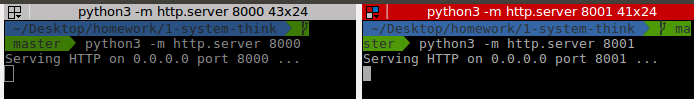
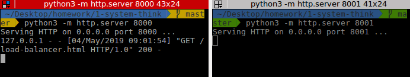
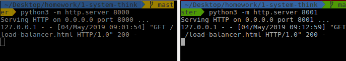

# Load banlancing bằng Nginx
## Giới thiệu
1. Làm một web tĩnh đơn giản (hello world), viết bằng python 
2. Cho web chạy trên 2 port khác nhau 
3. Cài đặt nginx để load balancing giữa 2 port trên (verify lại bằng web browser)

## Điều kiện tiên quyết
Cài đặt Nginx như sau:
- Cài đặt Nginx
Cài Nginx trên ubuntu bằng cách sử dụng apt 

```
    sudo apt update
    sudo apt install nginx
```
- Điều chỉnh tường lửa
Kiểm tra khả dụng ufw

```
    sudo ufw app list

    OutputAvailable applications:
    Nginx Full
    Nginx HTTP
    Nginx HTTPS
    OpenSSH
```
Cho phép truy cập trên port 80

```
    sudo ufw allow 'Nginx HTTP'
```
Xác minh thay đổi

```
    sudo ufw status

    OutputStatus: active

    To                         Action      From
    --                         ------      ----
    OpenSSH                    ALLOW       Anywhere                  
    Nginx HTTP                 ALLOW       Anywhere                  
    OpenSSH (v6)               ALLOW       Anywhere (v6)             
    Nginx HTTP (v6)            ALLOW       Anywhere (v6)
```

- Kiểm tra web server

Để đảm bảo service đang chạy: systemd

```
    systemctl status nginx

    Output● nginx.service - A high performance web server and a reverse proxy server
    Loaded: loaded (/lib/systemd/system/nginx.service; enabled; vendor preset: enabled)
    Active: active (running) since Fri 2018-04-20 16:08:19 UTC; 3 days ago
        Docs: man:nginx(8)
    Main PID: 2369 (nginx)
        Tasks: 2 (limit: 1153)
    CGroup: /system.slice/nginx.service
            ├─2369 nginx: master process /usr/sbin/nginx -g daemon on; master_process on;
            └─2380 nginx: worker process
```
Dùng browser truy cập Nginx thông qua địa chỉ IP:

```
    http://your_server_ip
```
Bạn sẽ thấy trang đích Nginx mặc định


## Cài đặt
- Sau khi đã cài đặt nginx, vào /etc/nginx/nginx.conf thêm
   
```
	upstream backend  {
	  server localhost:8000;
	  server localhost:8001;
	}


	server { listen 80;

		location / {
			proxy_pass http://backend;

		}
	}
```
vào phần đầu của http{}
 với 8000 và 8001 là 2 port cần load balancing

- Restart nginx để thực hiện load balancing 2 port trên
   
```
  systemctl restart nginx
```

- Tạo 1 file html tên load-balancer.html với nội dung sau:
   
```
  <!DOCTYPE html>
  <html lang="en">
  <head>
  </head>
  <body>
      Hello 
  </body>
  </html>
```

- Vào folder chứa file load-balancer.html, chạy server bằng python3 trên port 8000 và 8001
   
```
  python3 -m http.server 8000
  python3 -m http.server 8001
```

  

- Mở trình duyệt web, thử truy cập để lấy file load-balancer.html, trình duyệt sẽ hiện thị như sau:
   
  

- Mỗi lần ta request trang html load-balancer.html, thì Nginx sẽ thực hiện load balancing trên 2 port 8000 và 8001 để trả về cho trình duyệt, quan sát terminal
erminal

  

server đang phục vụ ở port 8000
Nếu ta request thêm lần nữa sẽ thấy

  

server đã chuyển sang phục vụ ở port 8001
Nginx đã thực hiện load balancing giữa 2 port này của server.

## Link tham khảo
https://www.codehub.vn/Lam-the-nao-de-cai-dat-Nginx-tren-Ubuntu-18-04-Quickstart
