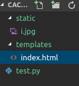
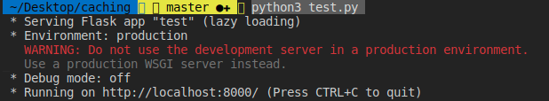
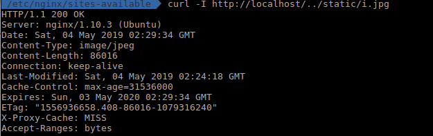
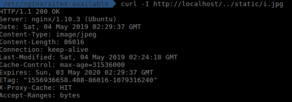

# Caching bằng Nginx
## Giới thiệu
Cài đặt nginx để phục vụ trang web tĩnh (trang web có hiển thị một bức ảnh). Tìm cách để bật module cache cho nginx (bức ảnh khi hoạt động sẽ nằm trong mem, ko phải fetch từ disk nữa)

## Điều kiện tiên quyết
Đã cài đặt Nginx, xem lại README.md ở phần Exe 1 - Load-balancer

## Cài đặt
- Xây dụng cây thư mục như sau

  

  - Trong đó file index.html sẽ hiện thị bức hình
  
```
    <!DOCTYPE html>
    <html lang="en">
    <head>
    </head>
    <body>
        
    </body>
    </html>
```
    Output

  

  - File hình i.jpg
  - File test.py để chạy file html
```
    from flask import Flask, render_template
    app = Flask(__name__)

    @app.route("/")
    def main():
        return render_template('index.html',port=8000)

    if __name__ == "__main__":
        app.run(host='localhost', port= 8000)
```
  ở đây mình chạy ở localhost port 8000

- Cấu hình lại file default trong /etc/nginx/sites-available như sau:
   
```
      proxy_cache_path /home/cpu11371/cache levels=1:2 keys_zone=my_zone:10m inactive=60m;
    server {
      listen 80 default_server;
      listen [::]:80 default_server;

      root /var/www/html;

      index index.html index.htm index.nginx-debian.html;

      server_name localhost;

      location / {
        proxy_pass http://localhost:8000;
      }

      location ~* \.(jpg|jpeg|png|gif|ico|css|js)$ {
        expires 365d;
        proxy_cache my_zone;
        add_header X-Proxy-Cache $upstream_cache_status;
        proxy_cache_valid any 30m;
        proxy_pass http://localhost:8000;
      }
    }

```
  Trong đó:
  - proxy_cache_path: lưu địa chỉ file cache của nginx, của mình là /home/cpu11371/cache
  - Khi server được request trả về file hình, ta sẽ dùng nginx để cache lại file hình đó và proxy cache path ở trên
  
```
    location ~* \.(jpg|jpeg|png|gif|ico|css|js)$ {
        expires 365d;
        proxy_cache my_zone;
        add_header X-Proxy-Cache $upstream_cache_status;
        proxy_cache_valid any 30m;
        proxy_pass http://localhost:8000;
      }
``` 

## Chạy và kiểm trả  
- Restart nginx 
 
```
    systemctl restart nginx
```
- Chạy file test.py để chạy server ở port 8000
   
```
    python3 test.py
```

  Output

  
  
- Dùng lệnh curl để yêu cầu server trả về file hình i.jpg
   
```
   curl -I http://localhost/../static/i.jpg
```
  Vì lần đầu nginx chưa cache lại nên X-Proxy-Cache sẽ là Miss

  

  Thử request lại lần 2, lúc này nginx đã cache file hình i.jpg nên X-Proxy-Cache là Hit

  

Link tham khảo:

https://www.nginx.com/blog/nginx-caching-guide/