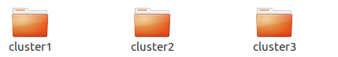
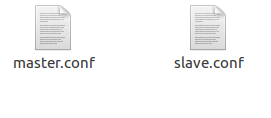
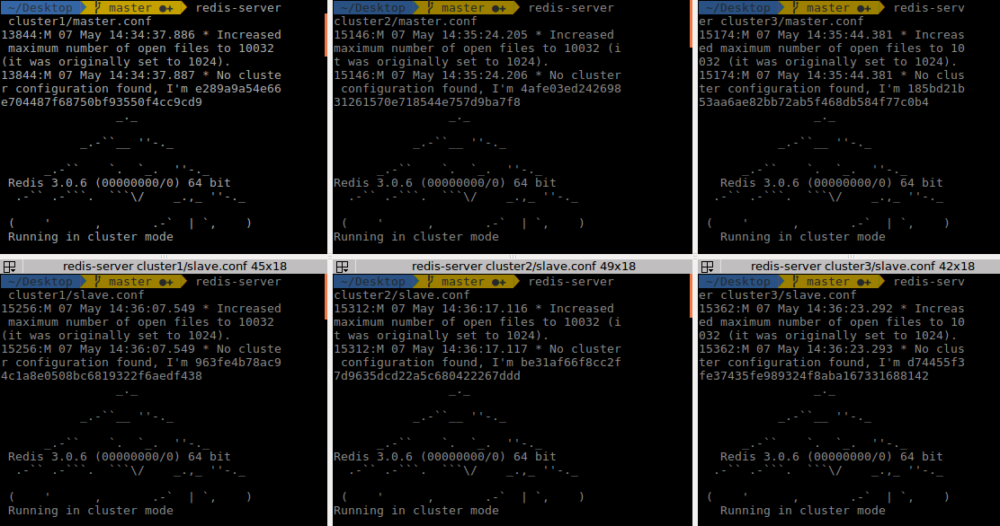
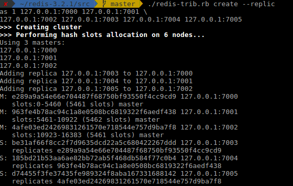
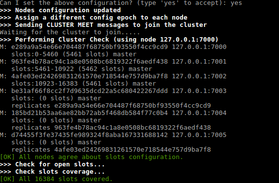
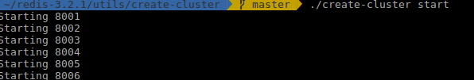
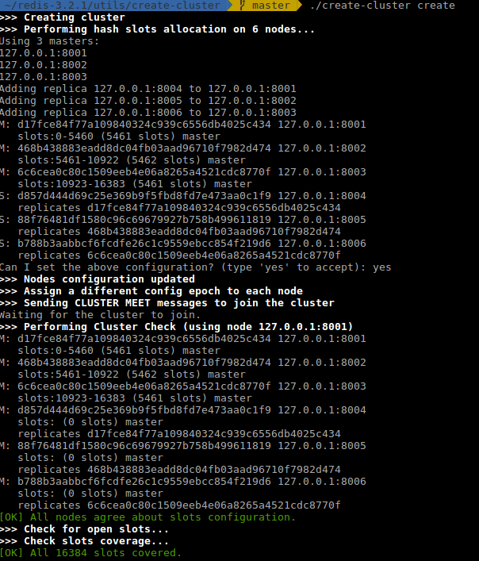
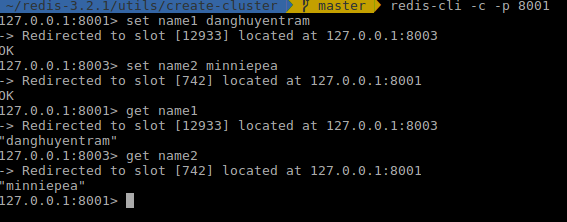
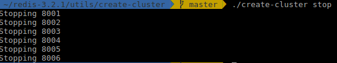

# Config cluster redis 3 node
## Giới thiệu
Config cluster redis 3 node, chạy cùng machine, khác port

## Điều kiện tiên quyết
Cài đặt Redis như sau
- Cài đặt dependencies:
   
```
    sudo apt-get update && sudo apt-get upgrade
    sudo apt install make gcc libc6-dev tcl
```
- Tải và cài Redis
   
```
    wget http://download.redis.io/redis-stable.tar.gz
    tar xvzf redis-stable.tar.gz
    cd redis-stable
    sudo make install
```
- Kiểm tra install thành công:
  
```
    make test
```
   Nếu thành công, console sẽ hiện output:

```
    \o/ All tests passed without errors!
```

#### Cấu trúc Redis cluster
Cluster hoạt động cần:
- Tối thiểu 3 Redis master nodes
- Tối thiểu 3 Redis slaves, 1 slave cho mỗi master


## Cài đặt và kiểm tra
Có 2 cách để tạo cluster:
- Cách 1: Tạo các Redis instance rỗng chạy cluster mode
- Cách 2: Cấu hình trong file create-cluster

### Cách 1: Tạo các Redis instance rỗng chạy cluster mode
- Tạo 3 folder để chứa các cặp node master và slave tương ứng
   
  

- Trong mỗi folder tạo 1 file master.conf và 1 file slave.conf. 
   
  

   Ở đây:
   - Các node master mình sẽ chạy ở các port: 7000,7002,7004
   - Các node slave mình sẽ chạy ở các port: 7001,7003,7005
  Bạn có thể chạy ở port khác nếu muốn.

- Cấu hình từng file master ở port 7000 như sau:
```
    port 7000
    pidfile /var/run/redis_7000.pid
    cluster-enabled yes
    cluster-config-file nodes-7000.conf
    cluster-node-timeout 15000
```
tương tự với 2 file master còn lại

- Cấu hình từng file slave ở port 7001 như sau:
```
      port 7001
      pidfile /var/run/redis_7001.pid
      cluster-enabled yes
      cluster-config-file nodes-7001.conf
      cluster-node-timeout 15000
```
    tương tự với 2 file slave còn lại
- Restart cả 6 node lên
   
```
   redis-server + <đường dẫn file node>
```
  

- Tạo cluster mới
   Với Redis 4 và 3
```
    ./redis-trib.rb create --replicas 1 127.0.0.1:7000 127.0.0.1:7001 \
    127.0.0.1:7002 127.0.0.1:7003 127.0.0.1:7004 127.0.0.1:7005
```
   Với Redis 5

```
    redis-cli --cluster create 127.0.0.1:7000 127.0.0.1:7001 \
    127.0.0.1:7002 127.0.0.1:7003 127.0.0.1:7004 127.0.0.1:7005 \
    --cluster-replicas 1
```
   Option:  --cluster-replicas 1 : nghĩa là tạo 1 slave cho mỗi master được tạo.

   Output:

  

  Redis-cli sẽ yêu cầu bạn cấu hình cluster

```
  Can I set the above configuration? (type 'yes' to accept):
```
  Nếu đồng ý, gõ yes, cluster sẽ được cấu hình và join vào, bây giờ chúng có thể nói chuyện được với nhau. Nếu mọi thứ đều thành công ta sẽ nhận được output:

  


### Cách 2: Dùng create-cluster script

- Ta sẽ cấu hình lại file create-cluster

Truy cập file create-cluster

```
   ~/redis-3.2.1/utils/create-cluster gedit create-cluster 
```

  

  Có thể thay đổi port và số node tùy vào yêu cầu, mặc định là 6 node gồm: 3 node master và 3 node default và bắt đầu từ port 8000

- Start cluster
   
```
  create-cluster start 
```
Output

  
Start 6 node bắt đầu từ port 8001 đến 8006

- Tạo cluster
   
```
  create-cluster create
```
Output

  
)

- Test cluster
  Dùng redis-cli để gửi nhận dữ liệu giữa các cluster

```
  redis-cli -c -p <port>
```
Output

  

- Dừng cluster

```
create-cluster stop
```
Output

  


## Link tham khảo 
- https://blog.usejournal.com/first-step-to-redis-cluster-7712e1c31847
- https://redis.io/topics/cluster-tutorial
- https://www.linode.com/docs/applications/big-data/how-to-install-and-configure-a-redis-cluster-on-ubuntu-1604/

