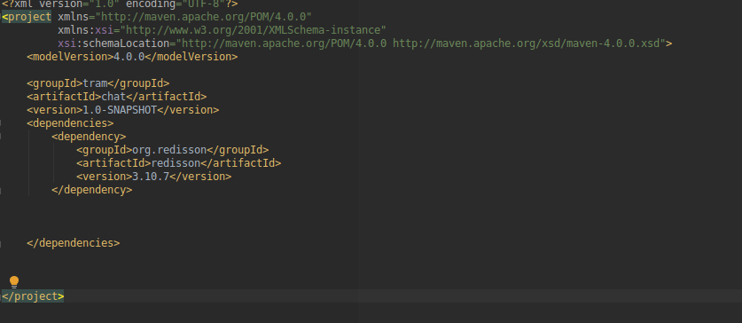
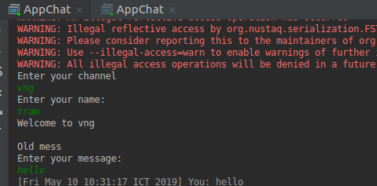
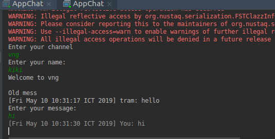
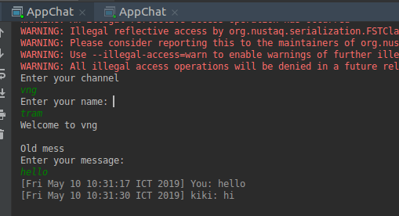

# Chat room
## Giới thiêu
Viết chương trình chat đơn giản sử dụng Redis pub/sub (Dùng Java, Maven, và thư viện Redisson). Lưu dữ liệu chat cho mỗi người, set expire trong 1 ngày.

## Điều kiện tiên quyết
### Cài đặt Redis
### Cài đặt Maven project 
Mình sử dụng Maven trên IntelliJ
Tải IntelliJ ở đây:
https://www.jetbrains.com/idea/download/#section=windows

## Cài đặt
- Tạo một project Maven trong IntelliJ
- Thêm dependency redisson vào file pom.xml
   
```
        <dependency>
                <groupId>org.redisson</groupId>
                <artifactId>redisson</artifactId>
                <version>3.10.7</version>
        </dependency>
```
Ta sẽ có được file pom.xml như sau

  

- Tạo class để lưu nội dung và thông tin message
Bạn có thể dùng String để lưu nội dung và thông tin message.
Ở đây, để rõ ràng mình sẽ lưu các thông tin về tên channel, tên người gửi, nội dung, ngày cho mỗi message vào class MessageContent

```
        public class MessageContent implements Serializable {
        String channel, name, mess;
        Date date;
```

- Subcribe và publish message
Topic object hỗ trợ cơ chế subcribe và publish của Redis
**Subcribe** Một redis object có thể subcribe một topic, nghĩa là đăng kí lắng nghe và nhận tất cả các message được publish trên topic đó .

**Publish** Một redis object có thể publish (đăng) một message lên topic cho các subcribe đăng kí topic này có thể lắng nghe được

- Mình sử dụng một Rlist kiểu MessageContent định nghĩa ở trên để lưu các message trong mỗi topic. Vì Rlist lưu theo thứ tự nên các message luôn giữ được thứ tự theo thời gian.
  
```
      RList<MessageContent> listmess;
```
  - Khởi tạo một Redisson cho mỗi người dùng khi tham gia vào chat room
  
```
   Config config = new Config();
        config.useSingleServer()
                .setAddress("redis://127.0.0.1:6379");
        client = Redisson.create(config);
```
  - Ta sẽ subcribe một topic: channel và lắng nghe các message trong topic này
  
```
     public void sub(String channel) {
        listmess = client.getList(channel); // lấy các message trước đó trong channel từ Rlist của channel đó

        RTopic subTopic = client.getTopic(channel); // subcribe vào topic tên channel
        subTopic.addListener(MessageContent.class, new MessageListener<MessageContent>() { // lắng nghe các message trên channel
            public void onMessage(CharSequence charSequence, MessageContent messageContent) {
                System.out.println(color[messageContent.getName().length()] +  messageContent.getMessageContent(name) + ANSI_RESET); // với môi message được lắng nghe, in ra màn hình
            }
        });
    }
```


- Với mỗi message, trước khi tạo một message, mình sẽ subcribe vào topic đó trước. Sau đó tạo message và publish nó vào topic để mọi subcriber có thể listen được
   
```
   public void pub() {
        // lấy tên channel và tên người gửi
        Scanner scanner = new Scanner(System.in);
        System.out.println("Enter your channel");
        String channel = scanner.nextLine();
       
       // subcribe vào channel
        sub(channel);

        System.out.println("Enter your name: ");
        name = scanner.nextLine();

        System.out.println("Welcome to "+ channel+"\n");

        // lấy các message cũ của channel lưu trong Rlist
        getOldMessage(channel,name);


        RTopic pubTopic = client.getTopic(channel);
        System.out.println("Enter your message: ");

        while (true) { // với mỗi message
            String content = scanner.nextLine();
            Date date = new Date();

            // Tạo đối tượng MessageContent lưu nội dung và thông tin message
            MessageContent messageContent = new MessageContent(channel, name, content, date);

            // thêm message vào Rlist của channel
            listmess.add(messageContent);
            listmess.expire(1, TimeUnit.DAYS);

            // publish message để các subcriber lắng nghe
            pubTopic.publish(messageContent);
        }

    }
```

## Chạy và kiểm tra
Mình sẽ thực hiện chat của 2 người trên topic: vng
- Chạy chương trình chat cho người nhất, nhập thông tin tên topic, tên người chat.
  
  Chương trình sẽ hiện thị các message cũ trong topic này, nhưng vì mình mới tạo topic nên vẫn chưa có

  

- Chạy chương trình chat cho người thứ hai, nhập thông tin tên topic, tên người chat.
    

Ở đây ta có thể thấy mess cũ là dòng chat của người thứ nhất vừa nhắn, chúng đã được lưu lại trong Rlist và publish lên topic nên ta mới có thể nhận được. Tiếp đến, ta nhập một message mới vào

- Quay trở lại người thứ nhất, message của người hai đã được lắng nghe và in ra màn hình
      

- Ta có thể chat với nhiều người, ở nhiều topic khác nhau

## Link tham khảo
- https://www.baeldung.com/redis-redisson?fbclid=IwAR33yMC3eOuGLd2GeuGm0Y6OUbQxY1OKhoEGCM9red78hMGJ3csBat2OBgs
- https://github.com/redisson/redisson/wiki/7.-Distributed-collections?fbclid=IwAR3I-RXGhvlpPdxETI8ApAY3_4XVlvZhWL2tmW7CuaOaJL8_AGCxGItfjLQ