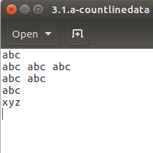
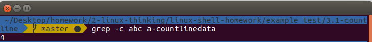
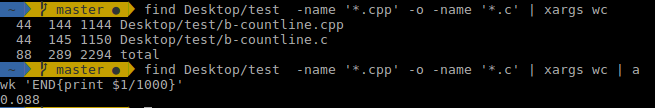
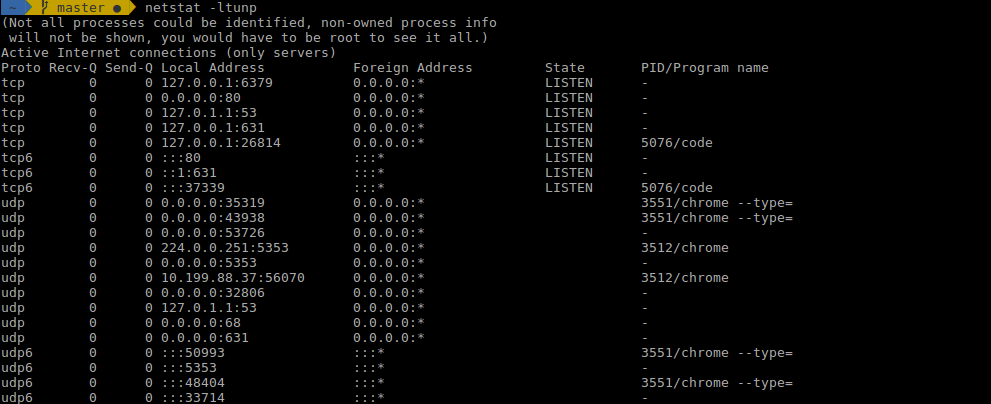
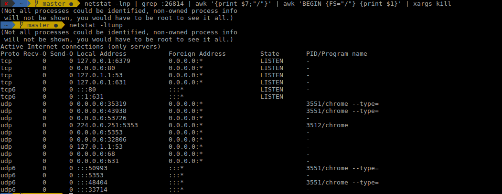
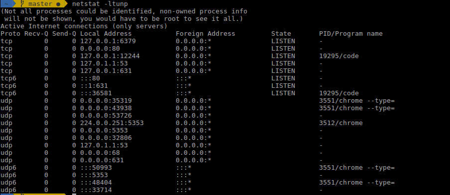

Mục lục
<!-- TOC -->    

- [1. Linux command](#1-linux-command)
	- [1.1 Basic command](#11-basic-command)
	- [1.2 Intermediate Commands](#12-intermediate-commands)
- [2 Bài tập](#2-b%C3%A0i-t%E1%BA%ADp)
	- [2.1 Processing texts](#21-processing-texts)
		- [2.1.1 Count the number of lines satisfying a specific pattern in a log file](#211-count-the-number-of-lines-satisfying-a-specific-pattern-in-a-log-file)
		- [2.1.2 Calculate KLOC of code C/C++ files in a directory](#212-calculate-kloc-of-code-cc-files-in-a-directory)
	- [2.2 System](#22-system)
		- [2.2.1 Kill multiple processes following a patterns (using awk, grep, xargs)](#221-kill-multiple-processes-following-a-patterns-using-awk-grep-xargs)
		- [2.2.2 Kill processes opening a specific port (using netstat, grep...)](#222-kill-processes-opening-a-specific-port-using-netstat-grep)
		- [2.2.3 List opennned ports, handles](#223-list-opennned-ports-handles)
		- [2.2.4 Find files via regular expressions, and remove them](#224-find-files-via-regular-expressions-and-remove-them)
		- [2.2.5 List, one at a time, all files larger than 100K in the /home/username directory tree. Give the user the option to delete or compress the file, then proceed to show the next one. Write to a logfile the names of all deleted files and the deletion times.](#225-list-one-at-a-time-all-files-larger-than-100k-in-the-homeusername-directory-tree-give-the-user-the-option-to-delete-or-compress-the-file-then-proceed-to-show-the-next-one-write-to-a-logfile-the-names-of-all-deleted-files-and-the-deletion-times)
	- [2.3 Shell Scripting](#23-shell-scripting)
<!-- /TOC -->


# 1. Linux command
## 1.1 Basic command
- pwd: trả về đường dẫn tuyệt đối - đường dẫn bắt đầu từ root


- ls: liệt kê tất cả các file có trong thư mục hiện tại. Hiện tất cả file ẩn: ls-a


- cd: di chuyển tới directory nào đó


- mkdir và rmdir. mkdir: tạo folder hay directory. rmdir: xóa directory, chỉ xóa được nếu directory rỗng. Để xóa directory có chứa file dùng rm


- rm: xóa file và cả directory. Dùng rm-r để chỉ xóa các directory.


- touch: tạo file


- man & --help: tìm thông tin và cách sử dụng cho các lệnh command


- cp: copy file, tham số đầu: vị trí file được copy, tham số thứ hai: file được copy đi đâu


- mv: move file, có thể vừa move vừa rename


- locate: tìm nơi chứa file có tên. Bỏ qua upcase lowercase dùng thêm -i. Ví dụ tìm file có tên chưa chữ "hello" dùng locate -i hello


## 1.2 Intermediate Commands

- echo: chuyển dữ liệu vào file. Ví dụ, tạo một file mới và có thể thêm dòng text vào như sau:
```
locate -i hello
```
- cat: hiển thị nội dung file


- nano, vi jed: text editor in linux command line

- sudo: "SuperUser Do" dùng quyền admin


- df: hiện thị disk space khả dụng với mỗi partition trong hẹ thống. Để hiện thị theo MB dùng "df -m"


- du: cho biết file đang lưu ở disk nào


- tar: nén, giải nén file bằng tarbal archive trong linux command line

- zip, unzip: nén và giải nén file abngwf zip archive

- uname: hiện thị thông tin về system linux, dùng "uname -a" để biết tất cả thông tin


# 2 Bài tập
## 2.1 Processing texts
### 2.1.1 Count the number of lines satisfying a specific pattern in a log file 

Syntax:
```
grep -c pattern [files]
```
Ta dùng grep để tìm các pattern chứa trong files, sau đó dùng cờ -c: count line để đếm số dòng chứa các pattern đó, nếu có nhiều pattern cùng chứa trên một dòng thì chỉ đếm 1 lần dòng đó

Example:
Ta có file countlinedata như sau:



Ta sẽ thử đếm số dòng có pattern là abc, kết quả như sau:




### 2.1.2 Calculate KLOC of code C/C++ files in a directory
Syntax:

```
find directory_path -name '*.cpp' -o -name '*.c' | xargs wc -l | awk 'END{print $1/1000}'
```

Ta dùng lệnh find để tìm các tìm trong directory các file có phần mở rộng là cpp và c. Dùng xargs để lấy kết quả từ lệnh find trước và wc: count line để đếm số dòng trong file đó. Cuối cùng sẽ cộng tổng số dòng lại thành total, dùng ``` awk 'END{print $1/1000}' ``` để lấy dòng cuối cùng ra và chia cho 1000 vì đang đếm Kilo line of code.

Example:




## 2.2 System
### 2.2.1 Kill multiple processes following a patterns (using awk, grep, xargs)
Syntax:

```
for KILLPID in `ps ax | grep 'processname' | awk ' { print $1;}'`; do    kill -9 $KILLPID; done
```

Ta dùng:

- ps ax tìm tất cả process đang chạy
- grep để lọc các process theo processname
- awk ' { print $1;}'` để lấy pid của các process
- kill -9 $KILLPID: kill process

### 2.2.2 Kill processes opening a specific port (using netstat, grep...)
- Liệt kê các process đang chạy ở các port
  
-l or --listening shows only the sockets currently listening for incoming connection.

-a or --all shows all sockets currently in use.

-t or --tcp shows the tcp sockets.

-u or --udp shows the udp sockets.

-n or --numeric shows the hosts and ports as numbers, instead of resolving in dns and looking in /etc/services.

```
netstat -ltunp
```



- Tìm pid process chạy ở port 26814
Dùng awk lấy pid/program name ở $7, tiếp tục dùng awk tách lấy pid ra
```
netstat -lnp | grep :26814 | awk '{print $7;"/"}' | awk 'BEGIN {FS="/"} {print $1}' 
```
- Dùng xargs kill process

```
netstat -lnp | grep :26814 | awk '{print $7;"/"}' | awk 'BEGIN {FS="/"} {print $1}' | xargs kill 
```

Sau đó kiểm tra lại bằng netstat -lnp, ta thấy process ở port 26814 đã bị kill




### 2.2.3 List opennned ports, handles
Syntax:

```
netstat -ltunp
```
Dùng netstat liệt kê các process chạy cả bằng tcp và udp




### 2.2.4 Find files via regular expressions, and remove them
- Tìm file bằng regex
Syntax:

```
find directory_path -regex '.*cpp'
```

- Sau đó remove file

```
xargs rm
```

Example: tìm các file có phần mở rộng trong /home/cpu11371/Desktop/homework là cpp và remove chúng
```
find /home/cpu11371/Desktop/homework -regex '.*cpp' | xargs rm
```

### 2.2.5 List, one at a time, all files larger than 100K in the /home/username directory tree. Give the user the option to delete or compress the file, then proceed to show the next one. Write to a logfile the names of all deleted files and the deletion times.
- List, one at a time, all files larger than 100K in the /home/username directory tree

```
#!/bin/bash

keydelete=1
keycompress=2


for f in `find /home/cpu11371/Downloads -type f -size +100k` 
do
	echo $f
	read -p "press 1 to delete or 2 to compress this file: " key
	if [ $key -eq $keydelete ]
		then
			
			now=$(date +"%T")
			echo -e "$f $now" >> /home/cpu11371/Downloads/log.txt
			rm -r $f
			echo "delete $f success"
			
		else
			if [ $key -eq $keycompress ]
				then
					zip -r $f.zip /home/cpu11371/Downloads
					echo "compress $f success"
			fi
					
	fi
done
```

- Với mỗi file có size >100k trong directory /home/cpu11371/Downloads  ta sẽ cho user lựa chọn delete hoặc compress file đó

```
for f in `find /home/cpu11371/Downloads -type f -size +100k` 
	echo $f
	read -p "press 1 to delete or 2 to 
```

  - Nếu user chọn delete file, nhấn phím 1. Đầu tiên ta sẽ lấy time hiện tại, viết tên file delete là time hiện tại vào file log.txt. Sau đó xóa file
```
if [ $key -eq $keydelete ]
		then
			
			now=$(date +"%T")
			echo -e "$f $now" >> /home/cpu11371/Downloads/log.txt
			rm -r $f
			echo "delete $f success"
```

  - Nếu user chọn compress file, nhấn phím 2. Thực hiện compress file bằng lệnh zip

```
if [ $key -eq $keycompress ]
				then
					zip -r $f.zip /home/cpu11371/Downloads
					echo "compress $f success"
			fi
```

## 2.3 Shell Scripting
Give you a text file which contains several numbers (may be serveral thousand), each on it's own line. You task is write a script which print the sum of all numbers in the file. I'm looking for effficient solution

Syntax:

```
awk '{sum+=$1} END {print sum}' filename 
```
Dùng awk đọc từng dòng trong file và cộng dồn lại, cuối cùng in ra màn hình tổng

Example:
Tính tổng các số trong file sample.data

- File sample.data
```
169
071
215
153
059
100
150
369
954
094
238
```
- Vào thư mục chứa file sample.data, dùng lệnh

```
awk '{sum+=$1} END {print sum}' sample.data
```

Output

```
2572
```

