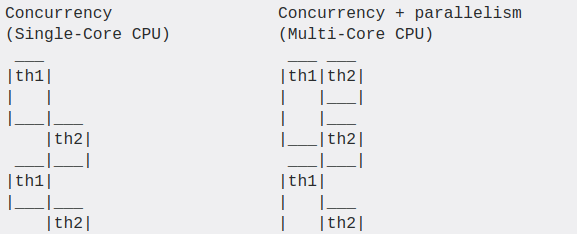
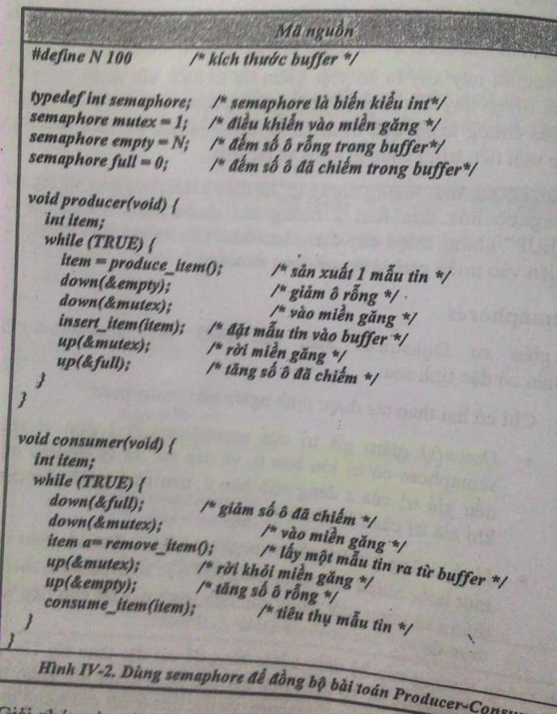
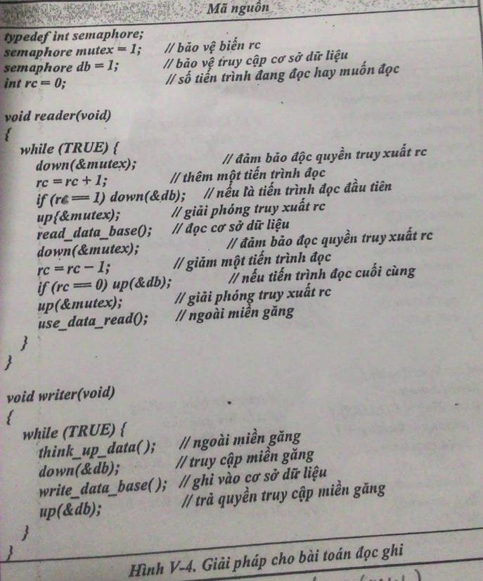
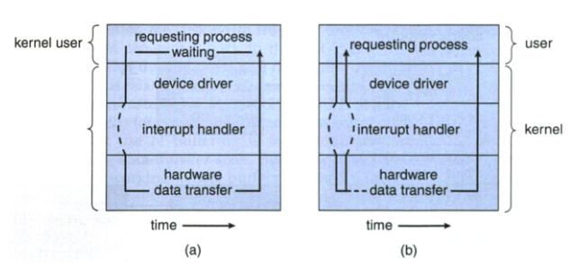

# Kiến thức về Linux System

<!-- TOC -->              
- [Kiến thức về Linux System](#Ki%E1%BA%BFn-th%E1%BB%A9c-v%E1%BB%81-Linux-System)
  - [2.1 File và File System](#21-File-v%C3%A0-File-System)
    - [File descriptor](#File-descriptor)
      - [Hoạt động của các file descriptor](#Ho%E1%BA%A1t-%C4%91%E1%BB%99ng-c%E1%BB%A7a-c%C3%A1c-file-descriptor)
    - [Linux file types](#Linux-file-types)
    - [Regular file](#Regular-file)
    - [Special file](#Special-file)
      - [Directory](#Directory)
      - [Links](#Links)
      - [Named pipe](#Named-pipe)
      - [Socket](#Socket)
      - [Block special file](#Block-special-file)
      - [Character special file:](#Character-special-file)
  - [2.2 Process Thread](#22-Process-Thread)
    - [2.2.1 Process](#221-Process)
    - [2.2.2 Thread](#222-Thread)
      - [Concurrency](#Concurrency)
      - [Parallelism](#Parallelism)
      - [So sánh concurrency và paralleism](#So-s%C3%A1nh-concurrency-v%C3%A0-paralleism)
      - [Kết hợp Concurrency và parallelism](#K%E1%BA%BFt-h%E1%BB%A3p-Concurrency-v%C3%A0-parallelism)
      - [Thread (tiểu trình):](#Thread-ti%E1%BB%83u-tr%C3%ACnh)
      - [So sánh process và thread](#So-s%C3%A1nh-process-v%C3%A0-thread)
      - [Thư viện POSIX thread](#Th%C6%B0-vi%E1%BB%87n-POSIX-thread)
      - [Multi-threading (đa luồng):](#Multi-threading-%C4%91a-lu%E1%BB%93ng)
      - [Vấn đề trong multi-threading](#V%E1%BA%A5n-%C4%91%E1%BB%81-trong-multi-threading)
      - [Race condition (tranh đoạt điều khiển)](#Race-condition-tranh-%C4%91o%E1%BA%A1t-%C4%91i%E1%BB%81u-khi%E1%BB%83n)
      - [Ngăn chặn race condition](#Ng%C4%83n-ch%E1%BA%B7n-race-condition)
      - [Deadlock](#Deadlock)
      - [Giải quyết deadlock](#Gi%E1%BA%A3i-quy%E1%BA%BFt-deadlock)
  - [2.4 Synchronization](#24-Synchronization)
    - [2.4.1 Semaphore](#241-Semaphore)
    - [2.4.2 Mutex](#242-Mutex)
    - [2.4.3 So sánh semaphore với mutex](#243-So-s%C3%A1nh-semaphore-v%E1%BB%9Bi-mutex)
    - [2.4.4 Reader writer problem](#244-Reader-writer-problem)
  - [2.5 Netwoking](#25-Netwoking)
    - [2.5.1 Socket TCP UDP](#251-Socket-TCP-UDP)
      - [Cơ chế gọi hàm trong lập trình socket](#C%C6%A1-ch%E1%BA%BF-g%E1%BB%8Di-h%C3%A0m-trong-l%E1%BA%ADp-tr%C3%ACnh-socket)
      - [Cách sử dụng socket TCP UDP](#C%C3%A1ch-s%E1%BB%AD-d%E1%BB%A5ng-socket-TCP-UDP)
    - [2.5.2 Nonblocking I/O và Blocking I/O](#252-Nonblocking-IO-v%C3%A0-Blocking-IO)
      - [Blocking I/O](#Blocking-IO)
      - [Nonblocking I/O](#Nonblocking-IO)
  - [3. Bài tập](#3-B%C3%A0i-t%E1%BA%ADp)


## 2.1 File và File System
Linux tuân theo một triết lý đó là: everything-is-a-file

Rất nhiều thứ trong Linux xuất hiện trong file system của bạn, nhưng nó không thật sự là file. Nó là các file đặc biệt đại diện cho các hardware device, system information, ...

Những file đặc biệt này được lưu ở pseudo hay virtual file system ví dụ như /dev: chứa các file đặc biệt đại diện cho devices, /proc: chứa các file đặc biệt đại diện cho system và process information

Link:
https://www.howtogeek.com/117939/htg-explains-what-everything-is-a-file-means-on-linux/

### File descriptor


Trong các hệ điều hành , file descriptor (FD) là một công cụ dùng để quản lý truy cập file, các thao tác nhập xuất, network socket, library files, file thực thi chương trình, chuột, bàn phím,…. Nói cho đơn giản thì toàn bộ mọi thứ trên  điều được biểu diễn dưới dạng file. Và FD là các số nguyên không âm đại diện cho những file này.

Khi ta mở hoặc tạo một file, kernel sẽ trả về giá trị file descriptor cho process tương ứng. Khi ta đóng file đó lại thì file descriptor này sẽ được giải phóng để cấp phát cho những lần mở file sau. Ví dụ. nếu người dùng A mở 10 tập tin để đọc thì sẽ có 10 FD tương ứng (có thể được đánh số lần lượt là 101, 102, 103,…, 110) và các giá trị này sẽ được lưu trong bảng danh sách chứa file descriptors.


Mỗi một process sẽ có một bảng danh sách file descriptor riêng do kernel quản lý, kernel sẽ chuyển danh sách này sang danh sách file table quản lý toàn bộ file được truy cập bởi tất cả các process. File table này sẽ lưu lại chế độ mà file đó đang được sử dụng (đọc, ghi, chèn). Và file table này sẽ được mapping qua một bảng thứ 3 là inode table thật sự quản lý các file nằm bên dưới. Khi một tiến trình muốn đọc hoặc ghi file, tiến trình này sẽ chuyển file descriptor cho kernel xử lý (bằng các lệnh system call) và kernel sẽ truy cập file này thay cho process. Process không thể truy cập trực tiếp các file hoặc inode table


#### Hoạt động của các file descriptor
Hệ Unix cung cấp các cách thức mà hoạt động theo file descriptor

- Tạo các file descriptor:
  - open(), open64(), creat(), creat64()
  - socket()
  - accept()
  - socketpair()
  - pipe()
- Chỉ số của file descriptor
  - dirfd()
  - fileno()
- Các hoạt động của một file descriptor
  - read(), write()
  - readv(), writev()
  - pread(), pwrite()
  - recv(), send()
  - recvmsg(), sendmsg() (cho phép gửi các FDs)
  - sendfile()
  - lseek(), lseek64()
  - fstat(), fstat64()
  - fchmod()
  - fchown()
  - fdopen()
  - gzdopen()
  - ftruncate()
  - fsync()
  - fdatasync()
  - fstatvfs()
- Thao tác trên nhiều tập tin
  - select(), pselect()
  - poll(), epoll()
  - kqueue()
- Thao tác trên bảng đặc tả tập tin
  - close()
  - dup() (bản sao của đặc tả tập tin hiện có đảm bảo được số lượng thấp nhất có sẵn đặc tả tập tin)
dup2() (đặc tả tập tin mới sẽ có giá trị được thông qua như một tham số)
  - fcntl (F_DUPFD)
  - fcntl (F_GETFD and F_SETFD)
- Hoạt động làm thay đổi trạng thái process
  - fchdir() (thiết lập thư mục làm việc hiện tại của quá trình dựa trên một thư mục đặc tả tập tin)
  - mmap() (bản đồ phạm vi của một tập tin vào không gian địa chỉ của quá trình)
- Block file
  - flock()
  - fcntl (F_GETLK, F_SETLK and F_SETLKW)
  - lockf()
- Socket
  - connect()
  - bind()
  - listen()
  - accept() (tạo một đặc tả tập tin cho một kết nối đến)
  - getsockname()
  - getpeername()
  - getsockopt()
  - setsockopt()
  - shutdown() (tắt một hoặc cả hai nửa của một kết nối full duplex)

Link: https://vi.wikipedia.org/wiki/%C4%90%E1%BA%B7c_t%E1%BA%A3_t%E1%BA%ADp_tin


### Linux file types
Trong linux kernel, file type được khai báo ở header file sys/stat.h


### Regular file
**Regular file**: một loại file, có thể được lưu trong file system. Hầu hết các file được sử dụng trực tiếp bởi user là regular files. Ví dụ như: executable file, text file, image file là regular file.

Khi data được read hay write vào regular file, kernel sẽ thực hiện hành động đó theo các quy tắc của filesystem. 

**Làm thế nào để biết một file là regular**
Trong bash, 
```
test -f file"
```

return status là 0 nếu file là regular file, 1 nếu là loại khác hoặc không tồn tại

Example:
```
test -f /etc/passwd; echo $?  # check for regular file, echo exit status of test
```
Output:
0

```
test -f /etc; echo $?         # directories are not regular files, so test fails
```
Output:
1

Hoặc có thể dùng stat
```
stat /etc/passwd
```

Output
```
  File: /etc/passwd
  Size: 2234        Blocks: 8          IO Block: 4096   regular file
Device: 801h/2049d  Inode: 132814      Links: 1
Access: (0644/-rw-r--r--)  Uid: (    0/    root)   Gid: (    0/    root)
Access: 2018-07-06 08:45:49.960000000 -0400
Modify: 2018-03-14 23:46:25.048004001 -0400
Change: 2018-03-14 23:46:25.052004001 -0400
 Birth: -
```

Link: https://www.computerhope.com/jargon/r/regular-file.htm

### Special file
Trong OS, special file là một kiểu file, có thể được lưu trong file system. Special file có thể được gọi là device file

Special file dùng để expose device như một file của file system. Special file cung cấp một giao diện tổng quát cho các thiết bị phần cứng (và thiết bị ảo được tạo và sử dụng bởi kernel), bởi vì tools cho file I/O có thể được dùng để truy cập device

Khi data được read hay write vào special file, operation sẽ thực hiện ngay lập tức và không tuân theo quy tắc của filesystem thông thường

Trong linux, có 6 loại special file

#### Directory
Thư mục là file nhị phân dùng để track và định vị các file khác và các thư mục khác. Định dạng nhị phân được sử dụng để các thư mục chứa một lượng lớn các tên thư mục có thể tìm kiếm nhanh chóng.

#### Links
Link bao gồm nhiều tên file, dùng để liên kết tới một single file trên đĩa. Nó nằm trong file system như regular file hay thư mục

Link gồm 2 loại: hard link và symbolic link

Hard link không thực sự liên kết tới file thông thường. Nó lưu lại 1 bản copy các thuộc tính của file gốc. Nếu file thông thường bị xóa, dữ liệu của nó có thể được truy xuất thông qua hard link

Symbolic link bao gồm 1 con trỏ, tên đường dẫn tới file thông thường. Nếu file thông thường bị xóa, dữ liệu của nó không thể truy xuất được nữa nếu dùng symbolic link

#### Named pipe
Named pipe là công cụ cho phép 2 hay nhiều system process có thẻ giao tiếp với nhau bằng cách dùng 1 file hoạt động như 1 pipe giữa chúng. Loại communication này được biết đến như interprocess communication hay IPC

#### Socket
Socket là công cụ dùng cho IPC. Điểm khác biệt giữa socket và pip là socket có thể cho phép 2 process giao tiếp với nhau ở các thiết bị khác hay thông qua mạng.

#### Block special file
Block special file hoạt dộng như một giao diện trực tiếp tới block device. Block device có thể là bất kì device mà có thể biểu diễn data I/O dưới dạng các blocks

**Làm thế nào để biết 1 file là block special**
Dùng lệnh
```
test -b file
```
nếu trả về 0 thì file là block special, 1 là kiểu khác hoặc không tồn tại

Example
```
test -b /dev/sda1; echo $?   # check for block special, echo exit status of test
```
Output: 0

```
test -b /dev/null; echo $?   # character special files are not block special
```
Output: 1

hoặc dùng stat:
```
stat /dev/sda1
```
Output:
```
  File: /dev/sda1
  Size: 0           Blocks: 0          IO Block: 4096   block special file
Device: 6h/6d Inode: 7998        Links: 1     Device type: 8,1
Access: (0660/brw-rw----)  Uid: (    0/    root)   Gid: (    6/    disk)
Access: 2018-07-08 06:41:25.540000000 -0400
Modify: 2018-07-08 06:41:25.540000000 -0400
Change: 2018-07-08 06:41:25.540000000 -0400
 Birth: -
```

#### Character special file:
Character special file khá giống với block device, nhưng data sẽ được write 1 character(8 bit hay 1 byte) tại 1 thời điểm

**Làm thế nào để biết 1 file là character special**
Dùng lệnh
```
test -c file
```

Example:
```
test -c /dev/null; echo $?
```
Output: 0

hoặc dùng stat
```
stat /dev/random
```
Output:
```
  File: /dev/random
  Size: 0           Blocks: 0          IO Block: 4096   character special file
Device: 6h/6d Inode: 6518        Links: 1     Device type: 1,8
Access: (0666/crw-rw-rw-)  Uid: (    0/    root)   Gid: (    0/    root)
Access: 2018-07-08 06:41:19.676000000 -0400
Modify: 2018-07-08 06:41:19.676000000 -0400
Change: 2018-07-08 06:41:19.676000000 -0400
 Birth: -
```

link: https://www.computerhope.com/jargon/s/special-file.htm

## 2.2 Process Thread
### 2.2.1 Process
Process (tiến trình): là một chương trình đang được thực thi (đang chạy). Nhưng, một chương trình không phải là một process. Vì chương trình là một file, hay một folder bị động nằm trên máy; Trong khi đó, một process là một chương trình đang hoạt động (đang chạy, đã được tải lên bộ nhớ chính để hoạt động).

Một chương trình có thể có hai (hay nhiều) process đang chạy, nhưng chúng được coi là hai (hay nhiều) quá trình độc lập với nhau.

**Các trạng thái của 1 process**


- New: process mới được tạo.
- Running: process đang được thực thi/ chạy.
- Waiting: process đợi I/O hoặc tín hiệu nào đó.
- Ready: process sẵn sàng được CPU chạy.
- Terminated: process hoàn thành việc.

Những process của một chương trình cần phải tải lên bộ nhớ chính (cụ thể là RAM) trước khi được CPU nhận và thực hiện những yêu cầu của chương trình.

Các bước chuyển quá trình của process:

(1): Những process được chương trình tạo ra, được sắp vào “hàng chờ” (hay còn gọi là stack).

(2): Process được CPU thấy và thực thi.

(3): Khi process quá bự, CPU phải nhả để thực hiện process khác. (bạn có thể tìm hiểu các thuật toán xử lý process của CPU)

(4): Khi process đã được thực hiện xong.

(5): Khi process đang thực hiện và yêu cầu I/O hay các tín hiệu khác. (ví dụ bạn cần file word in ra, process sẽ phải nói cho CPU, CPU gửi tín hiệu cho máy in, máy in in ra rồi báo lại CPU. Trong thời gian đó, để tiết kiệm thời gian, process này sẽ được chuyển qua trạng thái chờ, cho process khác vào thực hiện)

(6): Sau khi I/O hay tín hiệu đã đến, process được sắp lại vào “hàng chờ”, chờ thực thi.

**Process control block PCB**
Mỗi process khi tạo ra sẽ được lưu thông tin tại một PCB tương ứng.

Những thông tin được chứa trong PCB:
Trạng thái của process: 1 trong 5 trạng thái được liệt kê bên trên

1. Bộ đếm (program counter): chứa địa chỉ (hay trong ngôn ngữ lập trình C, ta gọi nó là con trỏ/ pointer) đến lệnh cần thực thi tiếp theo
2. Thanh ghi CPU: có kiểu khác nhau tùy vào kiến trúc máy tính
3. Thông tin định thời CPU: độ ưu tiên của các process, quy định process nào thì thực thi trước
4. Thông tin quản lý bộ nhớ: tùy hệ thống bộ nhớ của từng hệ điều hành
Trạng thái của các tín hiệu I/O: danh sách các I/O được sử dụng bởi các process
5. Thông tin về số lượng CPU, thời gian sử dụng thực tế, thời gian process được giữ CPU tối đa

Link: https://stream-hub.com/process-la-gi

**Memory layout**


1. Text segment
Text segment là một phần của program trong object file hoặc bộ nhớ, bao gồm các lệnh thực thi

Như một vùng nhớ, text segment có thể nằm dưới heap hoặc stack để ngăn heap và stack bị overflow khi overwriting nó

Textsegment thường chỉ read-only để ngăn program vô tình thay đổi các lệnh của nó.

2. Data segment
Data segment là một phần của vùng địa chỉ ảo trong program, bao gồm các biến toàn cục và biến static đã được khỏi tạo bởi chương trình.

Data segment không read-only, vì giá trị các biến có thể thay đổi lúc runtime

3. Stack
Stack: dùng để lưu vết các lời gọi hàm hoặc các event

Thường thì stack area và heap area sẽ liền kể nhau trong nhưng sẽ mở rộng theo chiều ngược lại với nhau, nếu stack pointer và heap pointer gặp nhau thì lúc đó đã hết memory trống. 

Stack area bao gồm program stack, theo cấu trúc là LIFO, nào ở higher part của memory. Stack pointer luôn trỏ vào đầu của stack. Tập các value của một function gọi là stack frame, stackframe có thể chỉ chứa duy nhất một địa chỉ trả về

4. Heap
Heap: dùng để lưu các dữ liệu / tham số phát sinh trong quá trình thực thi

Heap là segment lưu trữ của vùng nhớ động. 

Heap area bắt đầu từ cuối của BSS segment và mở rộng dần lên. Heap area quản lí bởi malloc, realloc, free. Heap area được chia sẽ bởi tất cả shared libraries và dynamically loaded trong process

link: https://www.geeksforgeeks.org/memory-layout-of-c-program/

**Khác nhau giữa Heap và Stack**

|       | Stack    | Heap   |
| :------------- | :----------: | -----------: |
| Vùng nhớ | được cấp phát theo từng block liền nhau  | được cấp phát ngẫy nhiên theo yêu cầu  |
| Cấp phát và thu hồi vùng nhớ | thực hiện tự đông bởi compiler | thực hiện bởi programmer |
| Chi phí | ít hơn | nhiều hơn |
| Cài đặt | khó | dễ |
| Thời gian truy cập | nhanh | chậm |
| Khuyết điểm | thiếu vùng nhớ | vùng nhớ bị phân mảnh |
| Kích thước| không thể thay đổi | có thể thay đổi  |

Link: https://www.geeksforgeeks.org/stack-vs-heap-memory-allocation/

### 2.2.2 Thread
#### Concurrency 


Concurrency là hai hay nhiều process khởi động, chạy và hoàn tất trong khoảng thời gian chồng chéo nhau. Vì trong 1 khoảng thời gian, 1 core máy tính chỉ có thể thực hiện được 1 lệnh duy nhất, nên nó sẽ thực hiện ngắt và chuyển đổi giữa các lệnh của các thread khác nhau. Điều này làm cho ta cảm thấy chúng đang chạy song song với nhau nhưng không phải

#### Parallelism


Parallelism là các process sẽ thực sự chạy song song, độc lập với nhau với nhau bằng các sự dụng multicore, mỗi process chạy trên 1 core riêng biệt

#### So sánh concurrency và paralleism
|  	| Semaphore 	| Mutex 	|
|-------------------------	|--------------------------------------------------------------------------------------------------------------------------------------------------------------	|-----------------------------------------------------------------------------------------------------------------------------	|
| Bản chất 	| Semaphore là cơ chế signalling 	| Mutex là cơ chế locking 	|
| Thể hiện 	| Semaphore là 1 giá trị integer 	| Mutex là 1 object 	|
| Cơ chế 	| Semaphore cho phép nhiều thread cùng truy cập vào hưu hạn các instance của tài nguyên 	| Mutex cho phép nhiều thread truy cập vào 1 tài nguyên duy nhất nhưng không đồng thời 	|
| Quyền sở hữu 	| Giá trị semaphore có thể được thay đổi bởi bất kì process đang giữ hoặc là trả lại tài nguyên 	| Mutex object lock chỉ được trả lại bởi 1 process duy nhất đó là process đã giữ lock đó 	|
| Loại 	| 2 loại: counting semaphore và binary semaphore 	| chỉ có 1 loại 	|
| Hoạt động 	| Giá trị semaphore được thay đổi bằng cách sử dụng wait() và signal() operation 	| Mutex object là lock và unlock bởi process yêu cầu hoặc trả lại tài nguyên 	|
| Tài nguyên bị chiếm giữ 	| Nếu mọi tài nguyên đều bị chiếm giữ, process yêu cầu tài nguyên sẽ chuyển sang wait() operation và tự block tới khi semaphore được tăng giá trị lên 1 đơn vị 	| Nếu mutext object bị khóa, process yêu cầu tài nguyên sẽ bị chờ và chuyển vào queue bởi system cho tới khi lock được trả ra 	|

#### Kết hợp Concurrency và parallelism


 Có thể kết hợp 2 cái lại để đạt hiệu quả tốt hơn.

 Ví dụ như: 
SERIAL > PARALLEL > CONCURRENT > CONCURRENT+PARALLEL

Link: https://stackoverflow.com/questions/1050222/what-is-the-difference-between-concurrency-and-parallelism

#### Thread (tiểu trình): 
là một tác vụ cơ sở độc lập nhìn từ CPU, nó bao gồm định danh tiểu trình, một con trỏ lệnh, một tập thanh ghi, stack. Các thread trong cùng 1 process có thể chia sẽ vùng mã nguồn, vùng dữ liệu và những tài nguyên dùng chung khác, ví dụ như tập tin đang mở. Một process có thể có nhiều thread

#### So sánh process và thread

|       | Process    | Thread   |
| :------------- | :----------: | -----------: |
| Cơ bản| Process là một chương trình nào đó được thực thi  | Thread là 1 phần của process |
| Tạo và ngắt | cần nhiều thời gian hơn | cần ít thời gian hơn |
| Context switch | cần nhiều thời gian hơn | cần ít thời gian hơn |
| Tài nguyên | tốn nhiều hơn| tốn ít hơn |
| Chia sẽ tài nguyên | các process độc lập với nhau |các thread có thể chia sẽ vùng nhớ với nhau|

Link: https://www.geeksforgeeks.org/difference-between-process-and-thread/

#### Thư viện POSIX thread 
là một chuẩn cho lập trình thread trong C/C++. Nó cho phép bạn tạo ra các ứng dụng chạy song song theo luồng, rất hiệu quả trên hệ thống nhiều bộ vi xử lý hoặc bộ vi xử lý nhiều nhân ở đó các luồng xử lý có thể được lập lịch chạy trên các bộ xử lý khác nhau do đó tăng được tốc độ xử lý song song hoặc xử lý phân tán.

#### Multi-threading (đa luồng): 
nhiều thread chạy song song nhau và thực hiện nhiệm vụ khác nhau cùng một lúc

#### Vấn đề trong multi-threading
Tranh chấp bộ nhớ, đồng bộ dữ liệu, phát hiện deadlock

#### Race condition (tranh đoạt điều khiển)
Xảy ra khi nhiều thread cùng truy cập và cùng lúc muốn thay đổi dữ liệu (có thể là 1 biến, 1 row trong db, 1 vùng shared data,...). Vì thuật toán chuyển đổi việc thực thi giữa các threads có thể xảy ra bất kì lúc nào nên không thể biết được thứ tự của các thread truy cập và thay đổi dữ liệu nên giá trị của data có thể sẽ không như mong muốn. 

Ví dụ: có 1 function
```
public class Counter {
    protected long count = 0;
    public void add(long value) {
         this.count = this.count + value;
    }
}
```
Giả sử có 2 thread A và B cùng thực thi phương thức add trên 1 instance của class Counter các bước sẽ như sau:
1. Đọc giá trị count từ memory.
2. Cộng value vào count.
3. Gán lại giá trị count.

Quá trình thực thi của thread A và B có thể diễn ra như sau:

```
this.count = 0
A: Đọc giá trị this.count 
B: Đọc giá trị this.count
B: Cộng giá trị a vào this.count 
B: Cập nhật lại giá trị this.count
A: Cộng giá trị b vào this.count
A: Cập nhật lại giá trị this.count
```


Vậy sau khi thực thi giá trị của this.count là this.count + a hoặc this.count + b, hoàn toàn không kiểm soát được!
Để ngăn chặn việc đó xảy ra phải để hàm add() được thực thi tuần tự. Có thể lock hoặc synchronized method add().

```
public class Counter {
    protected long count = 0;
    public synchronized void add(long value) {
         this.count = this.count + value;
    }
}
```

#### Ngăn chặn race condition
Một giải pháp tốt cho bài toán race condition phải thỏa được 4 điều kiện sau:
1. Tại 1 thời điểm chỉ có duy nhất một tiến trình được thực thi trong miền găng
2. Không được giả sử về tốc độ xử lí của CPU, hay số lượng CPU
3. Không có tiến trình nào đang ở ngoài miền găng mà lại khóa không cho tiến trình khác vào miền găng
4. Không tiến trình nào phải chờ đợi mãi mãi để vào miền găng

Các giải pháp busy waiting:
1. Nhóm sử dụng phần mềm
   - Sử dụng cờ hiệu
   - Kiểm tra luân phiên
   - Giải pháp Peterson
2. Nhóm có sự hỗ trợ phần cứng
   - Vô hiệu hóa ngắt
   - Chỉ thị TSL (test and set)

Giải pháp Sleep and wakeup
- Semaphore
- Mutex
- Monitor
- Message
- Barrier
  
#### Deadlock
Một tập tiến trình wor trạng thái deadlock nếu mỗi tiến trình trong tập này đang đợi một hoặc nhiều tài nguyên bị chiếm giữ bởi tiến trình khác trong nhóm

Ví tất cả các tiến trình đều chờ đợi, không có tiến trình nào có thể hoàn thành công việc và trả lại tài nguyên mà tiến trình khác đang chờ, nghĩa là tiến trình chờ đợi mãi mãi

**Điều kiện dẫn đến deadlock**
Thỏa 4 điều kiện sau cùng lúc sẽ xảy ra deadlock
1. Độc quyền: mỗi tài nguyên chỉ được cấp cho duy nhất một tiến trình hoặc không cấp cho tiến trình nào hết
2. Giữ và chờ: Tiến trình đang giữ tài nguyên và yêu cầu thêm tài nguyên mới
3. Không thu hồi: hệ thống không thể thu hồi tài nguyên cấp cho một tiến trình nào đó, trừ khi tiến trình này trả lại tài nguyên
4. Vòng tròn chờ: tồn tại một vòng trồn của các tiến trình, mỗi tiến trình chờ đợi tài nguyên của tiến trình kế tiếp trong vòng tròn

#### Giải quyết deadlock
4 phương pháp chính được sử dụng để giải quyết vấn đề deadlock:
1. Phớt lờ vấn đề deadlock
2. Nhận diện và phục hồi: cho phép deadlock xảy ra, nếu có thì nhận biết và tìm cách khắc phục
   - Mỗi loại tài nguyên chỉ có một
   - Mỗi loại tài nguyên có nhiều tài nguyên
   - Phục hồi bằng cách thu hồi tài nguyên
   - Phục hồi dựa vào rollback
   - Phục hồi bằng cách kết thúc tiến trình
3. Phòng tránh deadlock: bằng cách cấp phát tài nguyên một cách cẩn thận
   - Giải thuật nhà băng cho một loại tài nguyên
   - Giải thuật nhà băng cho nhiều loại tài nguyên
4. Ngặn chặn : bằng cách không cho một trong 4 điều kiện dẫn đến deadlock thỏa mãn
   - Điều kiện truy xuất độc quyền
   - Điều kiện giữ và yêu cầu tài nguyên mới
   - Điều kiện không thu hồi tài nguyên
   - Điều kiện vòng lặp

## 2.4 Synchronization
### 2.4.1 Semaphore
Semaphore  s là một biến có đặc tính như sau:
- Chỉ có 2 thao tác được định nghĩa trên semaphore
  - Down(s): giảm giá trị semaphore s đi 1 đơn vị nếu semaphore có giá trị >0 và tiếp tục xử lí. Nếu giá trị s đang nhỏ hơn 0, tiến trình phải chờ đến khi giá trị của s lớn hơn 0
  - Up(s): tăng giá trị của semaphore s lên 1 đơn vị. Nếu có một hoặc nhiều tiến trình đang chờ semaphore s, thì hệ thống sẽ chọn 1 trong các tiến trình này để cho tiếp tục thực thi

Cách thông thường các hệ điều hành dùng để cài đặt thao tác Up và Down của semaphore là vô hiệu hóa hết các ngắt trong khi kiểm tra giá trị semaphore, cập nhật semaphore, đặt tiên trình vào trạng thái ngủ. Những việc trên chỉ tốn vài dòng lệnh nên việc vô hiệu hóa các ngắt sẽ không ảnh hưởng nhiều đến hệ thống. Nếu hệ thống có nhiều CPU, thì mỗi semaphore phải được bảo vệ bởi một biến lock dùng chỉ thị TSL để chắc chắn rằng tại một thời điểm chỉ có một PCU truy xuất semaphore này

Ví dụ: bài toán producer và consumer được đồng bộ hóa bằng semaphore như sau:



Giải pháp này dùng 3 semaphore: 1 là full để đếm số ô đã chiếm, semaphore empty để đếm số ô trống, semaphore mutex chỉ cho phép một tiến trình có thể truy cập buffer tại 1 thời điểm. nếu semaphore được khởi động bằng 1 và được dùng để đồng bộ một hoặc nhiều tiến trình vào miền găng còn được gọi là semaphore nhị phân. Mỗi tiến trình phải thực hiện lệnh Down trước khi vào miền găng và lệnh Up khi ra khởi, sẽ đảm bảo chỉ một tiến trình có thể vào miền găng

### 2.4.2 Mutex
Mutex là phiên bản đặc biệt của semaphore, được dùng khi chức năng đếm của semaphore không cần thiết

Một mutex có thể 1 trong 2 trạng thái: khóa hoặc mở, thường là kiểu int, 0: mở, 1: khóa

### 2.4.3 So sánh semaphore với mutex

|  	| Semaphore 	| Mutex 	|
|-------------------------	|--------------------------------------------------------------------------------------------------------------------------------------------------------------	|-----------------------------------------------------------------------------------------------------------------------------	|
| Bản chất 	| Semaphore là cơ chế signalling 	| Mutex là cơ chế locking 	|
| Thể hiện 	| Semaphore là 1 giá trị integer 	| Mutex là 1 object 	|
| Cơ chế 	| Semaphore cho phép nhiều thread cùng truy cập vào hưu hạn các instance của tài nguyên 	| Mutex cho phép nhiều thread truy cập vào 1 tài nguyên duy nhất nhưng không đồng thời 	|
| Quyền sở hữu 	| Giá trị semaphore có thể được thay đổi bởi bất kì process đang giữ hoặc là trả lại tài nguyên 	| Mutex object lock chỉ được trả lại bởi 1 process duy nhất đó là process đã giữ lock đó 	|
| Loại 	| 2 loại: counting semaphore và binary semaphore 	| chỉ có 1 loại 	|
| Hoạt động 	| Giá trị semaphore được thay đổi bằng cách sử dụng wait() và signal() operation 	| Mutex object là lock và unlock bởi process yêu cầu hoặc trả lại tài nguyên 	|
| Tài nguyên bị chiếm giữ 	| Nếu mọi tài nguyên đều bị chiếm giữ, process yêu cầu tài nguyên sẽ chuyển sang wait() operation và tự block tới khi semaphore được tăng giá trị lên 1 đơn vị 	| Nếu mutext object bị khóa, process yêu cầu tài nguyên sẽ bị chờ và chuyển vào queue bởi system cho tới khi lock được trả ra 	|

link: https://techdifferences.com/difference-between-semaphore-and-mutex.html

### 2.4.4 Reader writer problem
Bài toán đọc ghi do Courtois và đông nghiệp đề xuất năm 1971. Xen xét một hệ thống đặt vé máy bay, có nhiều tiến trình muốn đọc và ghi. Hệ thống cho phép nhiều tiến trình có thể đọc dữ liệu cùng một lúc tuy nhiên chỉ cho duy nhất một tiến trình có thể ghi và không một tiến trình nào có thể đọc hoặc ghi lúc này.

Giải pháp là khi tiến trình đọc đầu tiên thực hiện lệnh down(db) trên semaphore db để vào miền găng. Các tiến trình đọc tiếp theo chỉ việc tăng biến đếm rc. Nếu tiến trình đọc cuối cùng đã đọc xong (rc=0) thì nó làm nhiệm vụ gọi up(db) để cho phép tiến trình ghi được vào miền găng. Gigiar pháp thỏa điều kiện cho phép nhiều tiến trình đọc được phép đọc cùng một lúc. 

Nếu hệ thống mà các tiến trình đọc liên tiếp thực thi và lauan phiên nhau thì có thể khóa tiến trình ghi dài hạn. Đề ngăn trường hợp này, phải thay đổi giải pháp một chút. Khi có một tiến trình ghi đến, thì các tiến trình đọc đến sau tiến trình ghi phai bị tạm dừng, mà không cho phép đọc cơ sở dữ liệu. Như vậy tiến trình ghi sẽ có cơ hội vào trong miền găng sau một khoảng thời gian nhất định.

Dưới đây là mã nguồn



## 2.5 Netwoking
### 2.5.1 Socket TCP UDP
Socket là một cổng logic mà một chương trình sử dụng để kết nối với một chương trình khác chạy trên một máy tính khác trên Internet. Chương trình mạng có thể sử dụng nhiều. Socket cùng một lúc, nhờ đó nhiều chương trình có thể sử dụng Internet cùng một lúc.

Có 2 loại socket:
- Stream Socket: Dựa trên giao thức TCP( Tranmission Control Protocol) việc truyền dữ liệu chỉ thực hiện giữa 2 quá trình đã thiết lập kết nối. Giao thức này đảm bảo dữ liệu được truyền đến nơi nhận một cách đáng tin cậy, đúng thứ tự nhờ vào cơ chế quản lý luồng lưu thông trên mạng và cơ chế chống tắc nghẽn.
- Datagram Socket: Dựa trên giao thức UDP( User Datagram Protocol) việc truyền dữ liệu không yêu cầu có sự thiết lập kết nối giữa 2 quá trình. Ngược lại với giao thức TCP thì dữ liệu được truyền theo giao thức UDP không được tin cậy, có thế không đúng trình tự và lặp lại. Tuy nhiên vì nó không yêu cầu thiết lập kết nối không phải có những cơ chế phức tạp nên tốc độ nhanh…ứng dụng cho các ứng dụng truyền dữ liệu nhanh như chat, game…..

Port: Port xác định duy nhất một quá trình (process) trên một máy trong mạng. Hay nói cách khác là cách mà phân biệt giữa các ứng dụng.
VD: Khi máy bạn chạy nhiều ứng dụng mạng như Yahoo,Firefox, game online… . Ví dụ chương Yahoo sử dụng ( port 5150 hay 5050)  thì khi ai đó gửi tin nhắn đến cho bạn, lúc tin nhắn đến máy bạn nó sẽ dựa vào port để nhận biết đó là chương trình Yahoo ( port 5150) chứ ko pải là chương trình khác. Sau đó thông tin sẽ đc xử lý và hiễn thị tin nhắn lên.

#### Cơ chế gọi hàm trong lập trình socket
**TCP**


**UDP**


TCP :
- Dùng cho mạng WAN 
- Không cho phép mất gói tin 
- Đảm bảo việc truyền dữ liệu 
- Tốc độ truyền thấp hơn UDP

UDP: 
- Dùng cho mạng LAN 
- Cho phép mất dữ liệu 
- Không đảm bảo.
- Tốc độ truyền cao, VolP truyền tốt qua UDP

TCP hoạt động theo hướng kết nối (connection-oriented), trước khi truyền dữ liệu giữa 2 máy, nó thiết lập một kết nối giữa 2 máy theo phương thức "bắt tay 3 bước (three-way-hand-shake)" bằng cách gửi gói tin ACK từ máy đích sang máy nhận, trong suốt quá trình truyền gói tin, máy gửi yêu cầu máy đích xác nhận đã nhận đủ các gói tin đã gửi, nếu có gói tin bị mất, máy đích sẽ yêu cầu máy gửi gửi lại, thường xuyên kiểm tra gói tin có bị lỗi hay ko, ngoài ra còn cho phép qui định số lượng gói tin được gửi trong một lần gửi (window-sizing), điều này đảm bảo máy nhận nhận được đầy đủ các gói tin mà máy gửi gửi đi --> truyền dữ liệu chậm hơn UDP nhưng đáng tin cậy hơn UDP 

UDP hoạt động theo hướng ko kết nối (connectionless), ko y/c thiết lập kết nối giữa 2 máy gửi và nhận, ko có sự đảm bảo gói tin khi truyền đi cũng như ko thông báo về việc mất gói tin, ko kiểm tra lỗi của gói tin

Link: https://giai-ma.blogspot.com/2016/04/so-sanh-2-giao-thuc-tcp-va-udp.html

#### Cách sử dụng socket TCP UDP
**Server**
1. Setup socket
Cả client và server đều cần setup socket
```
int socket(int domain,int type,int protocol);
```
Trong đó:
- domain: AF_INET cho IPv4 hoặc AF_INET6 cho IPv6 
- type:
  - SOCK_STREAM cho TCP
  - SOCK_DGRAM cho UDP
- protocol: 0
- Ví dụ: 
```
int sockfd = socket(AF_INET, SOCK_STREAM,0);
```

2. Binding (ở server)
Chỉ có server binding
```
int bind(int sockfd, const struct sockaddr *my_addr,
socklen_t addrlen);
```
Trong đó:
- sockfd: file descriptor socket()
- my_addr:
  - Cấu trúc là struct sockaddr_in đối với IPv4
  - cast (struc sockaddr_in*) thành (struct sockaddr*)
  ```
  struct sockaddr_in {
  short sin_family; // e.g. AF_INET
  unsigned short sin_port; // e.g. htons(3490)‏
  struct in_addr sin_addr; // see struct in_addr, below
  char sin_zero[8]; // zero this if you want to
  };
  struct in_addr {
  unsigned long s_addr; // load with inet_aton()‏
  }; 
  ```
- addrlen: size của sockaddr_in
- Ví dụ:
  
```
  struct sockaddr_in saddr;
  int sockfd;
  unsigned short port = 80;
  if((sockfd=socket(AF_INET, SOCK_STREAM, 0) < 0) { // from back a couple slides
  printf(“Error creating socket\n”);
  ...
  }
  memset(&saddr, '\0', sizeof(saddr)); // zero structure out
  saddr.sin_family = AF_INET; // match the socket() call
  saddr.sin_addr.s_addr = htonl(INADDR_ANY); // bind to any local address
  saddr.sin_port = htons(port); // specify port to listen on
  if((bind(sockfd, (struct sockaddr *) &saddr, sizeof(saddr)) < 0) { // bind!
  printf(“Error binding\n”);
  ...
  } 
```
- htonl(), htons()
  - Byte ordering:
    - Network order là big-edian
    - Host order có thể là big hoặc little-edian( x86 là little, SPARC là big)
  - Chuyển đổi:
    - htons(), htonl(): host to network short/long
    - ntohs(), ntohl(): network order to host short/long
  - Cần chuyển đổi: address, port,...

3. Listen(server)
Server sẽ lắng nghe

```
int listen(int sockfd,int backlog);
```

- sockfd: file descriptor socket()
- backlog: số connection đang chờ xử lí trong queue
- Ví dụ
```
listen(sockfd,5)
```

4. Accept (server)
Server sẽ accept các connection tới

```
int accept(int sockfd,struct sockaddr *addr,socklen_t *addrlen)
```
- sockfd: file descriptor socket()
- addr: trỏ tới nơi lưu client address, (struct sockaddr_in *) cast thành (struct sockaddr *)
- addrlen: trỏ tới nơi lưu size của addr, có thể là sizeof(*addr)
- Ví dụ:
```
int isock=accept(sockfd,(struct sockaddr_in*)&caddr,&clen);
```

Sau 4 bước trên ta đã có 1 server hoàn chỉnh
```
struct sockaddr_in saddr, caddr;
int sockfd, clen, isock;
unsigned short port = 80;
if((sockfd=socket(AF_INET, SOCK_STREAM, 0) < 0) { // from back a couple slides
 printf(“Error creating socket\n”);
 ...
}
memset(&saddr, '\0', sizeof(saddr)); // zero structure out
saddr.sin_family = AF_INET; // match the socket() call
saddr.sin_addr.s_addr = htonl(INADDR_ANY); // bind to any local address
saddr.sin_port = htons(port); // specify port to listen on
if((bind(sockfd, (struct sockaddr *) &saddr, sizeof(saddr)) < 0) { // bind!
 printf(“Error binding\n”);
 ...
}
if(listen(sockfd, 5) < 0) { // listen for incoming connections
 printf(“Error listening\n”);
 ...
}
clen=sizeof(caddr)‏
if((isock=accept(sockfd, (struct sockaddr *) &caddr, &clen)) < 0) { // accept one
 printf(“Error accepting\n”);
 ...
} 
```

**Client**
Client chỉ cần connect tới server
```
int connect(int sockfd,const struct sockaddr
*saddr,socklen_t addrlen);
```

Ví dụ:
```
connect(sockfd,(struct sockaddr*)&saddr,sizeof
(saddr));
```

Nếu bạn send data tới www.google.com, thì phải cần DNS để chuyển từ hostname sang IP và ngược lại. DNS là tập dữ liệu của các host entries

```
struct hostent {
 char *h_name; // official hostname
 char **h_aliases; // vector of alternative hostnames
 int h_addrtype; // address type, e.g. AF_INET
 int h_length; // length of address in bytes, e.g. 4 for IPv4
 char **h_addr_list; // vector of addresses
 char *h_addr; // first host address, synonym for h_addr_list[0]
}; 
```

- hostname -> IP address
```
struct hostent *gethostbyname(const char *name);
```

- IP address -> hostname
```
struct hostent *gethostbyaddr(const char *addr,int len,int 
type);
```
Ta có được một đoạn mã cho client

```
struct sockaddr_in saddr;
struct hostent *h;
int sockfd, connfd;
unsigned short port = 80;
if((sockfd=socket(AF_INET, SOCK_STREAM, 0) < 0) { // from back a couple slides
 printf(“Error creating socket\n”);
 ...
}
if((h=gethostbyname(“www.slashdot.org”)) == NULL) { // Lookup the hostname
 printf(“Unknown host\n”);
 ...
}
memset(&saddr, '\0', sizeof(saddr)); // zero structure out
saddr.sin_family = AF_INET; // match the socket() call
memcpy((char *) &saddr.sin_addr.s_addr, h->h_addr_list[0], h->h_length); // copy the address
saddr.sin_port = htons(port); // specify port to connect to
if((connfd=connect(sockfd, (struct sockaddr *) &saddr, sizeof(saddr)) < 0) { // connect!
 printf(“Cannot connect\n”);
 ...
} 
```

**Đóng socket**
```
int close(int sockfd);
```

**Tóm lại**
- Client:socket()->connect()->I/O->close()
- Server:socket()->bind()->listen()->accept()->I/O->close()

link: https://www.cs.cmu.edu/~srini/15-441/S10/lectures/r01-sockets.pdf

### 2.5.2 Nonblocking I/O và Blocking I/O
#### Blocking I/O
Yêu cầu thực thi một IO operation, sau khi hoàn thành thì trả kết quả lại. Pocess/Theard gọi bị block cho đến khi có kết quả trả về hoặc xảy ra ngoại lệ. Thực hiện đọc ghi trên input/outputstream

Trong cơ chế blocking I/O, khi process thực hiện một I/O operation chưa sẵn sàng và bị đẩy vào chế độ sleep, nó đăng ký bản thân vào một hàng đợi gọi là wait queue trên file ấy. Khi một file đã sẵn sàng để đọc và ghi (điều này thường do driver của file ấy quyết định), tất cả process đang chờ sự thay đổi của file trong wait queue của event tương ứng được đánh thức.

#### Nonblocking I/O
Yêu cầu thực thi IO operation và trả về ngay lập tức (timeout = 0). Nếu operation chưa sẵn sàng để thực hiện thì thử lại sau. Tương đương với kiểm tra IO operatio có sẵn sàng ngay hay không, nếu có thì thực hiện và trả về, nếu không thì thông báo thử lại sau. Thực hiện đọc ghi trên buffer

Nonblocking I/O thì khác, hành động thử đọc/ghi dữ liệu lên file được gọi là polling (thăm dò). Nếu không có cơ chế thông báo thời điểm file operation sẵn sàng để thực hiện, chương trình  sẽ phải liên tục polling một file trong một vòng lặp vô hạn cho tới khi thành công.



Hình trên:
- (a) Blocking IO system call sẽ không trả về cho tới khi IO hoàn tất
- (b) Nonblocking IO system call sẽ trả về ngay lập tức, process sẽ thông báo lại sau khi IO hoàn tất

Link: http://faculty.salina.k-state.edu/tim/ossg/Device/blocking.html


## 3. Bài tập
- [ls](./ls/README.md)

- [tro choi xep bi](./tro-choi-xep-bi/README.md)
