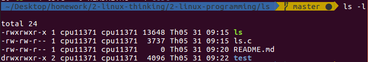

# Linux Command
## Giới thiệu
Viết chương trình C mô phỏng lại command ls -l



## Cài đặt
- Get pathname of the working dicretory
   
```
 if(!getcwd(pathname, sizeof(pathname)))
    die("Error getting pathname");
```

- Dùng scandir để lấy các file và folder trong directory lưu vào mảng file, các file này sẽ được sort theo alphabet

```
  count = scandir(pathname, &files, one, alphasort);
```

- Tính total của tất cả file trong directory
   
total int = Sum of (physical_blocks_in_use) * physical_block_size/ls_block_size) 
    -  ls_block_size is an arbitrary environment variable (normally 512 or 1024 bytes) 
    - physical_block_size is the OS dependent value of an internal block interface, which may or may not be connected to the underlying hardware. This value is normally 512b or 1k, but is completely dependent on OS. 

Vậy nên total = st_blocks*512/1024 = st_block/2

```
  int total=0;
  for(int i=0;i<count;i++){
    if (stat(files[i]->d_name, &statbuf) == 0  && (strcmp(".",files[i]->d_name)!=0 && strcmp("..",files[i]->d_name)!=0))
       total+=statbuf.st_blocks/2;
  }
    printf("total %d\n",total);
```

- In ra thông tin cho mỗi file trong directory
    -  Ta sẽ bỏ qua file . và .. vì chỉ cần quan tâm các file trong directory
  
```
    if (stat(files[i]->d_name, &statbuf) == 0 && (strcmp(".",files[i]->d_name)!=0 && strcmp("..",files[i]->d_name)!=0))
```

- Hàm stat trả về thông tin của file lưu vào statbuf, nếu thành công trả về 0
  
- Lấy permissionvà number of links của file

```
        printf("%10.10s", get_perms(statbuf.st_mode));
```

- Hàm getpwuid: lấy thông tin về user ứng với uid
  - st_uid: user id of owner
  - pw_name: username

```
   if (!getpwuid_r(statbuf.st_uid, &pwent, buf, sizeof(buf), &pwentp))
          printf(" %s ", pwent.pw_name);
        else
          printf(" %d ", statbuf.st_uid);
```

- Hàm getgrgrid: trả về con trỏ tới structure chứa broken-out field của record trong group db khớp với group id gid
  - gr_name: group name

```
if (!getgrgid_r (statbuf.st_gid, &grp, buf, sizeof(buf), &grpt))
          printf(" %s  ", grp.gr_name);
        else
          printf(" %d  ", statbuf.st_gid);
```

- Lấy size của file

```
        printf(" %5d ", (int)statbuf.st_size);
```
- Lấy thời gian tạo của file
  
```
localtime_r(&statbuf.st_mtime, &time);
        /* Get localized date string. */
        strftime(datestring, sizeof(datestring), "%b %d %H:%M", &time);

        printf(" %s", datestring);
```

- Lấy tên file, nếu file là directory thì tên file sẽ có màu xanh

```
 if (S_ISDIR(statbuf.st_mode)) 
              printf("\033[1;34m");

        printf(" %s \n",files[i]->d_name);

        // reset color
        printf("\033[0m");
```

## Chạy và kiểm tra
- Build:

```
gcc ls.c -o ls
```
- Run:

```
./ls
```
 Output:

```
 total 24
-rw-rw-r-- 1   cpu11371  cpu11371       0  May 31 09:20 README.md 
-rwxrwxr-x 1   cpu11371  cpu11371   13648  May 31 09:41 ls 
-rw-rw-r-- 1   cpu11371  cpu11371    3737  May 31 09:15 ls.c 
drwxrwxr-x 2   cpu11371  cpu11371    4096  May 31 09:22 test 
```