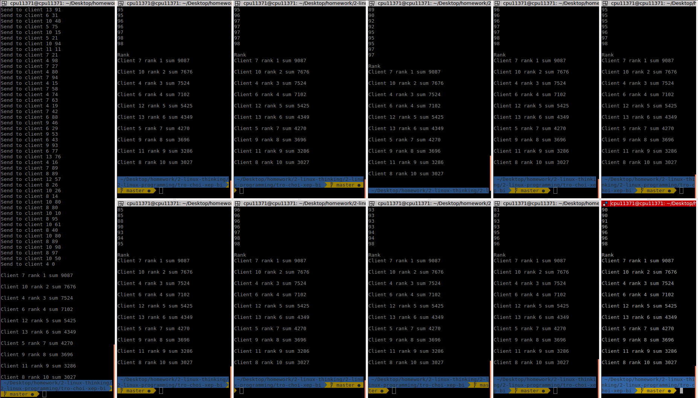

# Trò chơi xếp bi

## 1.Giới thiệu
### Mục tiêu

Biết cách xây dựng TCP Client, TCP Server
Vận dụng các kiến thức về Linux System ở trên để giải quyết bài toán, cụ thể là về Networking, Thread, Synchronization,...
Biết cách sử dụng các công cụ debug trong quá trình code.

### Mô tả

Vào mùa thu năm 2019, Bill và đồng bọn đã nghĩ ra một trò chơi hết sức kinh dị như sau: Cả bọn xây dựng một cửa hàng cung cấp bi với số lượng và chất lượng (kích thước) có giới hạn. Sau khi xây dựng xong cửa hàng, cả bọn tập trung tại một điểm và chạy đến cửa hàng để lấy ngẫu nhiên một bi về tổ của từng thằng, sau đó sắp xếp theo kích thước tăng dần của các bi. Một thời gian sau, cửa hàng hết bi và cả bọn tìm ra người chiến thắng bằng cách gửi số liệu bi về cho bác bán hàng, bác bán hàng tiến hành tính tính toán toán và thông báo kẻ thắng cuộc.

### Yêu cầu

Xây dựng một chương trình (console) với hai thành phần Client (Bill và đồng bọn) và server (Cửa hàng và bác bán hàng). Khi Server start nó khởi tạo ngẫu nhiên một mảng các phần tử số nguyên, với kích thước mảng ngẫu nhiên trong khoảng từ 100-1000 phần tử. Các Client mở kết nối đến Server và tiến hành lấy một phần tử trong mảng và ghi vào một file (tổ), file này chứa danh sách các số đã lấy theo thứ tự tăng dần (file này ở phía Client nhé). Sau khi Server thông báo mảng đã hết các phần tử, Client tiến hành gửi số liệu đã ghi (file) cho Server, Server tính toán và đưa ra bảng xếp hạng (file) và gửi cho tất cả Client.

**Xây dựng một TCP Server**:

Lắng nghe và accept kết nối đến từ nhiều Client.
Random kích thước mảng và giá trị các phần tử trong mảng.
Xử lý logic như yêu cầu trên

**Xây dựng Client**:

Connect đến Server
Request bi và ghi nhận bi vào file
Gửi số liệu bi cho Server

### Ràng buộc

2 < Số lượng client < 10
100 < Kích thước mảng < 1000

## 2. Ý tưởng
### Server
1. Nhập vào số lượng client
2. Server sẽ mở connection tới các client và chờ cho đến khi đủ số lượng client connect vào, mỗi client là 1 thread
3. Khi đủ client connect vào, server bắt đầu nhận request yêu cầu phát bi từ client và tiến hành gửi bi cho client
4. Khi server đã gửi hết bi đi, server sẽ gửi message "end of ball" đến tất cả client và chờ client gửi mảng bi kết quả lên
5. Khi đã nhận được hết kết quả từ client, server ghi file log kết quả bi cho từng client
6. Tiếp đến server tính sum, xếp rank, ghi log rank ở server và gửi rank cho tất cả client

### Client
1. Mở connect tới server
2. Sau khi kết nối thành công và có đủ client connect vào, client sẽ liên tục gửi request "send me a ball" đến server để server gửi ball về, cho đến khi server hết bi
3. Khi nhận được message "end of ball" từ server, client sort mảng bi và gửi mảng lên server
4. Khi server đã tính sum, rank xong, client sẽ chờ nhận rank từ server và ghi log lại file rank
   
## 3. Cài đặt
Xem phần src code về server.c và client.c để rõ hơn
### Server
1. Nhập vào số client
2. Setup server:
- Setup socket
- Binding
- Listening
- Accept:
  - Với mỗi client connect tới và được accept bởi server (nếu 2< số client < 10):
    - Tạo một object client và khởi tạo các giá trị: socket, rank, sum, thread cho object đó và lưu vào mảng clientArr
    - Chờ đến khi đủ số client connect vào
- Khi đã đủ số client connect vào: server tạo cho mỗi client 1 thread
- Với mỗi thread sẽ xử lí:
  - ServerSendBallToClient(newsock): server phát bi cho tất cả client cho đến khi hết
  - Khi đã hết bi server sẽ yêu cầu client gửi file result lên, tính sum dựa trên file result đó và xếp hạng các client, ghi kết quả rank ra file, gửi kết quả rank về cho client

### Client
1. Setup client
2. Connect to server
3. Khi đã connect được với server thì liên tục gửi request: "Send me a number" để yêu cầu server gửi bi về, mỗi lần nhận được bi sẽ ghi xuống file log
4. Khi đã hết bi trên server thì bắt đầu đọc file log lên, sort, gửi kết quả lên server
5. Sau khi server tính rank xong sẽ gửi trả lại rank cho client, client sẽ ghi lại file rank

### 4. Chạy và kiểm tra
## Build
- Build server:

```
gcc server.c -o server -lpthread
```

- Build client:
  
```
gcc client.c -o client
```

- Run

	- Run server
```
./server
```

Output:

```
Enter number client:10
[+]Server Socket is created.
[+]Bind to port 4444
[+]Listening....
Waiting for 10 client connect:
```

	- Run 10 client

```
./client
```

Output server, client


