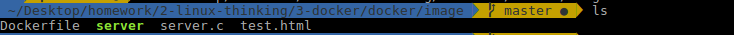
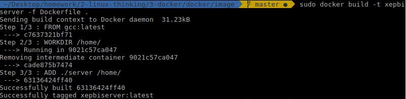
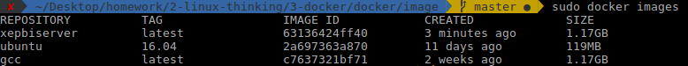
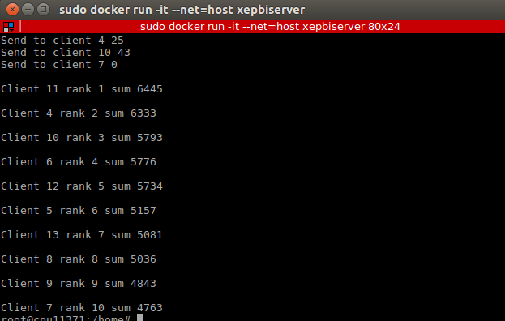
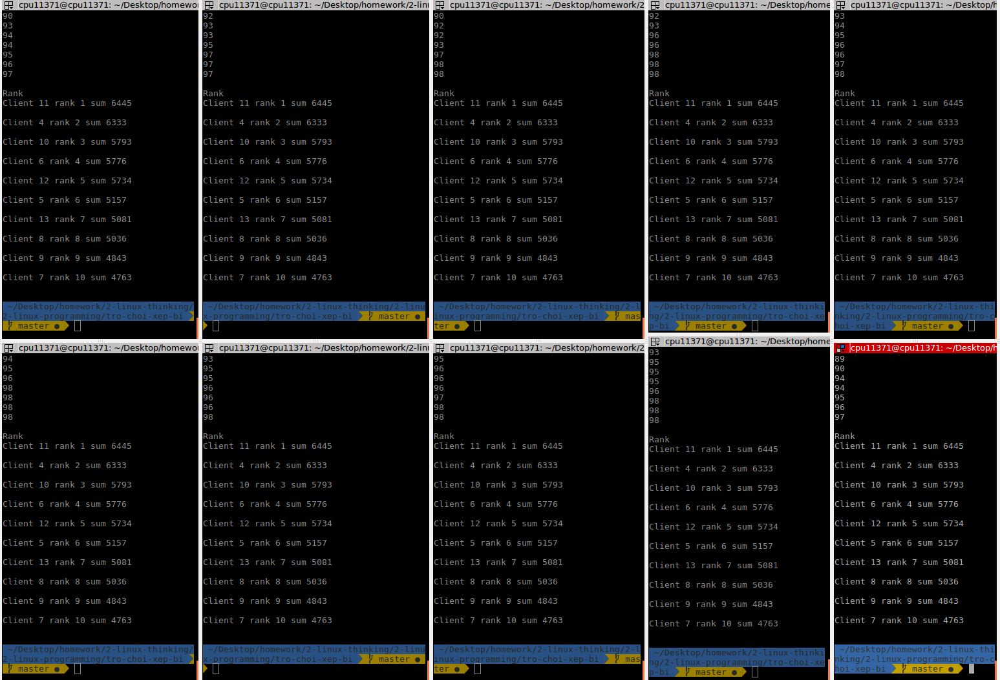

# Docker


<!-- TOC -->      

  - [1. Docker là gì](#1-docker-l%C3%A0-g%C3%AC)
  - [2. Một số khái niệm liên quan](#2-m%E1%BB%99t-s%E1%BB%91-kh%C3%A1i-ni%E1%BB%87m-li%C3%AAn-quan)
  - [3. Kiến trúc của Docker](#3-ki%E1%BA%BFn-tr%C3%BAc-c%E1%BB%A7a-docker)
  - [4. Quy trình thực thi của một hệ thống sử dụng Docker](#4-quy-tr%C3%ACnh-th%E1%BB%B1c-thi-c%E1%BB%A7a-m%E1%BB%99t-h%E1%BB%87-th%E1%BB%91ng-s%E1%BB%AD-d%E1%BB%A5ng-docker)
    - [4.1 Build](#41-build)
    - [4.2 Push](#42-push)
    - [4.3 Pull, Run](#43-pull-run)
  - [5. Cài đặt Docker](#5-c%C3%A0i-%C4%91%E1%BA%B7t-docker)
  - [6. Các lệnh cơ bản với Docker](#6-c%C3%A1c-l%E1%BB%87nh-c%C6%A1-b%E1%BA%A3n-v%E1%BB%9Bi-docker)
  - [7. Dockerfile](#7-dockerfile)
  - [8. Deploy server xepbi len docker](#8-deploy-server-xepbi-len-docker)


## 1. Docker là gì
Docker là một nền tảng để cung cấp cách để building, deploying và running ứng dụng một cách dễ dàng trên nền tảng ảo hóa. Có nhiều công nghệ Container khác như Solaris Zones, BSD jails, và LXC. 

Docker đang phát triển, phổ biến và nhanh chóng vì:
- **Easy of use**: Docker rất dễ cho mọi người sử dụng từ developers, systems admins, architects…v…v.. nó tận dụng lợi thế của container để build, test nhanh chóng. Có thể đóng gói ứng dụng trên laptop của họ và chạy trên public cloud, private cloud..v.v… Câu thần chú là “Build once, run anywhere”.
- **Speed**: Docker container rất nhẹ và nhanh, bạn có thể tạo và chạy docker container trong vài giây so sánh với VMs thì mỗi lần chạy VMs cần rất nhiều thời gian khởi động.
- **DockerHub**:  là một “app store for docker images”. trên DockerHub có hàng ngàn public images được tạo bởi cộng đồng. Dễ dàng tìm thấy những image mà bạn cần và chỉ cần pull về và sử dụng với một số sửa đổi nhỏ.
- **Modularity and Scalability**: Bạn có thể chia nhỏ những chức năng của ứng dụng thành các container riêng lẻ. Ví dụng Database chạy trên một container và Redis cache có thể chạy trên một container khác trong khi ứng dụng Node.js lại chạy trên một cái khác nữa. Với Docker, rất dễ để liên kết các container với nhau để tạo thành một ứng dụng, làm cho nó dễ dàng scale, update các thành phần độc lập với nhau.

## 2. Một số khái niệm liên quan
- **Images**: hiểu nôm na là một khuôn mẫu để tạo một container. Thường thì image sẽ base trên 1 image khác với những tùy chỉnh thêm. ví dụ bạn build 1 image dựa trên image ubuntu để chạy Apache web service và ứng dụng của bạn và những tùy chỉnh, cấu hình để ứng dụng của bạn có thể chạy được. Bạn có thể tự build một image riêng cho mình hoặc sử dụng những image được publish từ cộng đồng Docker Hub. Một image sẽ được build dựa trên những chỉ dẫn của Dockerfile.
- **Containers**: là một instance của một image. Bạn có thể create, start, stop, move or delete container dựa trên Docker API hoặc Docker CLI.
- **Registry (Docker Hub)**: là một kho chứa các image được publish bởi cộng đồng Docker. Nó giống như GitHub và bạn có thể tìm những image cần thiết và pull về sử dụng.
- **Docker Client**: là một công cụ giúp người dùng giao tiếp với Docker host.
- **Docker Daemon**: lắng nghe các yêu cầu từ Docker Client để quản lý các đối tượng như Container, Image, Network và Volumes. Các Docker Daemon cũng giao tiếp với nhau để quản lý các Docker Service.
- **Dockerfile**: là một tập tin bao gồm các chỉ dẫn để build một image .

Ví dụ một số chỉ dẫn trong Dockerfile
```
RUN apt-get y install some-package: cài đặt một package.

EXPOSE 8000: mở một port cho các ứng dụng khác giao tiếp

ENV ANT_HOME /usr/local/apache-ant cài đặt biến môi trường.
```
- **Volumes**: là phần dữ liệu được tạo ra khi container được khởi tạo.


## 3. Kiến trúc của Docker


Docker sử dụng kiến trúc client-server. Docker client sẽ nói liên lạc với các Docker daemon, các Docker daemon sẽ thực hiện các tác vụ build, run và distribuing các Docker container.  Cả Docker client và Docker daemon có thể chạy trên cùng 1 máy, hoặc có thể kết nối theo kiểu Dockẻ client điều khiển các docker daemon như hình dưới. Docker client và daemon giao tiếp với nhau thông qua socker hoặc RESTful API.

## 4. Quy trình thực thi của một hệ thống sử dụng Docker


Một hệ thống Docker được thực thi với 3 bước chính:
```
Build -> Push -> Pull,Run
```

### 4.1 Build
Đầu tiên chúng ta sẽ tạo một dockerfile, trong dockerfile này chính là code của chúng ta.

Dockerfile này sẽ được Build tại một máy tính đã cài đặt Docker Engine.

Sau khi build ta sẽ thu được Container, trong Container này chứa bộ thư viện và ứng dụng của chúng ta.

### 4.2 Push
Sau khi có được Container, chúng ta thực hiện push Container này lên đám mây và lưu trữ ở đó.

Việc push này có thể thực hiện qua môi trường mạng Internet.

### 4.3 Pull, Run
Giả sử một máy tính muốn sử dụng Container chúng ta đã push lên đám mây (máy đã cài Docker Engine) thì bắt buộc máy phải thực hiện việc Pull container này về máy. Sau đó thực hiện Run Container này.

Link tham khảo: https://luanbn.wordpress.com/2015/08/27/docker-part-2-cau-truc-va-quy-trinh-hoat-dong-cua-docker/

## 5. Cài đặt Docker
- Gỡ bỏ các version cũ trên máy tính

```
sudo apt-get remove docker docker-engine docker.io
```

- Update gói apt

```
sudo apt-get update
```

- Cài đặt package dưới đây để cho phép apt sử dụng repository thông qua HTTPS:


```
sudo apt-get install \
    apt-transport-https \
    ca-certificates \
    curl \
    software-properties-common
```

- Thêm official GPG key của Docker:

```
curl -fsSL https://download.docker.com/linux/ubuntu/gpg | sudo apt-key add -
```

- Thiết lập bản stable
  
Có 2 bản docker là stable và edge (trong đó bản edge mới nhất và được cập nhật liên tục nên không ổn định, còn bản stable thì cập nhật chậm hơn nhưng được test kỹ và ổn định)

Chạy lệnh dưới đây để thiết lập lấy bản stable: (bạn xem cpu của mình thuộc kiến trúc nào thì chọn tab đó nhé, thường thì hầu hết là x86_64 / amd64)

```
sudo add-apt-repository \
   "deb [arch=amd64] https://download.docker.com/linux/ubuntu \
   $(lsb_release -cs) \
   stable"
```

- Cài đặt docker
- Update lại gói apt:

```
sudo apt-get update
```

- Cài đặt bản mới docker mới nhất

```
sudo apt-get install docker.io
```

- Xác nhận Docker CE đã được cài đặt bằng cách kiểm tra version Docker và tạo container từ image hello-world.

Kiểm tra version:


Tạo container từ image hello-world.

Vì image hello-worldchưa có ở local nên nó sẽ phải tải về.


Ở trên nó báo lỗi vì bạn chưa thực hiện login vào docker.

Các bạn cần phải thực hiện login trước (Đăng ký tài khoản docker tại https://cloud.docker.com/)

Cú pháp login docker cho registry mặc định cloud docker như sau:

```
sudo docker login -u your_username -p your_password
```


Chạy lại container từ image hello-world, kết quả:


Link tham khảo: https://stackjava.com/docker/huong-dan-cai-dat-docker-tren-ubuntu-16-04-qua-repository.html

## 6. Các lệnh cơ bản với Docker
- Pull một image từ Docker Hub
  
```
docker pull {image_name}
```

- Liệt kê các images hiện có
  
```
docker images
```

- Xóa một image

```
docker rmi {image_id/name}
```

- Liệt kê các container đang chạy

```
docker ps
docker ps -a #Liệt kê các container đã tắt
```

- Xóa một container

```
docker rm -f {container_id/name}
```

- Đổi tên một container

```
docker rename {old_container_name} {new_container_name}
```

- Khởi động một container 

```
docker start {new_container_name}
docker exec -it {new_container_name} /bin/bash
```

- Tạo mới một container, đồng thời khởi động với tùy chọn cổng và volume

```
docker run --name {container_name} -p {host_port}:{container_port} -v {/host_path}:{/container_path} -it {image_name} /bin/bash
```

- Xem các thay đổi trên container

```
docker diff {container_name}
```

- Commit các thay đổi trên container và image

```
docker commit -m "message" {container_name} {image_name}
```

- Save image thành file .tar

```
docker save {image_name} > {/host_path/new_image.tar}
```

- Tạo một image mới từ file .tar

```
cat musashi.tar | docker import - {new_image_name}:latest
```

- Xem lịch sử các commit trên image

```
docker history {image_name}
```

- Khôi phục lại images từ IMAGE_ID

```
docker tag {iamge_id} {image_new_name}:{tag}
```

- Build một image từ container

```
docker build -t {container_name} .
Dấu . ở đây ám chỉ Dockerfile đang nằm trong thư mục hiện tại.
```

## 7. Dockerfile
Dockerfile chứa tập hợp các lệnh để docker có thể đọc hiểu và thực hiện để đóng gói thành một image theo yêu cầu người dùng

- FROM: Là base image để chúng ta tiến hành build một image mới. Command này phải được đặt trên cùng của Dockerfile
- MAINTAINER: Command này là tùy chọn, có thể có hoặc không. Nó chưa thông tin của người tiến hành xây dựng lên images.
- RUN: Sử dụng khi muốn thực thi một command trong quá trình build image
- COPY: Copy một file từ host machine tới docker image. Có thể sử dụng URL cho tệp tin cần copy, khi đó docker sẽ tiến hành tải tệp tin đó đến thư mục đích.
- ENV: Định nghĩa các biến môi trường
- CMD: Sử dụng khi muốn thực thi (execute) một command trong quá trình build một container mới từ docker image
- ENTRYPOINT: Định nghĩa những command mặc định, cái mà sẽ được chạy khi container running.
- WORKDIR: Định nghĩa directory cho CMD
- USER: Đặt user hoặc UID cho container được tạo bởi image
- VOLUME: Cho phép truy cập / liên kết thư mục giữa các container và máy chủ (host machine)

## 8. Deploy server xepbi len docker
- Tạo file Dockerfile
   
```
FROM gcc:latest

WORKDIR /home/

ADD ./server /home/

```                                                 

- Build docker
- Vào thư mực chứa Dockerfile



- Chạy lệnh build image tên là xepbiserver

```
sudo docker build -t xepbiserver -f Dockerfile .
```



- Kiểm tra các image có trong docker, thấy đã có xepbiserver



- Run docker

```
sudo docker run -it --net=host xepbiserver
```

- Tạo folder serverLog để lưu log

```
mkdir serverLog
```

- Run server

```
./server
```

- Run client ở local host

```
./client
```


- Khi đủ số client thì server bắt đầu phát bi

Server làm xong việc



Client nhận được rank



