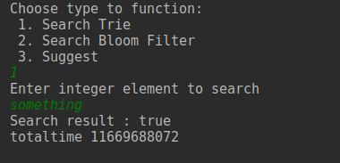
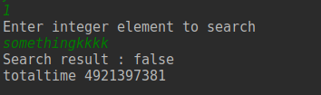
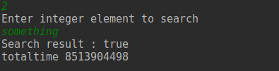
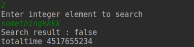
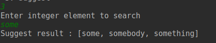
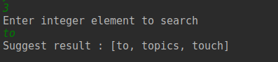
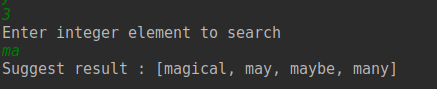

# Predictive text
## Giới thiệu
Cho dataset Blog Authorship Corpus.

Làm chương trình Java cung cấp 2 tính năng:

Kiểm tra 1 từ có nằm trong dataset không?
Gợi ý những từ giống với từ input mà có trong dataset (gần giống như cách Google instant search gợi ý). Sự gần giống giữa các từ do em tự định nghĩa nhưng phải hợp lý.

## Cài đặt
### Kiểm tra từ tồn tại
Sử dụng 2 cấu trúc là Bloom Filter và Trie để lưu trữ và kiểm tra từ tồn tại

#### Bloom Filter
Bloom filter gồm các phương thức chính sau:
- add: thêm 1 từ vào set
- contains: kiểm tra 1 từ có trong set không

1. Add

```
/* Function to get hash - MD5 */
    private int getHash(int i)
    {
        md.reset();
        byte[] bytes = ByteBuffer.allocate(4).putInt(i).array();
        md.update(bytes, 0, bytes.length);
        return Math.abs(new BigInteger(1, md.digest()).intValue()) % (set.length - 1);
    }
    /* Function to add an object */
    public void add(String word)
    {
        int[] tmpset = getSetArray(word);
        for (int i : tmpset)
            set[i] = 1;
        size++;
    }
    /* Function to check is an object is present */

    /* Function to get set array for an object */
    private int[] getSetArray(String word)
    {
        int[] tmpset = new int[keySize];
        tmpset[0] = getHash(word.hashCode());
        for (int i = 1; i < keySize; i++)
            tmpset[i] = (getHash(tmpset[i - 1]));
        return tmpset;
    }
```

2. Contains
```
  public boolean contains(String word)
    {
        int[] tmpset = getSetArray(word);
        for (int i : tmpset)
            if (set[i] != 1)
                return false;

        return true;
    }
```

Link: https://www.sanfoundry.com/java-program-implement-bloom-filter/

### Trie
Mỗi node Trie sẽ gồm:
- Map<Character, Trie> children
- value: giá trị của từ cho tới node hiện tại
- terminal: là có kết thúc của 1 từ hay không

Trie sẽ gồm các phương thức sau:
- insert: thêm 1 từ vào trie
- contains: kiểm tra 1 từ có trong trie không
- autoComplete: gợi ý các từ gần giống


1. Insert
```
 protected void add(char c) {
        String val;
        
        // node is start of new word
        if (this.value == null) {
            val = Character.toString(c);
        } else { // node is continue of word
            // add c to value before of word
            val = this.value + c;

        }
        
        // add new node child with key c
        children.put(c, new Trie(val));
    }

    public void insert(String word) {
        if (word == null) {
            throw new IllegalArgumentException("Cannot add null to a Trie");
        }
        Trie node = this;
        
        // for each char in word
        for (char c : word.toCharArray()) {
            if (!node.children.containsKey(c)) {
                // node dont have any child with key c -> add new node child
                node.add(c);
            }
            // go to child node with key c
            node = node.children.get(c);
        }
        
        // mark end of word
        node.terminal = true;
    }
```
Thêm từ bằng cách thêm từng kí tự vào trie
- Đi từ root, với mỗi node:
  - Nếu node chưa có children là kí tự thì thêm 1 node trie chứa kí tự đó làm children
  - Nếu node đã có 1 childen là kí tự đó thì gán node = childen và xét tiếp cho đến khi đi hết kí tự của từ
  - Khi thêm đến kí tự cuối của từ thì đánh dấu terminal = true: kết thúc 1 từ

2. Contains

```
 public boolean contains(String word){
        Trie node = this;
        // for each char in word
        for (char c : word.toCharArray()) {
            if (!node.children.containsKey(c)) {
                // node dont have any child with key c -> not contain
                return false;
            }

            // go to child node with key c
            node = node.children.get(c);
        }

        // end of word and node is terminal of word -> contain
        if(node.terminal==true)
            return true;
        else return false;
    }
```

Kiểm tra 1 từ có trong trie không ta cũng kiểm tra từng kí tự của từ

Đi từ root, với mỗi node childen, kiểm tra lần lượt từng kí tự có là có phải là childen của node hiện tại không:
- Nếu phải: đi đến node childen và tiếp tục kiểm tra
- Nếu không: từ đó không chứa trong trie
  
Nếu đã duyệt tới node chứa kí tự cuối cùng của từ, kiểm tra node đó có phải kết thúc 1 từ không:
- Có: tồn tại từ trong trie
- Không: không tồn tại từ trong trie

3. AutoComplete
Gợi ý từ gần giống dựa trên 1 từ

```
  public Collection<String> autoComplete(String prefix) {
        Trie node = this;
        // for each char in prefix
        for (char c : prefix.toCharArray()) {
            if (!node.children.containsKey(c)) {
                // node dont have any childen with key c
                // dont have any word with prefix -> out
                return Collections.emptyList();
            }

            // have a childen with key c -> go to childen
            node = node.children.get(c);
        }
        return node.allPrefixes();
    }

    protected Collection<String> allPrefixes() {
        List<String> results = new ArrayList<String>();

        // node is terminal of word -> add to result
        if (this.terminal) {
                results.add(this.value);
        }

        // node is not terminal of word
        // for each child of node
        for (Entry<Character, Trie> entry : children.entrySet()) {
            Trie child = entry.getValue();

            // find all prefix of child
            Collection<String> childPrefixes = child.allPrefixes();
            results.addAll(childPrefixes);
        }

        return results;
    }
```

Tìm node cuối cùng ứng với word
- Nếu không tìm được: không tìm được từ ứng với prefix
- Nếu tìm được
  - Với mối node child tìm đệ quy các prefix của node child của nó


Link: 
https://www.geeksforgeeks.org/auto-complete-feature-using-trie/

https://www.geeksforgeeks.org/trie-insert-and-search/

https://github.com/vivekn/autocomplete/blob/master/java/src/main/java/com/marcusmccurdy/trie/Trie.java


### Design pattern
Dùng 2 design pattern:
- Singleton
- Strategy


- Tạo 1 interface Dictionary
```
public interface Dictionary {
    public boolean contains(String word);
    
}
```
- Tạo 2 class Trie và Bloom filter implement interface trên, override lại phương thức contains

```
public class Trie implements Dictionary{
    public boolean contains(String word){
      ...
    }
}
```

```
public class BloomFilter implements Dictionary
{
     public boolean contains(String word)
    {
       ...
    }
}
```

- Tạo 1 class SearchContext gồm 1 dictionary
  - Dùng mẫu singleton: chỉ cho phép tạo 1 instance duy nhất
 
```
public class SearchContext {
    Dictionary dictionary;

    private static SearchContext instance ;

    private SearchContext(Dictionary dictionary){
        this.dictionary = dictionary;
    }

    public static SearchContext getInstance(Dictionary dictionary){
        instance = new SearchContext(dictionary);
        return instance;
    }

    public boolean contains(String word){
        return dictionary.contains(word);
    }
}
```

- Chuyển trạng thái search
```
    context = SearchContext.getInstance(trie);
    context = SearchContext.getInstance(bloomFilter);
```

## Chạy và kiểm tra
- Kiểm tra với trie
  - Từ something có trong trie


  - Từ somethingkkk không có trong trie



- Kiểm tra với bloom filter
  - Từ something có trong bloom filter


  - Từ somethingkkk không có trong trie
  


- Gợi ý từ
  - some
  

  - to
  

  - ma
  


