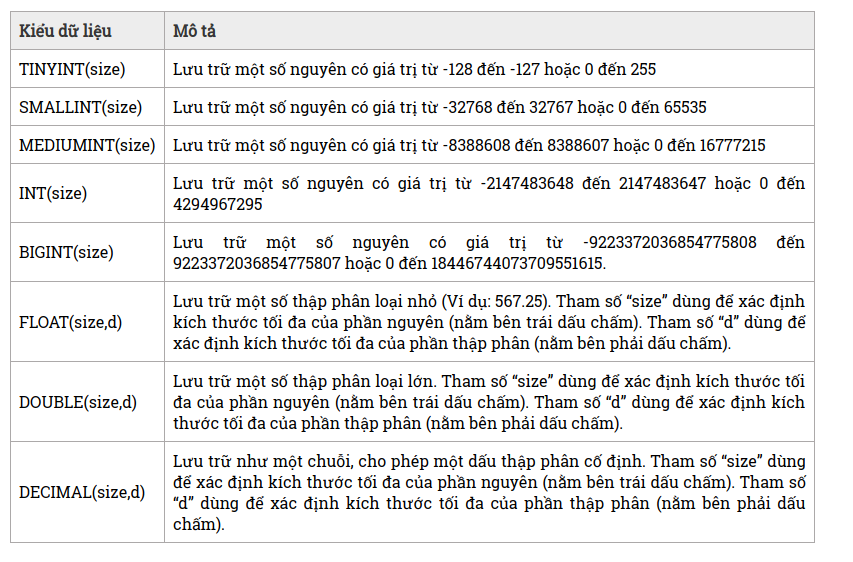
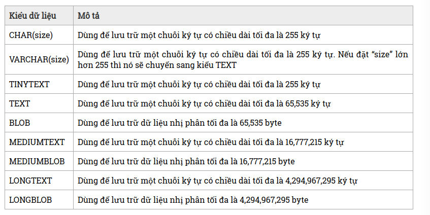
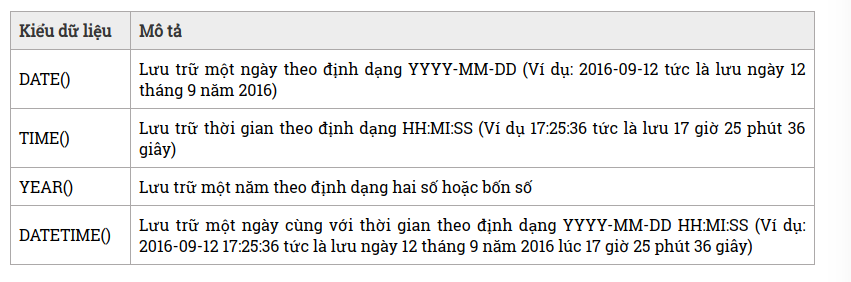
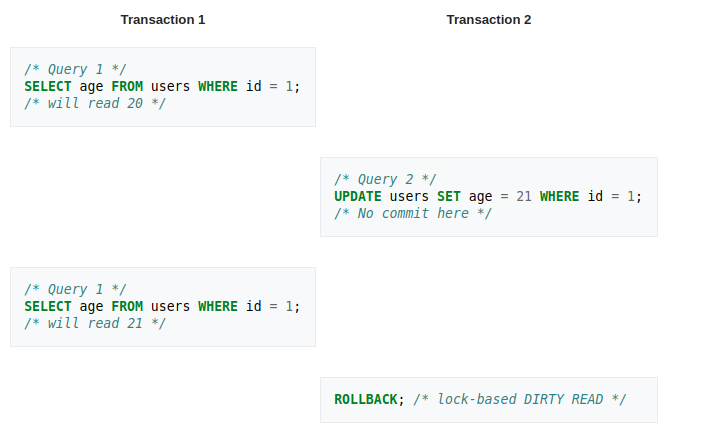
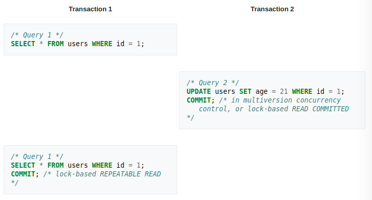
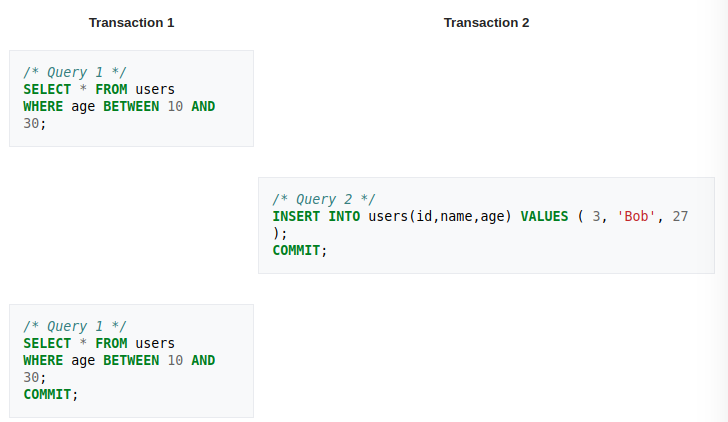
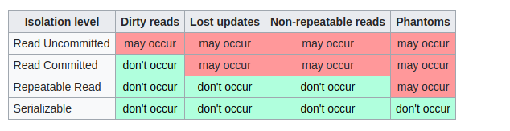

# My SQL
<!-- TOC -->
- [1 Storage Engine](#1-storage-engine)        
- [2 Data types](#2-data-types)        
- [3 Transaction](#3-transaction)       
- [4. Isolation](#4-isolation)        
<!-- /TOC -->


## 1 Storage Engine
### InnoDB
Đây là Storage Engine mặc định trong MySQL 5.7. InnoDB là một Storage Engine transaction-safe (tuân thủ ACID) cho MySQL có các commit, rollback và khả năng khôi phục lỗi để bảo vệ dữ liệu người dùng. Row-level locking của InnoDB và kiểu nonlocking read của Oracle-style làm tăng sự đồng thời và hiệu suất của nhiều người dùng. InnoDB lưu trữ dữ liệu người dùng trong các clustered indexes để giảm I/O cho các truy vấn thông thường dựa trên các primary key. Để duy trì tính toàn vẹn của dữ liệu, InnoDB cũng hỗ trợ các ràng buộc toàn vẹn Foreign Key.

### MyISAM
Table-level locking giới hạn hiệu suất read/write dữ liệu, vì vậy nó thường được sử dụng cho các công việc read-only hoặc read-mostly trong các cấu hình Web và lưu trữ dữ liệu.

### Memory
Lưu trữ tất cả dữ liệu trong RAM, để truy cập nhanh trong các môi trường đòi hỏi tra cứu nhanh các dữ liệu không quan trọng. Engine này trước đây gọi là HEAP Engine. Storage Engine này đang sử dụng ít dần, do InnoDB với vùng bộ đệm cung cấp một cách mục đích chung và bền để giữ hầu hết hoặc tất cả dữ liệu trong memory, và NDBCLUSTER cung cấp tra cứu giá trị quan trọng nhanh cho các bộ dữ liệu phân tán lớn.

### CSV
Các bảng của nó thực sự là các tập tin văn bản với các giá trị được phân cách bởi dấu phẩy. Các bảng CSV cho phép bạn nhập hoặc đổ dữ liệu ở định dạng CSV, để trao đổi dữ liệu với các tập lệnh và ứng dụng đọc và ghi cùng một định dạng. Vì bảng CSV không được lập chỉ mục, bạn thường giữ dữ liệu trong các bảng InnoDB trong quá trình hoạt động bình thường và chỉ sử dụng các bảng CSV trong giai đoạn nhập hoặc xuất.

### Archive
Các bảng nhỏ gọn, không biểu hiện này được dùng để lưu trữ và truy xuất số lượng lớn các thông tin kiểm tra lịch sử, lưu trữ, hoặc kiểm tra an toàn.

### Blackhole
Công cụ lưu trữ Blackhole chấp nhận nhưng không lưu dữ liệu, tương tự như /dev/null trên Unix. Các truy vấn luôn trả về một tập rỗng. Các bảng này có thể được sử dụng trong các cấu hình nhân bản, nơi các lệnh DML được gửi đến các slave server, nhưng các master server không giữ bản sao dữ liệu của chính nó.

### NDB (còn được gọi là NDBCLUSTER)
Công cụ cơ sở dữ liệu được nhóm lại này đặc biệt phù hợp với các ứng dụng đòi hỏi thời gian hoạt động và tính khả dụng cao nhất có thể.

### Merge
Cho phép một DBA MySQL hoặc nhà phát triển hợp lý nhóm một loạt các bảng MyISAM giống hệt nhau và tham chiếu chúng như một đối tượng. Tốt cho các môi trường VLDB như lưu trữ dữ liệu.

### Federated
Cung cấp khả năng liên kết máy chủ MySQL riêng biệt để tạo ra một cơ sở dữ liệu hợp lý từ nhiều máy chủ vật lý. Rất tốt cho môi trường phân phối hoặc môi trường dữ liệu mart.

### So sánh InnoDB và MyISAM
- InnoDB phục hồi từ một vụ crash hoặc tắt máy bất ngờ bằng cách phát lại các bản ghi log của nó. MyISAM phải quét và sửa chữa đầy đủ hoặc xây dựng lại các chỉ mục hoặc bảng có thể đã được cập nhật nhưng không đầy đủ sang ổ cứng. Kể từ khi phương pháp InnoDB là khoảng thời gian cố định trong khi thời gian MyISAM phát triển với kích thước của các tập tin dữ liệu, InnoDB cung cấp sẵn sàng hơn khi kích thước cơ sở dữ liệu phát triển.
- InnoDB, với innodb_flush_log_at_trx_commit đặt thành 1, ghi nhật ký transactioni sau mỗi transaction, cải thiện đáng kể độ tin cậy. MyISAM phải được chạy trên đầu trang của một hệ thống tập tin journal đầy đủ, chẳng hạn như ext4 gắn kết với data=journal, để cung cấp khả năng phục hồi tương tự chống lại các tập tin dữ liệu hỏng. (Journal có thể được đặt trên một thiết bị SSD để cải thiện hiệu năng MyISAM, tương tự, nhật ký InnoDB có thể được đặt trên một hệ thống tập tin không ghi nhật ký như ext2 chạy trên một SSD để tăng hiệu suất tương tự. )
- InnoDB có thể chạy ở chế độ mà nó có độ tin cậy thấp hơn nhưng trong một số trường hợp hiệu năng cao hơn. Thiết lập innodb_flush_log_at_trx_commit đến 0 chuyển sang chế độ mà transaction không commit với disk trước khi kiểm soát được trả lại cho người gọi. Thay vào đó, disk flushes xảy ra trên một bộ đếm thời gian.
- InnoDB tự động nhóm lại nhiều chèn đồng thời và flushes chúng vào đĩa cùng một lúc MyISAM dựa vào bộ nhớ cache khối hệ thống tập tin cho bộ nhớ đệm đọc cho các hàng dữ liệu và các chỉ mục, trong khi InnoDB thực hiện điều này trong chính công cụ, kết hợp các cache hàng với các cache chỉ mục.
- InnoDB sẽ lưu trữ các hàng trong trật tự primary nếu có, khác thứ tự duy nhất thứ tự then chốt. InnoDB sẽ sử dụng một phím số nguyên duy nhất được tạo ra bên trong và sẽ lưu trữ các hồ sơ theo thứ tự chèn, vì MyISAM nào. Ngoài ra, một trường khoá chính có thể tự động được sử dụng để đạt được hiệu quả tương tự.
- InnoDB cung cấp lưu trữ trang nén LZW có thể cập nhật cho cả dữ liệu và chỉ mục. MyISAM bảng nén không thể được cập nhật.
- Khi hoạt động ở các chế độ tuân thủ ACID đầy đủ, InnoDB phải thực hiện một tuôn ra đĩa ít nhất một lần cho mỗi giao dịch, mặc dù nó sẽ kết hợp flushes cho chèn từ nhiều kết nối. Đối với các ổ cứng hoặc mảng điển hình, điều này sẽ áp đặt giới hạn khoảng 200 giao dịch cập nhật mỗi giây. Đối với các ứng dụng yêu cầu tỷ lệ giao dịch cao hơn, bộ điều khiển đĩa với bộ nhớ đệm ghi và sao lưu pin sẽ được yêu cầu để duy trì tính toàn vẹn của giao dịch. InnoDB cũng cung cấp một số chế độ làm giảm hiệu ứng này, tự nhiên dẫn đến mất bảo đảm toàn vẹn giao dịch, mặc dù vẫn giữ được độ tin cậy cao hơn MyISAM. MyISAM không có chi phí này, nhưng chỉ vì nó không hỗ trợ giao dịch.
- MyISAM sử dụng khóa mức bảng để cập nhật và xóa các hàng hiện có, với một tùy chọn để nối các hàng mới thay vì lấy khóa và chèn chúng vào không gian trống. InnoDB sử dụng khóa cấp hàng. Đối với các ứng dụng cơ sở dữ liệu lớn, nơi nhiều hàng thường được cập nhật, cấp hàng khóa là rất quan trọng bởi vì một khóa bảng duy nhất giảm đáng kể đồng thời trong cơ sở dữ liệu.
- Cả InnoDB và MyISAM đều hỗ trợ tìm kiếm toàn văn, với InnoDB đạt được sự hỗ trợ chỉ mục toàn văn trong MySQL 5.6.4, nhưng kết quả có thể khác biệt đáng kể.

Link : https://viblo.asia/p/gioi-thieu-cac-storage-engine-trong-mysql-Eb85oEb8Z2G

## 2 Data types
Trong MySQL, kiểu dữ liệu được chia làm ba loại chính: numeric, string, date time

### Numeric


### String


### Date time


link: http://webcoban.vn/mysql/cac-kieu-du-lieu-trong-mysql.html

### utf8mb4
Theo định nghĩa của mysql

```
The utfmb4 character set has these characteristics:

Supports BMP and supplementary characters.

Requires a maximum of four bytes per multibyte character.
```

utf8mb4 bao gồm utf8mb3 

```
utf8 is an alias for the utf8mb3 character set.

The utf8mb3 character set has these characteristics:

・Supports BMP characters only (no support for supplementary characters)

・Requires a maximum of three bytes per multibyte character.

Applications that use UTF-8 data but require supplementary character support should use utf8mb4 rather than utf8mb3 (see Section 10.9.1, “The utf8mb4 Character Set (4-Byte UTF-8 Unicode Encoding)”).
```

- Đối với kí tự BMP, utf8mb4 và utf8mb3 lưu trữ giống hệt nhau: code value, encoding, length
- Đối với các kí tự bổ sung, utf8mb4 cần 4 byte đê lưu, trong khi utf8mb3 không thể lưu hết kí tự nếu nó có độ dài lớn hơn 3 byte và sẽ gây ra lỗi.

Vậy nên cần cover từ utf8mb3 sang utf8mb4 như sau:

```
SELECT CONCAT(utf8mb3_col, utf8mb4_col);
```
hoặc

```
SELECT * FROM utf8mb3_tbl, utf8mb4_tbl
WHERE utf8mb3_tbl.utf8mb3_col = utf8mb4_tbl.utf8mb4_col;
```
link: https://dev.mysql.com/doc/refman/5.5/en/charset-unicode-utf8mb4.html


## 3 Transaction
Có thể hiểu Transaction là một tiến trình xử lý có xác định điểm đầu và điểm cuối, được chia nhỏ thành các operation (phép thực thi) , tiến trình được thực thi một cách tuần tự và độc lập các operation đó theo nguyên tắc hoặc tất cả đều thành công hoặc một operation thất bại thì toàn bộ tiến trình thất bại. Nếu việc thực thi một operation nào đó bị fail đồng nghĩa với việc dữ liệu phải rollback về trạng thái ban đầu.

## ACID: tập các tính chất của các giao tác(transaction) trong RDBMS
  - Atomicity (tính nguyên tố): tất cả transaction đều phải được thực hiện hết hoặc không thực hiện transaction nào cả
  - Consistency (tính nhất quán): một transaction kết thúc (thành công hay thất bại), CSDL phải ở trạng thái nhất quán (đảm bảo mọi ràng buộc toàn vẹn)
  - Isolation (tính cô lập): một transaction không quan tâm đến các transaction khác xử lí đông thời với nó
  - Durability (tính bền vững): mọi thay đổi mà transaction thực hiện trên CSDL phải được ghi nhận bền vững vào thiết bị lưu trữ

## Sử dụng transaction
Trong MySQL, một transaction được bắt đầu với câu lệnh: START TRANSACTION;BEGIN;. Nhưng trước khi sử dụng câu lệnh này có thể  sử dụng câu lệnh: SET commit = 0 ở trước, mặc định thuộc tính commit = 1, Transaction sẽ được tự động hoàn thành mà không cần phải sử dụng COMMIT hoặc ROLLBACK.

- Khi một transaction hoàn thành thì cần đưa ra lệnh COMMIT để mọi hành động tác động tới các table được thực sự thay đổi.
Khi một transaction hoàn thành thì cần đưa ra lệnh COMMIT để mọi hành động tác động tới các table được thực sự thay đổi.

- Khi một transaction thất bại thì cần đưa ra lệnh ROLLBACK để hủy toàn bộ mọi hành động, phục hồi dữ liệu về trạng thái trước khi bắt đầu transaction.

Ví dụ: 

```
SET commit = 0;
START TRANSACTION;
BEGIN;
INSERT INTO accounts('userName', 'passWord') VALUES ('vukhuong', 'vukhuong');
INSERT INTO logs('ip', 'time') VALUES ('127.0.0.1', '2014/11/1');
COMMIT;
ROLLBACK;
```


## Rủi ro khi thực thi transaction
Có ba loại rủi ro chính khiến việc thực thi một transaction có thể bị fail.
- Việc thực thi operation bị lỗi: 
dẫn tới transaction bị lỗi
- Vấn đề về phần cứng và mạng: việc phần cứng hoặc mạng có vấn đề trong lúc đang thực thi transaction sẽ dẫn đến tiến trình xử lý thất bại.
- Các vấn đề với dữ liệu dùng chung: Đây là vấn đề khó nhất. Rõ ràng data là một tài nguyên dùng chung, do đó sẽ có những nguy cơ mà transaction gặp phải khi xử lý dữ liệu dùng chung này. Ta sẽ xem xét kỹ hơn dưới đây. Như chúng ta đã biết, phần mềm viết ra là để xử lý dữ liệu, 2 operations (phép) căn bản của phần mềm với dữ liệu là đọc và ghi (read và write) trong đó phép write lại được chia nhỏ thành 3 operations nhỏ hơn là insert (thêm mới), update (sửa), delete (xóa). Dữ liệu là một tài nguyên dùng chung, nếu như có nhiều tiến trình xử lý đồng thời thực hiện các phép trên dữ liệu sẽ xảy ra những rủi ro: write-write, write-read,… việc dữ liệu ghi cùng lúc dẫn tới hỏng dữ liệu hoặc dữ liệu đọc ra không đồng nhất với dữ liệu mới ghi vào,… sẽ đề cập kỹ hơn trong phần tiếp theo dưới đây.

link: https://viblo.asia/p/tim-hieu-ve-transaction-trong-mysql-RnB5pnxGZPG

## Distributed transaction
Khi xây dựng kiến trúc microservice phải phân rã kiến trúc của 1 hệ thống nguyên khối thành các service, và ở tầng database nó có thể phá vỡ các tính chất của 1 transaction. 

Ví dụ đặt hàng của 1 khách hàng với hệ thống nguyên khối (monolithic system):


Với ví dụ trên, khi user put order tới hệ thống, hệ thống sẽ tạo transaction với các bước như hình, và nếu bất kì bước nào thất bại, transaction sẽ được rollback. Điều này đẩm bảo tính ACID của transation

Nếu ta phân rã hệ thống trên thành các service là CustomerMicroservice và OrderMicroservice, mỗi service có 1 database riêng biệt


Khi user put order, cả 2 service sẽ được gọi để thực hiện các yêu cầu ứng vào database ứng với từng service. Vì transaction trên nhiều database riêng biệt nên đây chính là distributed trasaction

### Vấn đề:
- Không thể đảm bảo tính nguyên tử (Actomic): ở ví dụ trên nếu phương thức CreatOrder thất bại, ta không biết nên làm sao để rollback các xử lí trong UpdateCustomerFund
- Liệu ta có đang cô lập các hành động xử lí của người dùng cho các yêu cầu không?
  Nếu một đối tượng đang được xử lí ghi bởi một transaction và trước khi transaciton này kết thúc, nó lại được đọc bởi 1 transaction khác, vậy đối tượng này nên trả lại data cũ hay data đã cập nhật?

### Giải pháp:
Có thể thấy các vấn đề trên rất quan trọng đối với các hệ thống microservices. Mặt khác, không có cách nào để biết nếu một giao dịch đã hoàn thành thành công hay chưa. Dưới đây là 2 mẫu dùng để giải quyết vấn đề này:
- 2pc (two-phase commit)
- Saga

#### Two-phase commit (2pc) pattern
Two-phase commit có 2 giai đoạn:
- Giai đoạn prepare: tât cả các service nhỏ sẽ được yêu cầu chuẩn bị cho 1 số xử lý liên quan đên thay đổi dữ liệu có thể được thực hiện nguyên tủ
- Giai đoạn commit: khi tất cả đã được chuẩn bị, commit sẽ yêu cầu tất cả service thực hiện thay đổi thực sự

Thông thường cần phải có 1 điều phối viên (coordinator) để duy trì vòng đời của transaction và điều phối viên sẽ cần gọi các service nhỏ trong giai đoạn prepare và commit. Dưới đây là cách triển khai 2pc cho vd đăt hàng của khách hàng:


Ở ví dụ trên, khi user gửi yêu cầu tạo orders, điều phối viên sẽ tạo 1 global transaction với tất cả thông tin cần xử lí. Sau đó sẽ bảo cho CustomerMicroservice để chuẩn bị UpdateCustomerFund đã tạo. CustomerMicroservice sau đó sẽ kiểm tra, nếu đủ điều kiện để thực hiện thay đổi, nó sẽ lock đối tượng khỏi các thay đổi tiếp theo và thông báo cho điều phối viên nó đã chuẩn bị xong

OrderMicroservice cũng thực hiện giống vậy. Khi điều phối viên đã xác nhận tất cả các service đã sẵn sàng áp dụng các thay đổi của chúng, sau đó điều phối viên sẽ yêu cầu các services áp dụng các thay đổi của mình bằng cách yêu cầu commit với giao dịch. Tại thời điểm này, tất cả các đối tượng sẽ được mở khóa (unlock). 

Nếu tại bất kỳ thời điểm nào, một service ở bước chuẩn bị bị fail, điều phối viên sẽ hủy bỏ transaction và bắt đầu quá trình khôi phục (rollback). Dưới đây là sơ đồ khôi phục 2pc cho ví dụ đặt hàng của khách hàng: 


Trong ví dụ trên, CustomerMicroservice không thể chuẩn bị vì một số lý do nào đó, nhưng OrderMicroservice đã trả lời rằng nó được chuẩn bị để tạo đơn hàng. Điều phối viên sẽ yêu cầu hủy bỏ xử lý ở OrderMicroservice và OrderMicroservice sau đó sẽ khôi phục mọi thay đổi được thực hiện đồng thời mở khóa các đối tượng cơ sở dữ liệu.

**Ưu điểm**:
- Các giai đoạn prepare và commit đảm bảo tính nguyên tử cho transaction. Transaction sẽ kết thúc nếu tất cả service trong microservice thành công và sẽ rollback lại toàn bộ nếu 1 cái thất bại
- Cho phép cách li read-write: khi thay đổi trên 1 trường không thể nhin thấy bên ngoài transaction cho đến khi điều phối viên commit các thay đổi

**Khuyết điểm**
- 2pc là cơ chế lock object. Transaction sẽ lock object được thay đổi trước khi transaction hoàn tất.  Trong ví dụ trên, nếu một khách hàng đặt hàng, thì thuộc tính "fund" (số tiền trong thẻ của khách hàng) sẽ bị khóa . Điều này ngăn khách hàng áp dụng các đơn đặt hàng mới. Điều này thật sự rất không tốt. Trong một hệ thống cơ sở dữ liệu, các giao dịch có xu hướng xử lý nhanh chóng (thông thường trong vòng 50 ms). Tuy nhiên, trong hệ thống microservice khi tích hợp với các dịch vụ bên ngoài như dịch vụ thanh toán. Việc lock đối tượng có thể trở thành một nút cổ chai dẫn đến hiệu năng hệ thống bị giảm đáng kể.

#### Saga pattern
Saga pattern là một pattern được sử dụng rộng rãi cho các distributed transaction. Nó khác với 2pc xử lý theo cơ chế đồng bộ  (lock object), mô hình Saga xử lý không đồng bộ . Trong mô hình Saga, distributed transaction được thực hiện bằng các transaction cục bộ  không đồng bộ trên tất cả các service nhỏ liên quan. Các service nhỏ liên lạc với nhau thông qua một chuỗi sự kiện. Dưới đây là sơ đồ của mẫu Saga cho ví dụ đặt hàng của khách hàng:


Trong ví dụ trên, OrderMicroservice nhận được yêu cầu đặt hàng (createOrder). Đầu tiên, nó bắt đầu một giao dịch cục bộ để tạo một đơn đặt hàng và sau đó phát ra một sự kiện OrderCreated. Dịch vụ khách hàng lắng nghe sự kiện này và cập nhật quỹ khách hàng sau khi nhận được sự kiện. Nếu một khoản khấu trừ được thực hiện thành công, thì một sự kiện CustomerFundUpdated sẽ được phát ra, trong ví dụ này có nghĩa là kết thúc giao dịch. Nếu bất kỳ dịch vụ nhỏ nào không hoàn thành giao dịch cục bộ của mình, các dịch vụ nhỏ khác sẽ chạy các xử lý rollback để phục hồi các thay đổi. Dưới đây là sơ đồ của mẫu Saga khi một dịch vụ bị lỗi và các dịch vụ khác thực hiện rollback: 


**Ưu điểm**
Saga pattern có một lợi thế lớn là nó hỗ trợ các giao dịch dài hạn. Vì mỗi microservice chỉ tập trung vào giao dịch nguyên tử cục bộ của riêng mình, nên các dịch vụ nhỏ khác sẽ không bị chặn nếu microservice chạy trong một thời gian dài. Điều này cũng cho phép các giao dịch tiếp tục chờ đợi đầu vào của người dùng. Ngoài ra, bởi vì tất cả các giao dịch cục bộ của từng service đang diễn ra song song nên sẽ không có đối tượng nào bị lock như ở mô hình 2pc hay các hệ thống đơn thuần.

**Khuyết điểm**
Mô hình Saga rất khó để gỡ lỗi, debug, đặc biệt là khi hệ thống có nhiều service liên quan. Ngoài ra, các thông báo sự kiện giữa các service có thể trở nên khó maintain nếu hệ thống trở nên phức tạp. Một nhược điểm khác của mẫu Saga là nó không có cách ly đọc. Ví dụ, khách hàng có thể thấy đơn hàng được tạo khi service A xử lý xong, nhưng trong giây tiếp theo nếu service B trong chuỗi xử lý bị lỗi thì đơn hàng sẽ bị xóa do tất cả các service trong chuỗi xử lý transaction phân tán đều rollback.

Link: https://viblo.asia/p/patterns-for-distributed-transactions-within-a-microservices-architecture-bJzKmy2PK9N


## 4. Isolation
### Read phenomena
#### Lost update
Xảy ra khi transaction A đọc dữ liệu, transaction B cũng đọc dữ liệu sau A. A thay đổi dữ liệu, sau đó B cũng thay đổi dữ liệu đó nhưng là dữ liệu cũ trước khi A thay đổi nên không lấy được bản mới nhất của dữ liệu 

Ví dụ:


#### Dirty read
Đọc dữ liệu rác: xảy ra khi transaction A tiến hành phép write với dữ liệu, transaction B tiến hành đọc dữ liệu sau khi A làm xong phép write. Tuy nhiên vì một lý do gì đó, transaction A không commit được, do đó sự thay đổi phép write không được chấp nhận, dữ liệu rollback lại trạng thái ban đầu, khi đó dữ liệu của B sẽ trở thành dữ liệu rác.

vd:

Sau khi T2 rollback thì giá trị mà T1 đọc sau khi T2 ghi xuống là không tồn tại

#### Non-repeatable reads
Không thể đọc lại: xảy ra khi transaction A tiến hành phép read trên dữ liệu, sau đó transaction B thực hiện phép write làm dữ liệu thay đổi, lần kế tiếp A lại tiến hành phép read với chính dữ liệu. Như vậy, 2 lần đọc của A thấy dữ liệu không nhất quán (consistency) trên cùng một bản ghi.

vd:


Giá trị của T1 trong 2 lần đọc là khác nhau do T2 đã thay đổi giá trị đó

#### Phantom reads
 Là rủi ro xảy ra với lệnh read có điều kiện (chẳng hạn mệnh đề where trong sql). Transaction A đọc được một số X dữ liệu thỏa mãn điều kiện 1, transaction B tiến hành phép write sinh ra một lượng Y dữ liệu thỏa mãn điều kiện , A tính toán lại với điều kiện 1 thấy bổ sung thêm một lượng Y dữ và tổng dữ liệu giữa 2 lần trở lên không đồng nhất.

vd: 



### Các mức level isolation
#### Read uncommitted
Một transaction lấy dữ liệu từ một transaction khác ngay cả khi transaction đó chưa được commit. Xét ví dụ cụ thể như sau:

- thêm 1 dòng mới

```
INSERT INTO `users` (`id`, `name`, `point`) VALUES ('1', 'BaLongStupid', '1');
```

- Tiến hành tạo một transaction update point. Query 1:

```
START TRANSACTION;
    UPDATE `users` SET `point`= 100;
    SELECT SLEEP(30);
ROLLBACK;
```

- Tiến hành Query 2:

```
SET TRANSACTION ISOLATION LEVEL READ UNCOMMITTED;
	SELECT * FROM `users`;
COMMIT;
```

Giả sử sau khi tiến hành câu Query 1 ta tiến hành chạy câu Query 2 thì kết quả trả về sẽ là 'point' = 100. Nhưng ngay sau khi câu Query 1 chạy xong và bị rollback thì kết quả trả về thực tế sẽ là là 'point' = 1. Như vậy transaction thứ 2 lấy kết quả chưa được commit của transaction thứ 1 => Hiện tượng trên gọi còn được gọi là Dirty Read. Ưu điểm ở đây là các transaction sẽ chạy liên tục và transaction sau ghi đè lên Transaction trước (Dirty Write). Đây là mức Isolation thấp nhất và nó cũng tương đương với câu lệnh:

```
SELECT * FROM users WITH (nolock)

```

#### Read committed
Đây là level default của một transaction nếu như chúng ta không config gì thêm. Tại level này thì Transaction sẽ không thể đọc dữ liệu từ từ một Transaction đang trong quá trình cập nhật hay sửa đổi mà phải đợi transacction đó hoàn tất. Như vậy thì chúng ta có thể tránh được Dirty Read và Dirty Write nhưng các Transaction sẽ phải chờ nhau => Perfoman hệ thống thấp. Ta thực hiện câu Query 1 như sau:

```
START TRANSACTION;
    UPDATE `users` SET `point`= 100 WHERE 'id' > 0;
    SELECT SLEEP(30);
COMMIT;
    SELECT * FROM `users` WHERE `id` = 2;
```

và ngay sau đó thực hiện câu Query 2:

```
SET TRANSACTION ISOLATION LEVEL READ COMMITTED;
    INSERT INTO `users` (`id`, `name`, `point`) VALUES ('2', 'DaoAnhDungStupid', '2');
COMMIT;
```

Khi ta tiến hành thực thi câu Query 2 thì kết quả trả về sẽ bản ghi 'id' = 2 sẽ có point = 2. Mặc dù câu query q1 đã update tất cả bản ghi có id > 0 và updated point = 100 nhưng bản ghi với id = 2 được cập nhật sau khi bảng users được cập nhật và trước khi transaction (q1) kết thúc => Bản ghi này được gọi là Phantom Row (Bản ghi ma).

#### Repeatable read
Giống như mức độ của Read Committed, tại mức độ này thì transaction còn không thể đọc / ghi đè dữ liệu từ một transaction đang tiến hành cập nhật trên bản ghi đó. Query 1:

```
START TRANSACTION;
    SELECT SLEEP(30);
    SELECT * FROM `users` WHERE `id` = 2;
COMMIT;
```

Query 2:

```
SET TRANSACTION ISOLATION LEVEL REPEATABLE READ;
    SELECT * FROM `users` WHERE `id` = 2;
COMMIT;
```

Khi thực thi 2 câu query trên thì câu Query 2 phải đợi câu Query 1 commit hoàn tất mới có thể thực thi. Ở level này khi chúng ta sẽ được bảo vệ khi đọc dữ liệu select các bản ghi trong cùng một transaction. Giả sử ở câu Query 2 ta thay thế lệnh select thành lệnh Update / Delete thì dữ liệu tại 2 câu query sẽ khác nhau và chúng ta cũng không thể tránh được các Phantom Row.

#### Serializable
Level cao nhất của Isolation, khi transaction tiến hành thực thi nó sẽ khóa các bản ghi liên quan và sẽ unlock cho tới khi rollback hoặc commit dữ liệu. Query 1:

```
SET TRANSACTION ISOLATION LEVEL SERIALIZABLE;
START TRANSACTION;
    SELECT * FROM `users`;
    SELECT SLEEP(30);
    SELECT * FROM `users`;
COMMIT;
```

Query 2:

```
    INSERT INTO `users` (`id`, `name`, `point`) VALUES ('3', 'Dat09', '3');
```

Khi tiến hành 2 câu query trên thì bản ghi trả về giữa 2 lần select ở câu Query 1 là giống như nhau, và câu Query thứ 2 sẽ pending cho tới khi Query 1 kết thúc.

**Tóm tắt các mức isolation**



Link: https://viblo.asia/p/isolation-level-of-mysql-63vKjRmAK2R

