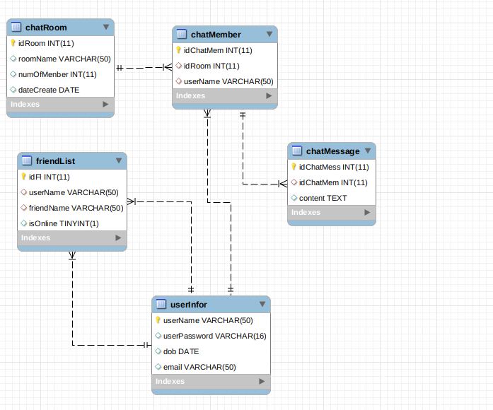

# ChatApp
## Giới thiệu
Thiết kế schema cho chương trình chat - trò chuyện (với Redis và với MySQL), sử dụng Python để tương tác.
Mô tả chương trình chat: cơ chế tương tự Zalo, Message.

1. Cơ bản:
   - Tạo tài khoản (username/password, email,...)
   - Chọn người trò chuyện (theo username hoặc email)
   - Hiển thị lịch sử trò chuyện (nếu có)
   - Trò chuyện (chat)
  
2. Nâng cao:
    - Kết bạn
    - Chat trong nhóm
    - Hiển thị trạng thái online/offline của người khác

3. Hướng dẫn
   - Thiết kế hệ thống tài khoản
   - Thiết kế cấu trúc lưu trữ lịch sử chat
   - Thiết kế cấu trúc lưu trữ nội dung tin nhắn

## Schema

### Mysql



Source database: 

### Redis

- "userInfor:userName" : hash {field-value}:
  - "userPassword" : string
  - "dob" : date format "YYYY-MM-DD"
  - "email" : string
  
vd: 

```
userInfor:danghuyentram {
    "userPassword": "abc", 
    "dob": "1998-07-04", 
    "email": "dht@gmail.com"
}
```


- "friendList:uuid" :hash {field-value}:
  - "userName" : string
  - "friendName" : string
  - "isOnline" : int

vd:

```
friendList:fab1da2a-aa04-11e9-a3b5-3052cb50e5fd {
    "userName": "danghuyentram", 
    "friendName": "trandt", 
    "isOnline": 0
}
```

- "chatRoom:roomName" : hash {field-value}:
  - "dateCreate" : date format "YYYY-MM-DD"

vd:

```
chatRoom:abc {
    "dateCreate": "2019-07-19"
}
```

- "chatMember:roomName:userName": hash {field-value}:
  - "roomName": string
  - "userName": string

vd:

```
chatMember:abc:danghuyentram {
    "roomName": "abc", 
    "userName": "danghuyentram"
}

```

- "chatMessage:roomName:datetime" hash {field-value}:
  - "userName": string
  - "content": string

vd:

```
chatMessage:abc:2019-07-19 16:13:14.583996 {
    "userName": "danghuyentram", 
    "content": "hi"
}

```
  
## Cài đặt
Ý tưởng:
Sử dụng 1 server để lưu database, xử lí, chuyến tiếp các message giữa các client

### Server
Với mỗi connection tới
- Nếu là connection mới : tạo 1 user mới ứng với socket đó và thêm vào connectionList
- Nếu là 1 message mới: đẩy vào chatApp để handle message

### ChatApp
#### Class user
Chứa các thông tin của 1 user:
- socket
- userName
- userPassword
- dob
- email

#### Class chatRoom:
Chứa các thông tin của 1 chat room:
- users[] = list socket của các user
- roomName
- color: màu đại diện của chat room

#### Class chatApp:
Cung cấp các chức năng:
- show list friend: lấy ra danh sách bạn bè và trạng thái có online không
- find: tìm bạn theo userName hoặc email
- addfriend: kết bạn
- chat: nhắn tin với 1 người
- join: tham gia vào 1 group chat
- list: liệt kê danh sách phòng của user và các phòng khác đang có người trò chuyện
- quit: thoát khỏi app

### Client
- Nhận thông tin login hoặc signup từ user
- Gửi lên server kiểm tra, nếu hợp lệ thì bắt đầu sử dụng app không thì nhập lại thông tin
- Gửi các message lên cho server và nhận phản hồi từ server

### Database
#### Class Abstract Database
Chứa các method cần dùng để các class database khi kế thừa implement lại

#### Class mysqldb
- Kết nối với mysql database
- Cung cấp các API để giao tiếp với db

#### Class redis
- Kết nối với redis database
- Cung cấp các API để giao tiếp với db

#### Class databaseFactory
- Nhận vào tham số là type
- Tạo database dựa trên type

Xem thêm ở phần src code

