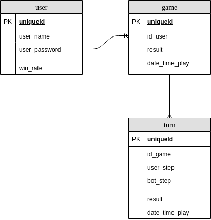

# 1. Architecture


Client giao tiếp với Server thông qua các API, các API sẽ được sử lí trong controller.
Repository sẽ đóng gói các thao tác trong model, controller sẽ giao tiếp với database thông qua repository.

# 2. Data model 
## ER diagram



## user table

| Name 	| Data type 	| Required 	| Description 	|
|---------------	|-------------	|----------	|------------------	|
| id 	| int 	| yes 	| uniqueid 	|
| user_name 	| varchar(50) 	| yes 	| username of user 	|
| user_password 	| varchar(16) 	| yes 	| password of user 	|
| win_rate 	| float 	| no 	| win rate of user 	|


## game table

| Name 	| Data type 	| Required 	| Description 	|
|----------------	|-----------	|----------	|--------------------------------------------------------	|
| id 	| int 	| yes 	| uniqueid 	|
| id_user 	| int 	| yes 	| id of user play game 	|
| result 	| int 	| no 	| total result of all turn: 0 - win, 1 - draw , 2 - lose 	|
| date_time_play 	| datetime 	| no 	| datetime start game 	|

## turn table

| Name 	| Data type 	| Required 	| Description 	|
|----------------	|-----------	|----------	|-------------------------------------------------	|
| id 	| int 	| yes 	| uniqueid 	|
| id_game 	| int 	| yes 	| id game of t 	|
| user_step 	| int 	| yes 	| step of user: 0 - rock, 1 - paper, 2 - scissors 	|
| bot_step 	| int 	| yes 	| step of bot: 0 - rock, 1 - paper, 2 - scissors 	|
| result 	| int 	| yes 	| result of turn: 0 - win, 1 - draw , 2 - lose 	|
| date_time_play 	| datetime 	| yes 	| datetime start turn 	|

# 3. API
## 3.1 Signup
Create new user account
- URL: 

```
/users/signup
```

- Method: POST
- URL params: none
- Data params: 
  
```
{
	"username":"danghuyentram",
	"password":"abc"
}
```

- Success Response:
  - code: 200
- Error Response:
  - content: {"error":"username already exsis"}
- Sample call:
```
POST /gamerps/users/signup HTTP/1.1
Host: localhost:8080
Content-Type: application/json
Cache-Control: no-cache
Postman-Token: afb3f5c3-170e-a18e-95ff-1fb82ac2a71c

{
	"username":"danghuyentram",
	"password":"abc"
}
```

## 3.2 Login
Login with exists account

- URL: 

```
/users/login
```

- Method: POST
- URL params: none
- Data params: 
  
```
{
	"username":"danghuyentram",
	"password":"abc"
}
```

- Success Response:
  - code: 200
- Error Response:
  - content: { "error": "Username or password is not correct" }

- Sample call:
```
POST /gamerps/users/login HTTP/1.1
Host: localhost:8080
Content-Type: application/json
Cache-Control: no-cache
Postman-Token: afb3f5c3-170e-a18e-95ff-1fb82ac2a71c

{
	"username":"danghuyentram",
	"password":"abc"
}
```


## 3.3 Play
Play with n turn
- URL: 

```
/users/play?username
```

- Method: POST
- URL params: 
  - username=[string]
- Data params: 
  
```
{
	"user_step":1
}
```

- Success Response:
  - For each turn:
    - code: 200
    - content: { "result":"win"}
  - End of n turn:
    - code: 200
    - content: { "result of game":"win"}
- Error Response:
  - content: { "error": "Username or password is not correct" }

- Sample call:
```
POST /gamerps/play?username=danghuyentram HTTP/1.1
Host: localhost:8080
Content-Type: application/json
Cache-Control: no-cache
Postman-Token: dbd198d0-74a2-21fd-1a44-1d967f8c7aaf

{
	 "user_step":1
}
```


## 3.4 History
Get history of user
- URL: 

```
/users/history?id
```

- Method: GET
- URL params: required
  - username=[string]
- Data params: none
- Success Response:
  - code: 200
- Error Response:
  - code: 404 NOT FOUND
  - content: { error : "User doesn't exist" }
  or
  - code: 401 UNAUTHORIZED
  - content: { error : "You are unauthorized to make this request." }
- Sample call:
```
GET /gamerps/users/history?username=danghuyentram HTTP/1.1
Host: localhost:8080
Content-Type: application/json
Cache-Control: no-cache
Postman-Token: 63a8d475-e778-23bb-92b6-a25d569b03af

```

## 3.5 Top 100 user
Get top 100 user with win rate
- URL: 

```
/users/top100/
```

- Method: GET
- URL params: none
- Data params: none
- Success Response:
  - code: 200
- Error Response:
  - content: { error : "Failed to get top 100 users" }
- Sample call:
```
GET /gamerps/top100 HTTP/1.1
Host: localhost:8080
Content-Type: application/json
Cache-Control: no-cache
Postman-Token: 674dff61-2d90-2166-643d-d340e6199b0d

```

# 4. Sequence diagram

## Signup


## Login


## Play game


## History


## Top 100 user


