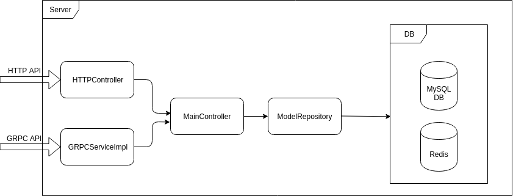
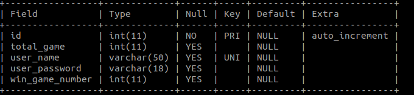
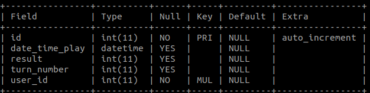
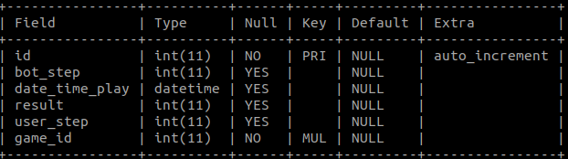
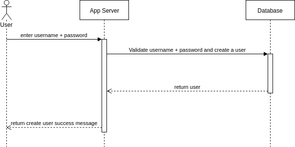
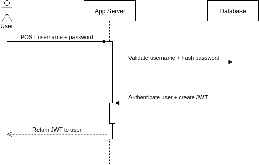
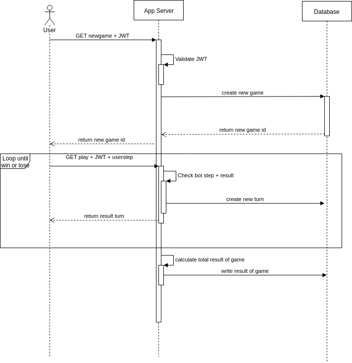
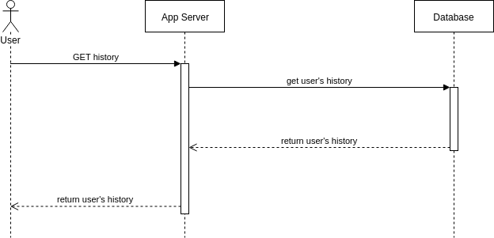
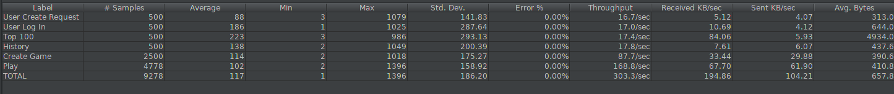

# 1. Architecture


- MainController gồm các phương thức xử lí chung cho cả http và grpc
- HTTP API được chuyển qua HTTPController kế thừa từ MainController
- GRPC API được chuyển qua GRPCServiceImpl implement lại MainController
- MainController giao tiếp với DB thông qua các Model và Repository của Model
- DB gồm mysql để lưu trữ chính và redis để cache một số thông tin


# 2. Data model 

## user table




## game table



## turn table



# 3. API
- URL: /gamerps/
## 3.1 Signup
Create new user account
- URL: 

```
/signup
```

- Method: POST
- URL params: none
- Data params: 
  
```
{
	"username":"danghuyentram",
	"password":"abc"
}
```

- Success Response:
  - code: 201
  - content: New user created
- Error Response:
  - code: 400
  - content: Username's length is >=3 and <=20, try with another username
  - content: Password's length is >=3 and <=18, try with another password
  - content: Username is exists, try with another username


## 3.2 Login
Login with exists account

- URL: 

```
/login
```

- Method: POST
- URL params: none
- Data params: 
  
```
{
	"username":"danghuyentram",
	"password":"abc"
}
```

- Success Response:
  - code: 200
  - header: token
- Error Response:
  - code: 401
  - content: { "error": "Username or password is not correct" }


## 3.3 Play
### Create new game
- URL: 

```
/users/newgame
```

- Method: POST
- Header: Authorization: token
- URL params: none
- Data params: none
- Success Response:
  - code: 201
  - content: "NewGameId": idgame
- Error Response:
  - code: 403
  - content: Failed to authenticate


### Play 
- URL: 

```
/users/play
```

- Method: POST
- Header: Authorization: token
- URL params: none
- Data params: 
  - idgame : int
  - userstep : [int]
- Success Response:
  - code: 200
  - content: result
- Error Response:
  - code: 400,403
  - content: Failed to authenticate
  - content: Not exists game of user: username
  - content: Userstep is not correct, userstep is can be [0,-1,1]


## 3.4 History
Get history of user
- URL: 

```
/history
```

- Method: GET
- Header: Authorization: token
- URL params: none
- Data params: none
- Success Response:
  - code: 200
  - content: history
- Error Response:
  - code: 403


## 3.5 Top 100 user
Get top 100 user with win rate
- URL: 

```
/top100/
```

- Method: GET
- Header: Authorization: token
- URL params: none
- Data params: none
- Success Response:
  - code: 200
  - content: top100
- Error Response:
  - content: 403


# 4. Sequence diagram

## Signup


## Login


## Play game


## History


## Top 100 user


# 5. Unit test với line coverage 80%


Xem chi tiết ở: ApplicationTests

# 6. Test performance với Jmeter

