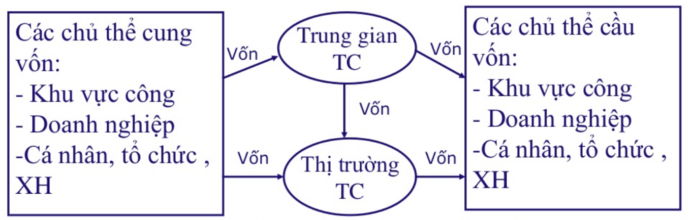

# Lý thuyết tài chính tiền tệ

Tài chính - tiền tệ là lĩnh vực rất sinh động, ảnh hưởng trực tiếp đến đời sống kinh tế - xã hội. Nghiên cứu về tài chính - tiền tệ giúp chúng ta hiểu được những vấn đề đang tồn tại trong đời sống kinh tế - xã hội. Bài viết của mình giới thiệu một số khái niệm quan trọng, để đem lại một cái nhìn chung về tài chính - tiền tệ.

# Tài chính
Tài chính ra đời la do sự phân công lao động, xã hội phát triển và chế độ tư hữu xuất hiện. 
Tài chính là một hệ thống các quan hệ phân phối giữa các chủ thể kinh thế thông qua việc thành lập và sử dụng các quỹ tiền tệ. Có 3 loại quan hệ tài chính chủ yếu: tín dụng, bảo hiểm, ngân sách nhà nước.

Đặc trưng của quan hệ tài chính:
  - Phải là một quan hệ phân phối
  - Quan hệ này diễn ra dưới dạng giá trị
  - Có sự thành lập và sử dụng một quỹ tiền tệ

Tài chính mang bản chất là quỹ tiền tệ, được hình thành từ những khoảng thu và để đáp ứng nhu cầu chi
  
## Hệ thống tài chính: 
Hệ thống tài chính là mạng lưới các trung gian tài chính (ngân hàng thương mại, tổ chức tiết kiệm và cho vay, bảo hiểm...) và thị trường tài chính (thị trường cổ phiếu, trái phiếu) mà trên đó người ta mua bán nhiều loại công cụ tài chính khác nhau (tiền gửi ngân hàng, tín phiếu kho bạc, cổ phiếu, trái phiếu) có liên quan đến việc chuyển tiền, vay và cho vay vốn. Các trung gian tài chính và thị trường tài chính đều đóng vai trò then chốt trong nên kinh tế. 

### Đặc điểm của hệ thống tài chính:
Thị trường tài chính: là nơi diễn ra các hình thức vay mượn, giao dịch các chứng từ có giá nhằm chuyển dịch vốn từ nơi cung cấp đến nơi có nhu cầu. Gồm 2 loại: thị trường tiền tệ, thị trường vốn

Các định chế tài chính:
  - Tài chính công: các quỹ tiền tệ của định chế thuộc khu vực công gắn liền với việc thực hiện các chức năng của nhà nước
  - Tài chính doanh nghiệp: các quỹ tiền tệ của các tổ chức sản xuất kinh doanh hàng hóa dịch vụ
  - Tài chính trung gian: là những tổ chức làm cầu nối giữa cung và cầu về vốn như công ty bảo hiểm, quỹ đầu tư,...
  - Tài chính cá nhân, tổ chức xã hội: các quỹ tiền tệ được sở hữu bởi các cá nhân, tổ chức xã hội

Cơ sở hạ tầng tài chính: là những nền tảng để qua đó các doanh nghiệp, nhà đầu tư, cá nhân thực hiện các giao dịch tài chính với các định chế tài chính trung gian và thị trường tài chính. Các thành phần của cơ sở hạ tầng tài chính:
  - Hệ thống pháp luật
  - Hệ thống giám sát
  - Hệ thống thông tin
  - Hệ thống thanh toán
  - Hệ thống dịch vụ chứng khoán
  - Nguồn nhân lực,...

## Tín dụng
Tín dụng được định nghĩa rõ ràng là sự thể hiện cho mối quan hệ vay và cho vay. Trong đó, người vay có thể là cá nhân hoặc tổ chức, còn người cho vay là ngân hàng, hoặc tổ chức tài chính tín dụng nào đó. Sản phẩm vay có thể là hàng hóa hoặc tiền.

Mối quan hệ vay và cho vay này có những quy định và ràng buộc cụ thể như vay tín chấp hay vay thế chấp. Bên cạnh đó, tín dụng thì luôn gắn với lãi suất. Những khoản vay tín dụng đều được áp lãi suất theo quy định của bên cho vay mà người vay muốn vay phải chấp nhận thực hiện.

Tín dụng ngân hàng là quan hệ tín dụng giữa bản thân ngân hàng, tổ chức tài chính với cá nhân hoặc doanh nghiệp. Bản thân ngân hàng sẽ đứng ở cả 2 vị trí: cho vay và đi vay.
  
# Tiền tệ
## Hình thái: 
Hóa tệ: thực chất là một loại hàng hóa đồng thời thực hiện vai trò của đồng tiền, gồm: hóa tệ phi kim, hóa tệ kim loại. Loại hóa tệ phổ biến nhất là vàng

Dấu hiệu giá trị (tín tệ): đồng tiền khi hàm chứa trong nó đầy đủ giá trị mà nó đại biểu thì lúc đó chỉ còn mang tính chát là một dấu hiệu của giá trị mà thôi. Loại tiền này có giá trị sử dụng lớn hơn giá trị

Tiền giấy: là loại tiền pháp định do nhà nước ban hành và bắt buộc sử dụng, là loại tiền được sử dụng phổ biến nhất hiện nay. Tiền giấy gần như không chứa giá trị bên trong và cũng chỉ là một dấu hiệu giá trị

## Định nghĩa tiền tệ:
Tiền tệ là bất cứ thứ gì được chấp nhận chung để đổi lấy hàng hóa, dịch vụ hoặc đẻ thanh toán các khoản nợ. Tiền tệ mang bản chất là 1 loại hàng hóa đặc biệt, đóng vai trò vật trao đổi trung gian. Theo quan điểm của Thomas - Men: "Vàng bạc là tiền tệ, chỉ có vàng bạc mới là của cải chính tông".   Chức năng của tiền tệ là thước đo giá trị, là phương tiện lưu thông, là phương tiện thanh toán, là phương tiện cất trữ. 

## Cung cầu tiền tệ
### Mức cầu tiền tệ
Cầu tiền tệ là số lượng tiền tệ mà dân chúng, doanh nghiệp, các tổ chức xã hội và các cơ quan Nhà nước cần nắm giữ để thoả mãn các nhu cầu giao dịch, dự phòng và tích luỹ.

Thành phần:
  - Cầu tiền chi nhu cầu giao dịch
  - Cầu tiền cho nhu cầu dự phòng
  - Cầu tiền cho nhu cầu cất trữ tài sản

### Mức cung tiền tệ
Mức cung tiền tệ là lượng tiền được cung ứng nhằm thỏa mãn các nhu cầu thanh toán và dự trữ của các chủ thể trong nền kinh tế.

Khối lượng tiền trong nền kinh tế được cung ứng từ những tác nhân sau:
- Ngân hàng Trung ương
- Ngân hàng thương mại và các tổ chức tín dụng
- Các tổ chức tài chính phi ngân hàng

Cung tiền tệ trong nền kinh tế do ngân hàng Trung ương quyết định thông qua chính sách tiền tệ. Khi ngân hàng Trung ương thực hiện chính sách tiền tệ thắt chặt thì mức cung tiền giảm và ngược lại. Các yếu tố làm cơ sở để ngân hàng Trung ương quyết định đến chính sách tiền tệ của mình là:
- Chỉ số trượt giá và tỷ lệ lạm phát trong nền kinh tế
- Tốc độ tăng trưởng kinh tế của quốc gia trong từng thời kỳ
- Mức độ thâm hụt ngân sách Nhà nước
- Mức độ thâm hụt cán cân thanh toán quốc tế

## Chính sách tiền tệ:

Chính sách tiền tệ (monetary policy) là chính sách kinh tế vĩ mô do ngân hàng trung ương (hoặc cơ quan hữu trách về tiền tệ) thực hiện. Ngân hàng trung ương thực hiện chính sách tiền tệ để đạt được các mục tiêu kinh tế vĩ mô của chính phủ như ổn định giá cả, tỷ lệ thất nghiệp, tăng trưởng kinh tế v.v...

Công cụ của chính sách tiền tệ: Ba công cụ của chính sách tiền tệ là tỷ lệ dự trữ bắt buộc, lãi suất chiết khấu và nghiệp vụ thị trường mở. Khi ngân hàng trung ương giảm tỷ lệ dự trữ bắt buộc, giảm lãi suất chiết khấu hay mua trái phiếu chính phủ, cung tiền tăng và lãi suất giảm. Khi lãi suất giảm, đầu tư và sản lượng sẽ tăng. Điều này hàm ý quy mô hoạt động kinh tế tăng.

Mục tiêu chính sách tiền tệ: Chính sách tiền tệ nhắm vào hai mục tiêu là lãi suất và cung tiền.

# Những vấn đề về lạm phát
Lạm phát là hiện tượng tiền có trong lưu thông vượt quá nhu cầu cần thiết, làm cho chúng bị mất giá, giá cả của hầu hết các loại hàng hóa tăng lên

Phân loại:
  - Lạm phát 1 con số (dưới 10% năm): lạm phát vừa phải - lạm phát nước kiêu
  - Lạm phát 2 con số (từ 10% đến dưới 100%): lạm phát cao - lạm phát phi mã
  - Lạm phát 3 con số trở lên (từ 100% trở lên): siêu lạm phát - lạm phát siêu tốc

## Nguyên nhân
Hiện nay nguyên nhân của lạm pát có nhiều quan điểm khác nhau nhưng có thể xem xét các quan điểm sau: 
- Quan điểm I: quan điểm đồng nhất giữa lạm phát và tăng giá. Theo quan điểm này thì lạm phát là sự tăng giá nói chung của hàng hóa.
- Quan điểm II: lạm phát lưu thông của tiền tệ. Cho rằng lạm phát là kết quả của việc tăng thêm tiền với một tỷ lệ cao. Quan điểm này cho rằng lạm phát cao là kết quả của tăng trưởng tiền tệ cao, song các nhà kinh tế cũng phải thừa nhận lạm phát cao kéo theo sự tăng trưởng tiền tệ cao. Nhưng đây cũng chưa thể được coi là một nguyên nhân đầy đủ
- Quan điểm III: lạm phát như cầu và lạm phát chi phí đẩy.
  - Lạm phát nhu cầu (lạm phát cầu kéo): quan điểm nảy coi lạm phát như là cầu quá mức đối với nhiều mặt hàng trên thị trường
  - Lạm phát chi phí (lạm phát chi phí - đẩy): Trong hoàn cảnh sản xuất không tangư hoặc tăng ít mà chi phí tăng lên (chi phí nguyên vật liệu, nhân công,...) thì sẽ sinh ra lạm phát chi phí đẩy

Nhìn chung cả 3 quan điểm này đều cho rằng nguyên nhân làm tăng gía cả là nguyên nhân gây ra lạm phát

## Tác động
Tác động phân phối lại thu nhập: khi lạm phát xảy ra, những người có tài sản, những người đang vay nợ là có lợi còn những người làm công ăn lương, những người gửi tiền thì chịu thiệt

Tác động đến phát triển kinh tế và việc làm: lạm phát vừa phải thúc đẩy kinh tế phát triển => kích thích sự tiêu dùng và giảm tỉ lệ thất nghiệp

Các tác động khác:
  - Làm tăng tỷ giá hối đoái
  - Hoạt động tín dụng rơi và tình trạng khủng hoảng
  - Thiệt hại cho ngân sách nhà nước
  - Tuy nhiên, làm gia tăng số thuế thu được mà không cần điều chỉnh luật

## Biện pháp:
Những biện pháp cấp bách:
  - Những biện pháp về chính sách tài khóa
  - Những biện pháp thắt chặt tiền tệ
  - Những biện pháp kiềm chế giá

Những biện pháp chiến lược:
  - Xây dựng và thực hiện chiến lược phát triển kinh tế - xã hội đúng đắn
  - Đổi mới chính sách tài chính công
  - Thực hiện chiến lược thị trường cạnh tranh hoàn toàn
  - Dùng lạm pháp để chóng lạm pháp
